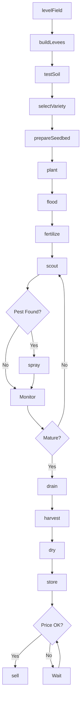
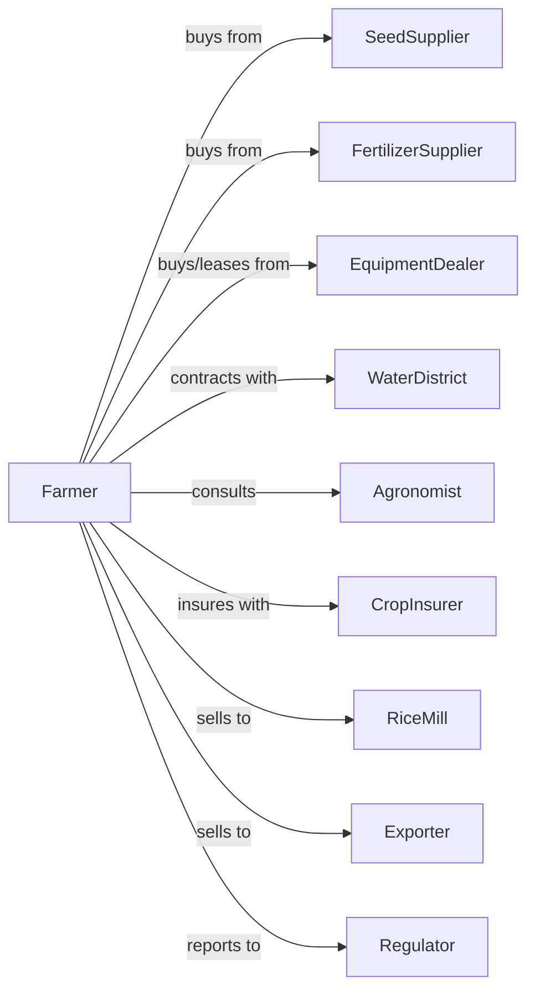

# Rice Farming

> Business-as-Code definition for rice production operations. Models the complete crop lifecycle from field leveling through flood management, harvest, and milling.

## Overview

Rice farming involves the cultivation of paddy rice in flooded fields for human consumption, export, and specialty markets. This definition exposes actions for water management, levee construction, milling quality optimization, and variety-specific production for long-grain, medium-grain, and aromatic rice markets.

## Actors

| Actor | Description |
|-------|-------------|
| SeedSupplier | Provides certified rice seed varieties |
| EquipmentDealer | Sells and services leveling equipment, rice combines |
| FertilizerSupplier | Provides nitrogen, phosphorus, and potassium |
| CropInsurer | Provides coverage for flood damage and yield loss |
| RiceMill | Purchases rough rice and processes to milled rice |
| Exporter | Purchases rice for international markets |
| WaterDistrict | Provides irrigation water and manages allocations |
| Agronomist | Advises on variety selection and water management |
| Regulator | Oversees water rights and pesticide applications |

## Roles

| Role | Description |
|------|-------------|
| FarmOwner | Owns land and water rights, makes variety decisions |
| FarmManager | Coordinates flooding schedules and harvest timing |
| EquipmentOperator | Operates tractors, levelers, and rice combines |
| WaterManager | Controls levees, pumps, and flood timing |
| Scout | Monitors for rice water weevil and blast disease |
| Bookkeeper | Tracks water costs, contracts, and milling returns |

## Entities

| Entity | Description |
|--------|-------------|
| Crop | Rice variety being cultivated (long-grain, jasmine, etc.) |
| Field | Leveled paddy with levees and water control structures |
| Seed | Certified variety with germination and purity specs |
| Water | Irrigation resource measured in acre-feet |
| Levee | Earthen berms controlling water depth in checks |
| Equipment | Tractors, levelers, rice combines, and bankout wagons |
| Contract | Forward sale with milling yield specifications |
| Yield | Rough rice production in hundredweight per acre |
| MillingYield | Percentage of whole kernels after processing |
| Disease | Blast, sheath blight, or other rice diseases |

## Actions

| Action | Description |
|--------|-------------|
| levelField | Precision grade fields for uniform water depth |
| buildLevees | Construct or repair levees for water containment |
| testSoil | Analyze nutrient levels and soil texture |
| selectVariety | Choose rice type based on market and growing season |
| prepareSeedbed | Till and smooth soil for water seeding or drill |
| plant | Broadcast seed into flooded field or drill into soil |
| flood | Establish permanent flood for weed and growth |
| fertilize | Apply nitrogen at critical growth stages |
| scout | Monitor for insects, disease, and weed escapes |
| spray | Apply herbicides, fungicides, or insecticides |
| drain | Remove water before harvest for field drying |
| harvest | Combine rice at optimal moisture content |
| dry | Reduce moisture for safe storage and milling |
| store | Place rough rice in bins or deliver to mill |
| sell | Execute sale to mill or exporter |

## Events

| Event | Description |
|-------|-------------|
| fieldLeveled | Precision grading completed |
| leveesBuilt | Levee construction or repair completed |
| soilTested | Nutrient analysis results received |
| varietySelected | Rice variety chosen for season |
| planted | Seed placed in field |
| flooded | Permanent flood established |
| fertilized | Nitrogen application completed |
| pestDetected | Rice water weevil or disease found |
| sprayed | Crop protection product applied |
| drained | Field water removed for harvest |
| harvested | Rice combined and collected |
| dried | Moisture reduced to storage level |
| stored | Rough rice placed in storage |
| sold | Sale transaction completed |
| millingYieldAssessed | Whole kernel percentage determined |

## Searches

| Search | Description |
|--------|-------------|
| findFields | List fields by leveling status and water access |
| getContracts | Retrieve active contracts with milling specs |
| checkWeather | Get forecast for planting and harvest windows |
| getPrice | Get rough rice price by variety and milling yield |
| findBuyers | List mills and exporters with current bids |
| getWaterAllocation | Check available irrigation water for season |
| getYieldHistory | Retrieve yields by field and variety |
| getMillingPremiums | Retrieve premiums for high milling yield |

## Workflow



## Actor Relationships



## Usage

### Calling Actions

```typescript
import { farmRice } from '@headlessly/farm-rice'

const farm = farmRice()

// Level field for uniform flooding
await farm.levelField({
  fieldId: 'west-paddy',
  tolerance: 0.1,
  gradeDirection: 'south'
})

// Select appropriate variety
const variety = await farm.selectVariety({
  type: 'long-grain',
  maturityDays: 120,
  millingYieldTarget: 58
})

// Plant using water seeding
await farm.plant({
  fieldId: 'west-paddy',
  varietyId: variety.id,
  method: 'waterSeeded',
  seedRate: 120,
  floodDepth: 4
})
```

### Event-Driven Automation

```typescript
// Auto-respond to pest detection
farm.pestDetected(async ({ fieldId, pest, level }) => {
  if (pest === 'riceWaterWeevil' && level >= 'threshold') {
    await farm.spray({
      fieldId,
      product: 'lambda-cyhalothrin',
      rate: 3.2,
      timing: 'early-flood'
    })
  }
})

// Auto-sell based on milling yield
farm.millingYieldAssessed(async ({ lotId, millingYield, moisture }) => {
  const { perCwt, premium } = await farm.getPrice({
    variety: 'long-grain',
    millingYield
  })

  if (millingYield >= 58 && moisture <= 12.5) {
    await farm.sell({
      lotId,
      deliveryPoint: 'regional-mill',
      deliveryWindow: '45-days'
    })
  }
})
```

## Related

- [All Other Grain Farming](./111199-AllOtherGrainFarming.mdx)
- [Oilseed and Grain Combination Farming](./111191-OilseedAndGrainCombinationFarming.mdx)
