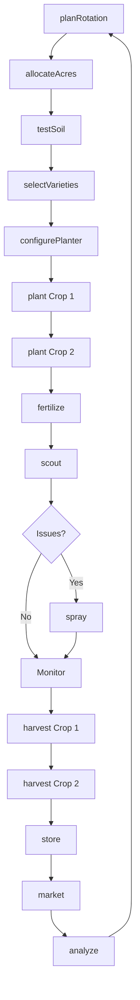
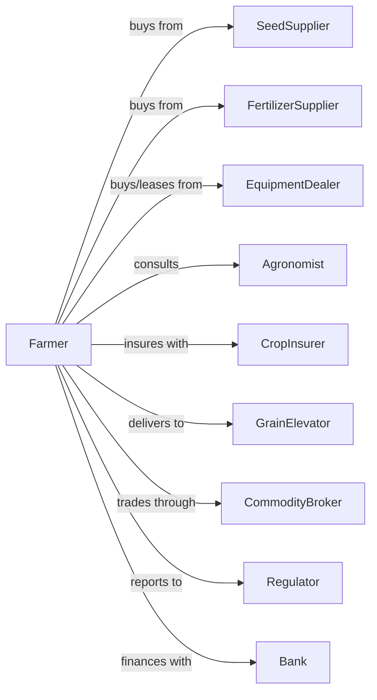

# Oilseed and Grain Combination Farming

> Business-as-Code definition for diversified oilseed and grain operations. Models multi-crop rotations, shared equipment utilization, and integrated marketing strategies.

## Overview

Oilseed and grain combination farming involves the cultivation of multiple crop types including soybeans, canola, corn, wheat, and other grains in rotation without any single crop dominating production. This definition exposes actions for managing diversified rotations, optimizing equipment use across crops, and coordinating marketing for multiple commodities.

## Actors

| Actor | Description |
|-------|-------------|
| SeedSupplier | Provides certified seed for multiple crop types |
| EquipmentDealer | Sells and services multi-purpose planting and harvest equipment |
| FertilizerSupplier | Provides nutrients tailored to rotation needs |
| CropInsurer | Provides multi-crop coverage and whole-farm protection |
| GrainElevator | Receives and stores multiple commodity types |
| CommodityBroker | Facilitates trading across multiple grain and oilseed markets |
| Agronomist | Advises on rotation planning and integrated pest management |
| Regulator | Oversees farm programs and conservation compliance |
| Bank | Provides operating loans and multi-commodity marketing tools |

## Roles

| Role | Description |
|------|-------------|
| FarmOwner | Owns land and determines rotation strategy |
| FarmManager | Coordinates planting schedules across multiple crops |
| EquipmentOperator | Operates shared equipment for different crop types |
| Scout | Monitors multiple crop fields for pests and diseases |
| Bookkeeper | Tracks expenses and revenue across commodity accounts |
| MarketingManager | Coordinates sales timing across multiple crops |

## Entities

| Entity | Description |
|--------|-------------|
| Rotation | Multi-year crop sequence plan for each field |
| Field | Land parcel with crop history and rotation assignment |
| Crop | Individual commodity type in the rotation |
| Seed | Planting material for each crop in the mix |
| Equipment | Shared machinery configured for multiple crops |
| Contract | Forward sale agreements for each commodity |
| Yield | Production by crop type and field |
| Soil | Growing medium benefiting from rotation diversity |
| Pest | Crop-specific threats managed through rotation |
| Input | Fertilizers and chemicals allocated by crop needs |

## Actions

| Action | Description |
|--------|-------------|
| planRotation | Design multi-year crop sequence for each field |
| allocateAcres | Assign crops to fields based on rotation and market |
| testSoil | Analyze nutrient levels and carryover credits |
| selectVarieties | Choose varieties for each crop in the rotation |
| configurePlanter | Adjust planter settings for different crops |
| plant | Execute planting for each crop type |
| fertilize | Apply nutrients based on crop-specific needs |
| scout | Monitor all crops for pest and disease pressure |
| spray | Apply crop-specific protection products |
| harvest | Combine each crop with appropriate settings |
| store | Segregate and condition grain by commodity |
| market | Execute sales across multiple commodities |
| hedge | Manage price risk for diversified production |
| analyze | Compare crop performance and rotation effects |

## Events

| Event | Description |
|-------|-------------|
| rotationPlanned | Multi-year crop plan established |
| acresAllocated | Crops assigned to fields for season |
| soilTested | Nutrient analysis completed |
| varietiesSelected | Seed choices finalized for all crops |
| planterConfigured | Equipment adjusted for crop type |
| planted | Crop seeded in assigned fields |
| fertilized | Nutrients applied to crop |
| pestDetected | Issue identified in field |
| sprayed | Treatment applied |
| harvested | Crop combined and collected |
| stored | Grain segregated in storage |
| marketed | Sale executed for commodity |
| hedged | Price protection established |
| rotationAnalyzed | Performance data compiled |

## Searches

| Search | Description |
|--------|-------------|
| findFields | List fields by rotation phase and crop history |
| getRotationPlan | Retrieve multi-year rotation schedule |
| getContracts | Retrieve contracts across all commodities |
| checkWeather | Get forecast for planting windows |
| getPrices | Get current prices for all crops in rotation |
| findBuyers | List buyers for each commodity type |
| getYieldHistory | Retrieve yields by crop and field |
| getRotationBenefit | Calculate yield impact of rotation |

## Workflow



## Actor Relationships



## Usage

### Calling Actions

```typescript
import { farmOilseedGrain } from '@headlessly/farm-oilseed-grain'

const farm = farmOilseedGrain()

// Plan rotation for all fields
const rotation = await farm.planRotation({
  fields: ['north-80', 'south-160', 'east-quarter'],
  crops: ['corn', 'soybeans', 'wheat'],
  years: 3
})

// Allocate acres for current season
await farm.allocateAcres({
  rotationId: rotation.id,
  year: 2024,
  adjustments: {
    'north-80': 'corn',
    'south-160': 'soybeans',
    'east-quarter': 'wheat'
  }
})

// Select varieties for each crop
const varieties = await farm.selectVarieties({
  crops: [
    { crop: 'corn', maturity: 105, traits: ['droughtTolerant'] },
    { crop: 'soybeans', maturityGroup: 2.5, traits: ['SCN-resistant'] },
    { crop: 'wheat', class: 'hardRedWinter', targetProtein: 12 }
  ]
})
```

### Event-Driven Automation

```typescript
// Track harvest completion across crops
farm.harvested(async ({ crop, fieldId, yield: bushels }) => {
  await farm.store({
    crop,
    fieldId,
    quantity: bushels,
    bin: assignBin(crop)
  })

  // Check if all crops harvested
  const status = await farm.getHarvestStatus()
  if (status.complete) {
    await farm.analyze({ season: currentSeason() })
  }
})

// Coordinate marketing across commodities
farm.stored(async ({ crop, quantity }) => {
  const prices = await farm.getPrices()

  if (prices[crop].percentile >= 75) {
    await farm.market({
      crop,
      quantity: quantity * 0.5,
      timing: 'immediate'
    })
  } else {
    await farm.hedge({
      crop,
      quantity,
      instrument: 'put-option'
    })
  }
})
```

## Related

- [Soybean Farming](./111110-SoybeanFarming.mdx)
- [Corn Farming](./111150-CornFarming.mdx)
- [Wheat Farming](./111140-WheatFarming.mdx)
