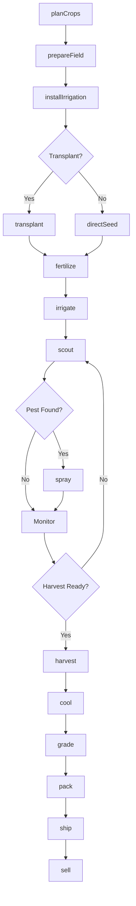
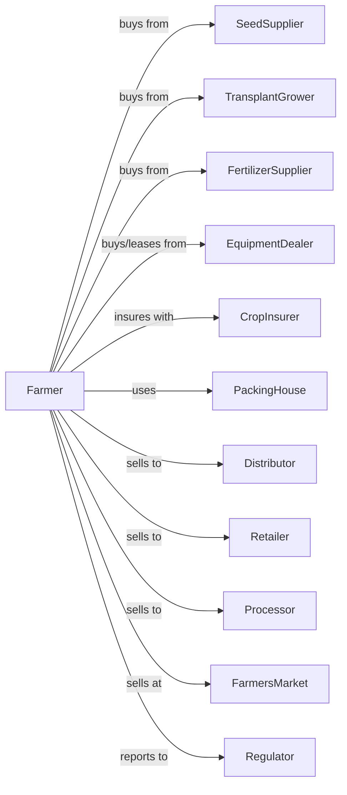

# Other Vegetable (except Potato) and Melon Farming

> Business-as-Code definition for diversified vegetable and melon production. Models the cultivation of tomatoes, peppers, onions, carrots, lettuce, melons, and other fresh market vegetables.

## Overview

Vegetable and melon farming involves the cultivation of fresh market vegetables and melons for direct sale, wholesale distribution, and processing. This definition exposes actions for managing transplant production, irrigation scheduling, harvest timing, post-harvest cooling, and quality grading across multiple crop types with varying maturity windows.

## Actors

| Actor | Description |
|-------|-------------|
| SeedSupplier | Provides vegetable and melon seed varieties |
| TransplantGrower | Produces transplants for field setting |
| EquipmentDealer | Sells and services planters, harvesters, and coolers |
| FertilizerSupplier | Provides fertilizers and foliar nutrients |
| CropInsurer | Provides coverage for weather and market losses |
| Distributor | Purchases vegetables for wholesale channels |
| Retailer | Purchases directly for store distribution |
| Processor | Purchases vegetables for canning or freezing |
| PackingHouse | Provides sorting, grading, and packing services |
| FarmersMarket | Provides direct-to-consumer sales venue |
| Regulator | Oversees food safety and labor compliance |

## Roles

| Role | Description |
|------|-------------|
| FarmOwner | Owns land and makes crop selection decisions |
| FarmManager | Coordinates planting schedules and harvest crews |
| EquipmentOperator | Operates transplanters, sprayers, and harvesters |
| IrrigationManager | Schedules water application by crop needs |
| HarvestCrew | Picks vegetables at optimal maturity |
| PackingCrewLead | Oversees sorting, grading, and packing |
| Bookkeeper | Manages sales, labor costs, and compliance |

## Entities

| Entity | Description |
|--------|-------------|
| Crop | Vegetable or melon type being cultivated |
| Field | Land parcel with irrigation and rotation history |
| Transplant | Young plants started in greenhouse for field setting |
| Seed | Direct-seeded variety with germination specs |
| Irrigation | Drip, overhead, or furrow water delivery system |
| Equipment | Transplanters, sprayers, and harvest aids |
| Contract | Forward sale with variety and quality specifications |
| Harvest | Picking event at optimal maturity stage |
| Grade | Quality classification by size, color, and condition |
| ColdChain | Temperature management from field to buyer |

## Actions

| Action | Description |
|--------|-------------|
| planCrops | Schedule planting dates for succession harvest |
| prepareField | Till, form beds, and install plastic mulch |
| installIrrigation | Set up drip tape or overhead systems |
| transplant | Set transplants at proper spacing |
| directSeed | Plant seeds for direct-seeded crops |
| fertilize | Apply nutrients through drip or foliar |
| irrigate | Apply water based on crop and weather needs |
| scout | Monitor for insects, disease, and nutrient issues |
| spray | Apply pest control or foliar nutrients |
| harvest | Pick vegetables at optimal maturity |
| cool | Rapidly reduce temperature after harvest |
| grade | Sort by size, color, and quality |
| pack | Place in containers for shipping |
| ship | Transport to buyer with cold chain integrity |
| sell | Execute sale to distributor, retailer, or direct |

## Events

| Event | Description |
|-------|-------------|
| cropsPlanned | Planting schedule established |
| fieldPrepared | Beds formed and mulch installed |
| irrigationInstalled | Water delivery system operational |
| transplanted | Plants set in field |
| directSeeded | Seeds planted in field |
| fertilized | Nutrients applied |
| irrigated | Water applied to crop |
| pestDetected | Insect or disease identified |
| sprayed | Treatment applied |
| harvestReady | Crop reached optimal maturity |
| harvested | Vegetables picked and collected |
| cooled | Temperature reduced to target |
| graded | Quality classification completed |
| packed | Containers ready for shipping |
| shipped | Product in transit to buyer |
| sold | Sale transaction completed |

## Searches

| Search | Description |
|--------|-------------|
| findFields | List fields by crop history and irrigation type |
| getContracts | Retrieve active buyer contracts |
| checkWeather | Get forecast for harvest and planting windows |
| getPrice | Get current wholesale and retail prices |
| findBuyers | List distributors and retailers with needs |
| getHarvestSchedule | Retrieve upcoming harvest dates by crop |
| getYieldHistory | Retrieve yields by field and variety |
| getInventory | Check packed inventory by variety and grade |

## Workflow



## Actor Relationships



## Usage

### Calling Actions

```typescript
import { growVegetableMelon } from '@headlessly/grow-vegetable-melon'

const farm = growVegetableMelon()

// Plan succession planting schedule
const schedule = await farm.planCrops({
  crops: [
    { crop: 'tomato', variety: 'roma', plantDate: '2024-04-15' },
    { crop: 'pepper', variety: 'bell', plantDate: '2024-04-20' },
    { crop: 'watermelon', variety: 'seedless', plantDate: '2024-05-01' }
  ],
  harvestTarget: 'continuous'
})

// Prepare field with plastic mulch
await farm.prepareField({
  fieldId: 'south-10',
  bedWidth: 36,
  mulchType: 'black-plastic',
  rowSpacing: 6
})

// Transplant tomatoes
await farm.transplant({
  fieldId: 'south-10',
  crop: 'tomato',
  variety: 'roma',
  spacing: 18,
  depth: 4
})
```

### Event-Driven Automation

```typescript
// Auto-irrigate based on soil moisture
farm.irrigated(async ({ fieldId, volumeApplied }) => {
  const moisture = await getSoilMoisture(fieldId)

  if (moisture < 0.25) {
    await farm.irrigate({
      fieldId,
      duration: 60,
      rate: 0.5
    })
  }
})

// Auto-harvest notification
farm.harvestReady(async ({ fieldId, crop, maturityIndex }) => {
  if (maturityIndex >= 0.9) {
    await notifyHarvestCrew({
      fieldId,
      crop,
      priority: 'high',
      window: '24-hours'
    })

    await farm.harvest({
      fieldId,
      crop,
      crew: 'team-a'
    })
  }
})

// Auto-sell when grade meets contract
farm.graded(async ({ lotId, crop, grade, quantity }) => {
  const contracts = await farm.getContracts({ crop })
  const matchingContract = contracts.find(c => c.grade === grade)

  if (matchingContract) {
    await farm.sell({
      lotId,
      contractId: matchingContract.id,
      quantity
    })
  }
})
```

## Related

- [Potato Farming](./111211-PotatoFarming.mdx)
- [Mushroom Production](../1114-GreenhouseNurseryAndFloricultureProduction/111411-MushroomProduction.mdx)
