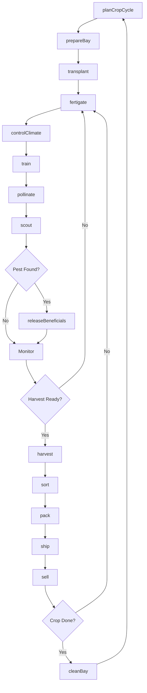
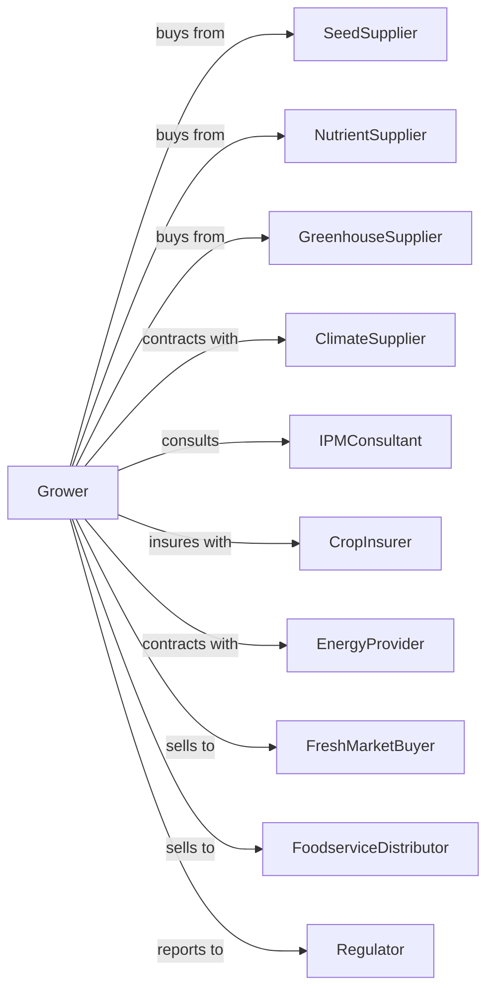

# Other Food Crops Grown Under Cover

> Business-as-Code definition for controlled environment food production. Models greenhouse cultivation of tomatoes, peppers, cucumbers, lettuce, herbs, and hydroponic systems.

## Overview

Food crops grown under cover encompasses greenhouse and controlled environment agriculture (CEA) for vegetables, herbs, leafy greens, and specialty crops using hydroponic, aeroponic, and substrate-based systems. This definition exposes actions for climate control, nutrient management, integrated pest management, harvest scheduling, and year-round production for premium fresh markets.

## Actors

| Actor | Description |
|-------|-------------|
| SeedSupplier | Provides seeds and transplants for protected culture |
| GreenhouseSupplier | Sells and installs greenhouse structures and systems |
| NutrientSupplier | Provides hydroponic nutrients and growing media |
| ClimateSupplier | Provides heating, cooling, and environmental controls |
| CropInsurer | Provides coverage for crop and structure losses |
| FreshMarketBuyer | Purchases produce for retail distribution |
| FoodserviceDistributor | Supplies restaurants and institutions |
| IPMConsultant | Advises on biological pest control |
| EnergyProvider | Supplies electricity and natural gas |
| Regulator | Oversees food safety and organic certification |

## Roles

| Role | Description |
|------|-------------|
| GreenhouseOwner | Owns facility and makes crop and market decisions |
| ProductionManager | Coordinates crop schedules and resource allocation |
| GrowingTechnician | Manages daily crop care and plant health |
| ClimateOperator | Controls heating, cooling, and ventilation |
| NutrientTechnician | Manages fertigation and water quality |
| HarvestCrew | Picks produce at optimal stage |
| PackingCrewLead | Oversees sorting and packaging |
| Bookkeeper | Manages sales, utilities, and compliance |

## Entities

| Entity | Description |
|--------|-------------|
| Greenhouse | Controlled environment growing structure |
| Bay | Section of greenhouse dedicated to specific crop |
| Crop | Food plant being cultivated |
| GrowingSystem | Hydroponic, aeroponic, or substrate method |
| Climate | Temperature, humidity, light, and CO2 levels |
| Nutrient | Fertilizer solution for plant feeding |
| Water | Irrigation source with quality parameters |
| Harvest | Picking event for ripe produce |
| Package | Container for retail or foodservice |
| Contract | Sale agreement with delivery schedule |

## Actions

| Action | Description |
|--------|-------------|
| planCropCycle | Schedule plantings for continuous harvest |
| prepareBay | Set up growing system and infrastructure |
| transplant | Move seedlings into production positions |
| fertigate | Apply nutrient solution to plants |
| controlClimate | Adjust temperature, humidity, CO2, and light |
| train | Prune and support plants for optimal growth |
| pollinate | Introduce bees or apply manual pollination |
| scout | Monitor for pests, disease, and nutrient issues |
| releaseBeneficials | Deploy biological pest control agents |
| harvest | Pick produce at target maturity |
| sort | Grade by size, color, and quality |
| pack | Package for specific market channels |
| ship | Transport maintaining cold chain |
| sell | Execute sale to buyer or distributor |
| cleanBay | Remove crop residue and sanitize |

## Events

| Event | Description |
|-------|-------------|
| cropCyclePlanned | Production schedule established |
| bayPrepared | Growing system ready for planting |
| transplanted | Seedlings placed in production |
| fertigated | Nutrients applied |
| climateAdjusted | Environmental conditions changed |
| trained | Plant maintenance completed |
| pollinated | Pollination activity completed |
| pestDetected | Pest or disease identified |
| beneficialsReleased | Biological controls deployed |
| harvestReady | Produce at optimal maturity |
| harvested | Produce picked |
| sorted | Quality grading completed |
| packed | Product packaged |
| shipped | Product in transit |
| sold | Sale transaction completed |
| bayCleaned | Growing area sanitized |

## Searches

| Search | Description |
|--------|-------------|
| findBays | List bays by crop and stage |
| getContracts | Retrieve active buyer contracts |
| getClimateStatus | Check environmental conditions |
| getPrice | Get current prices by crop and grade |
| findBuyers | List retail and foodservice buyers |
| getYieldHistory | Retrieve yields by bay and variety |
| getHarvestSchedule | Project daily harvest volumes |
| getNutrientStatus | Check fertigation solution parameters |

## Workflow



## Actor Relationships



## Usage

### Calling Actions

```typescript
import { growFoodCrops } from '@headlessly/grow-food-crops'

const greenhouse = growFoodCrops()

// Plan continuous tomato production
const plan = await greenhouse.planCropCycle({
  crop: 'tomato',
  variety: 'cluster',
  bays: ['bay-1', 'bay-2', 'bay-3'],
  succession: 3,
  intervalWeeks: 4
})

// Configure fertigation
await greenhouse.fertigate({
  bayId: 'bay-1',
  ecTarget: 3.2,
  phTarget: 5.8,
  recipe: 'tomato-generative',
  frequency: 'hourly'
})

// Control climate for fruit development
await greenhouse.controlClimate({
  bayId: 'bay-1',
  dayTemp: 75,
  nightTemp: 65,
  co2: 1000,
  humidityTarget: 70
})
```

### Event-Driven Automation

```typescript
// Auto-release beneficials for pest control
greenhouse.pestDetected(async ({ bayId, pest, level }) => {
  if (pest === 'whitefly' && level === 'early') {
    await greenhouse.releaseBeneficials({
      bayId,
      agent: 'encarsia-formosa',
      rate: 3,
      frequency: 'weekly'
    })
  }
})

// Auto-adjust climate based on growth stage
greenhouse.trained(async ({ bayId, growthStage }) => {
  if (growthStage === 'flowering') {
    await greenhouse.controlClimate({
      bayId,
      dayTemp: 77,
      nightTemp: 63,
      co2: 1200
    })
  }
})

// Auto-pack and sell based on harvest quality
greenhouse.harvested(async ({ bayId, crop, quantity }) => {
  await greenhouse.sort({
    bayId,
    grades: ['Premium', 'Choice', 'Standard']
  })
})

greenhouse.sorted(async ({ lotId, crop, grade, pounds }) => {
  const contract = await greenhouse.getContracts({ crop, grade })

  if (contract && contract.remaining >= pounds) {
    await greenhouse.sell({
      lotId,
      contractId: contract.id,
      quantity: pounds
    })
  }
})
```

## Related

- [Mushroom Production](./111411-MushroomProduction.mdx)
- [Nursery and Tree Production](./111421-NurseryAndTreeProduction.mdx)
