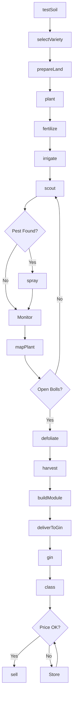
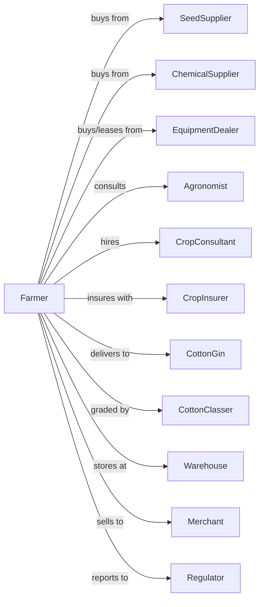

# Cotton Farming

> Business-as-Code definition for cotton production operations. Models the cultivation of upland and pima cotton from planting through ginning and sale.

## Overview

Cotton farming involves the cultivation of upland and extra-long staple (pima) cotton for fiber production, cottonseed oil, and livestock feed. This definition exposes actions for managing plant population, pest control for boll weevil and bollworm, defoliation timing, mechanical harvest, module building, and ginning coordination for fiber quality optimization.

## Actors

| Actor | Description |
|-------|-------------|
| SeedSupplier | Provides cotton seed with trait packages |
| EquipmentDealer | Sells and services planters, sprayers, and pickers |
| ChemicalSupplier | Provides herbicides, insecticides, and defoliants |
| CropInsurer | Provides coverage for yield and quality losses |
| CottonGin | Processes seed cotton into lint and seed |
| Merchant | Purchases cotton under contract or spot |
| Warehouse | Stores baled cotton for delivery |
| CottonClasser | Grades fiber quality (HVI testing) |
| Agronomist | Advises on variety selection and management |
| CropConsultant | Scouts fields and recommends treatments |
| Regulator | Oversees boll weevil eradication and programs |

## Roles

| Role | Description |
|------|-------------|
| FarmOwner | Owns land and makes variety and marketing decisions |
| FarmManager | Coordinates planting, spraying, and harvest |
| EquipmentOperator | Operates planters, sprayers, and pickers |
| Scout | Monitors for insects, weeds, and plant mapping |
| ModuleBuilder | Operates module builder at harvest |
| Bookkeeper | Manages gin tickets, warehouse receipts, and sales |

## Entities

| Entity | Description |
|--------|-------------|
| Crop | Cotton variety being cultivated |
| Field | Land parcel for cotton production |
| Seed | Planting material with variety and traits |
| Plant | Individual cotton plant with fruit positions |
| Boll | Fruit structure containing lint and seed |
| Module | Field storage unit of harvested seed cotton |
| Bale | Ginned and packaged cotton lint |
| Lint | Cotton fiber after ginning |
| Cottonseed | Seed after ginning for oil and meal |
| Contract | Forward sale agreement for cotton |

## Actions

| Action | Description |
|--------|-------------|
| testSoil | Analyze nutrient levels and pH |
| selectVariety | Choose cotton type and variety for region |
| prepareLand | Till and form beds for planting |
| plant | Place seed at target population and depth |
| fertilize | Apply nitrogen and other nutrients |
| irrigate | Apply water during critical growth periods |
| scout | Monitor for bollworm, aphids, and plant development |
| spray | Apply insecticides, herbicides, or PGRs |
| mapPlant | Assess fruit retention and maturity |
| defoliate | Apply defoliant for harvest preparation |
| harvest | Pick cotton with spindle or stripper |
| buildModule | Compress harvested cotton into modules |
| deliverToGin | Transport modules to gin |
| gin | Separate lint from seed |
| class | Test fiber quality (length, strength, micronaire) |
| sell | Execute sale to merchant or mill |

## Events

| Event | Description |
|-------|-------------|
| soilTested | Nutrient analysis results received |
| varietySelected | Cotton variety chosen |
| planted | Seed placed in ground |
| emerged | Plants visible above ground |
| fertilized | Nutrients applied |
| irrigated | Water applied |
| pestDetected | Bollworm, aphids, or other pest found |
| sprayed | Treatment applied |
| plantMapped | Fruit retention assessed |
| defoliated | Defoliant applied |
| harvested | Cotton picked and collected |
| moduleBuilt | Harvest compressed into module |
| deliveredToGin | Modules at gin facility |
| ginned | Lint separated from seed |
| classed | Fiber quality determined |
| baled | Lint packaged in bales |
| sold | Sale transaction completed |

## Searches

| Search | Description |
|--------|-------------|
| findFields | List fields by variety and irrigation status |
| getContracts | Retrieve active merchant contracts |
| checkWeather | Get forecast for harvest and spray windows |
| getPrice | Get current prices by quality parameters |
| findMerchants | List buyers with current bids |
| getYieldHistory | Retrieve yields by field and variety |
| getPestPressure | Get regional pest advisories |
| getGinSchedule | Check gin availability and wait times |

## Workflow



## Actor Relationships



## Usage

### Calling Actions

```typescript
import { farmCotton } from '@headlessly/farm-cotton'

const farm = farmCotton()

// Select variety for field conditions
const variety = await farm.selectVariety({
  type: 'upland',
  traits: ['bollgardII', 'roundupReady'],
  maturity: 'mid-full',
  fiberQuality: 'premium'
})

// Plant at optimal conditions
await farm.plant({
  fieldId: 'pivot-circle-3',
  varietyId: variety.id,
  population: 38000,
  rowSpacing: 40,
  depth: 1.0
})

// Scout and spray as needed
const scoutReport = await farm.scout({
  fieldId: 'pivot-circle-3',
  targets: ['bollworm', 'aphids', 'plantBugs']
})

if (scoutReport.bollworm.threshold) {
  await farm.spray({
    fieldId: 'pivot-circle-3',
    product: 'chlorantraniliprole',
    rate: 1.5
  })
}
```

### Event-Driven Automation

```typescript
// Auto-defoliate based on boll opening
farm.plantMapped(async ({ fieldId, openBolls, nodesAboveCrackingBoll }) => {
  if (openBolls >= 60 && nodesAboveCrackingBoll <= 4) {
    await farm.defoliate({
      fieldId,
      products: ['thidiazuron', 'ethephon'],
      rates: [0.1, 1.0]
    })
  }
})

// Auto-schedule gin delivery
farm.moduleBuilt(async ({ moduleId, fieldId, estimatedWeight }) => {
  const ginSchedule = await farm.getGinSchedule()

  await farm.deliverToGin({
    moduleId,
    ginId: ginSchedule.nextAvailable,
    estimatedWeight,
    fieldOrigin: fieldId
  })
})

// Auto-sell based on class results
farm.classed(async ({ baleId, length, strength, micronaire, color }) => {
  const price = await farm.getPrice({
    length,
    strength,
    micronaire,
    color
  })

  if (price.perPound >= 0.75) {
    await farm.sell({
      baleId,
      merchant: 'primary-merchant',
      terms: 'immediate-delivery'
    })
  }
})
```

## Related

- [Cotton Ginning](../../115-SupportActivitiesForAgricultureAndForestry/1151-SupportActivitiesForCropProduction/115111-CottonGinning.mdx)
- [All Other Miscellaneous Crop Farming](./111998-AllOtherMiscellaneousCropFarming.mdx)
