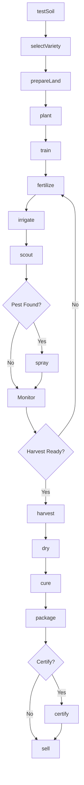
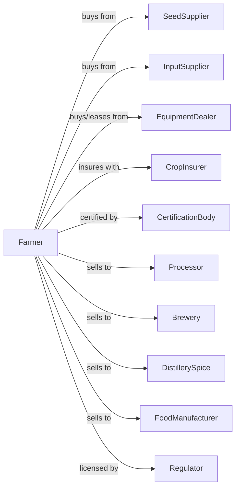

# All Other Miscellaneous Crop Farming

> Business-as-Code definition for specialty and diversified crop production operations. Models the cultivation of hemp, hops, herbs, spices, mint, and other specialty crops not classified elsewhere.

## Overview

Miscellaneous crop farming encompasses specialty crops including industrial hemp, hops, herbs, spices, mint, and diversified operations growing multiple crop types. This definition exposes actions for niche market cultivation, specialty harvest techniques, post-harvest processing, quality certification, and sales to processors, breweries, distilleries, and specialty food manufacturers.

## Actors

| Actor | Description |
|-------|-------------|
| SeedSupplier | Provides specialty crop seeds and propagation material |
| EquipmentDealer | Sells and services specialized harvest equipment |
| InputSupplier | Provides fertilizers and specialty crop inputs |
| CropInsurer | Provides coverage for specialty crop losses |
| Processor | Purchases crops for extraction or processing |
| Brewery | Purchases hops for beer production |
| DistillerySpice | Purchases botanicals for spirits |
| FoodManufacturer | Purchases herbs and spices for food products |
| CertificationBody | Provides organic and specialty certifications |
| Regulator | Oversees specialty crop licensing and compliance |

## Roles

| Role | Description |
|------|-------------|
| FarmOwner | Owns land and develops specialty crop markets |
| FarmManager | Coordinates diverse planting and harvest schedules |
| CropSpecialist | Manages cultivation of specialty crops |
| HarvestCrew | Performs specialized harvest operations |
| ProcessingLead | Oversees drying, curing, and packaging |
| Bookkeeper | Manages sales, certifications, and compliance |

## Entities

| Entity | Description |
|--------|-------------|
| Crop | Specialty crop being cultivated |
| Field | Land parcel for specialty production |
| Variety | Specific cultivar with market characteristics |
| Planting | Established crop with tracking data |
| Harvest | Collected crop material by type |
| Process | Post-harvest treatment (drying, curing, extraction) |
| Certificate | Organic, non-GMO, or specialty certification |
| Contract | Forward sale agreement with buyer |
| License | Regulatory permit for controlled crops |
| Quality | Grade or specification for market |

## Actions

| Action | Description |
|--------|-------------|
| testSoil | Analyze nutrients and suitability for crop |
| selectVariety | Choose cultivar for market and conditions |
| prepareLand | Till and amend soil for planting |
| plant | Establish crop with appropriate method |
| train | Guide plant growth on trellises or supports |
| fertilize | Apply nutrients for crop development |
| irrigate | Apply water based on crop requirements |
| scout | Monitor for pests, disease, and quality |
| spray | Apply approved treatments |
| harvest | Collect crop at optimal stage |
| dry | Reduce moisture for storage or processing |
| cure | Process crop for market specifications |
| package | Prepare crop for sale or shipment |
| certify | Obtain quality or organic certification |
| sell | Execute sale to buyer |

## Events

| Event | Description |
|-------|-------------|
| soilTested | Analysis results available |
| varietySelected | Cultivar chosen |
| planted | Crop established |
| trained | Plants guided on supports |
| fertilized | Nutrients applied |
| irrigated | Water applied |
| pestDetected | Pest or disease identified |
| sprayed | Treatment applied |
| harvestReady | Crop at optimal stage |
| harvested | Crop collected |
| dried | Moisture reduced |
| cured | Processing completed |
| packaged | Product prepared for market |
| certified | Certification obtained |
| sold | Sale transaction completed |

## Searches

| Search | Description |
|--------|-------------|
| findFields | List fields by crop type and certification |
| getContracts | Retrieve active buyer contracts |
| checkWeather | Get forecast for harvest and drying |
| getPrice | Get current prices by crop and quality |
| findBuyers | List processors and specialty buyers |
| getLicenses | Retrieve active regulatory licenses |
| getCertifications | Check certification status and renewals |
| getYieldHistory | Retrieve yields by crop and field |

## Workflow



## Actor Relationships



## Usage

### Calling Actions

```typescript
import { farmCrop } from '@headlessly/farm-crop'

const farm = farmCrop()

// Plant hops for brewery
await farm.plant({
  fieldId: 'hop-yard-1',
  crop: 'hops',
  variety: 'cascade',
  spacing: { inRow: 3.5, betweenRows: 14 },
  method: 'rhizome'
})

// Train hop bines
await farm.train({
  fieldId: 'hop-yard-1',
  trellisHeight: 18,
  stringsPerHill: 2
})

// Harvest at optimal lupulin
await farm.harvest({
  fieldId: 'hop-yard-1',
  method: 'mechanical-picker',
  targetMoisture: 75
})
```

### Event-Driven Automation

```typescript
// Auto-dry hops after harvest
farm.harvested(async ({ fieldId, crop, pounds }) => {
  if (crop === 'hops') {
    await farm.dry({
      fieldId,
      pounds,
      targetMoisture: 8,
      temperature: 140,
      method: 'kiln'
    })
  }
})

// Auto-package based on buyer specs
farm.cured(async ({ fieldId, crop, processedPounds }) => {
  const contracts = await farm.getContracts({ crop })

  for (const contract of contracts) {
    await farm.package({
      fieldId,
      crop,
      format: contract.packageSpec,
      quantity: Math.min(processedPounds, contract.remainingQuantity)
    })
  }
})

// Auto-schedule certification inspection
farm.packaged(async ({ fieldId, crop, lotId }) => {
  const certStatus = await farm.getCertifications({ fieldId })

  if (certStatus.organic && certStatus.needsInspection) {
    await farm.certify({
      lotId,
      crop,
      certType: 'organic',
      inspector: certStatus.assignedInspector
    })
  }
})
```

## Related

- [Tobacco Farming](./111910-TobaccoFarming.mdx)
- [Oilseed and Grain Combination Farming](../../1111-OilseedAndGrainFarming/111191-OilseedAndGrainCombinationFarming.mdx)
