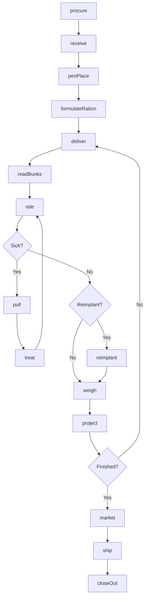
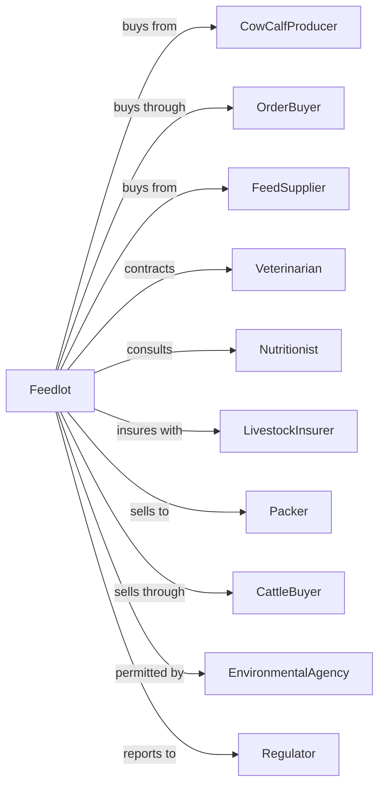

# Cattle Feedlots

> Business-as-Code definition for cattle feeding operations. Models the procurement, feeding, and marketing of cattle from placement through harvest.

## Overview

Cattle feedlots involve the intensive feeding of cattle for fattening and finishing prior to slaughter. This definition exposes actions for cattle procurement, pen management, ration formulation, health protocols, performance tracking, and marketing cattle to packers based on weight, quality grade, and yield grade projections.

## Actors

| Actor | Description |
|-------|-------------|
| CowCalfProducer | Supplies feeder cattle for placement |
| OrderBuyer | Procures cattle at auctions and direct from ranches |
| FeedSupplier | Provides corn, distillers grains, and supplements |
| Veterinarian | Provides health protocols and treatment oversight |
| Nutritionist | Formulates rations for optimal performance |
| LivestockInsurer | Provides death loss and price coverage |
| Packer | Purchases finished cattle for slaughter |
| CattleBuyer | Represents packers in procurement |
| EnvironmentalAgency | Oversees manure management and permits |
| Regulator | Oversees animal health and food safety |

## Roles

| Role | Description |
|------|-------------|
| FeedlotOwner | Owns facility and makes investment decisions |
| FeedlotManager | Coordinates daily operations and marketing |
| PenRider | Monitors cattle health and identifies sick animals |
| FeedTruckDriver | Delivers rations to pens |
| MillOperator | Prepares and processes feed rations |
| CattleProcessor | Manages receiving and shipping operations |
| Bookkeeper | Manages cattle accounting and closeouts |

## Entities

| Entity | Description |
|--------|-------------|
| Feeder | Cattle placed for finishing |
| Pen | Group of cattle managed together |
| Lot | Business unit tracking cattle from placement to sale |
| Ration | Feed mixture formulated for growth stage |
| Bunk | Feed delivery trough in pen |
| Implant | Growth-promoting hormone administered |
| CloseOut | Financial settlement for finished lot |
| Carcass | Harvested animal graded for quality |
| Grid | Pricing matrix based on quality and yield |
| Contract | Forward sale agreement with packer |

## Actions

| Action | Description |
|--------|-------------|
| procure | Purchase feeder cattle from suppliers |
| receive | Process incoming cattle with vaccines and implants |
| penPlace | Assign cattle to pens by weight and sex |
| formulateRation | Create feed mix for growth stage |
| deliver | Distribute rations to pens |
| readBunks | Assess feed consumption and adjust deliveries |
| ride | Monitor cattle for health issues |
| pull | Remove sick animal for treatment |
| treat | Administer medication to sick cattle |
| reimplant | Apply second growth implant at midpoint |
| weigh | Measure cattle weights for performance |
| project | Estimate finish date and grade |
| market | Negotiate sale with packer |
| ship | Load and transport cattle to packer |
| closeOut | Calculate profit or loss on lot |

## Events

| Event | Description |
|-------|-------------|
| procured | Feeder cattle purchased |
| received | Cattle processed and placed |
| penPlaced | Cattle assigned to pens |
| rationFormulated | Feed mix created |
| rationDelivered | Feed distributed to pens |
| bunksRead | Feed consumption assessed |
| ridden | Pen checked for health |
| pulled | Sick animal identified |
| treated | Medication administered |
| reimplanted | Second implant applied |
| weighed | Weights recorded |
| projected | Finish date estimated |
| marketed | Sale negotiated |
| shipped | Cattle loaded for transport |
| closedOut | Financial settlement completed |

## Searches

| Search | Description |
|--------|-------------|
| findLots | List lots by status, days on feed, and owner |
| getPenInventory | Check cattle count and weight by pen |
| getPerformance | Retrieve ADG, feed conversion, and cost of gain |
| getHealthRecords | View treatment history and mortality |
| getPrice | Get current cash and grid prices |
| findPackers | List packers with current bids |
| getRationCosts | Check ingredient prices and ration costs |
| getCloseOutHistory | Retrieve historical lot profitability |

## Workflow



## Actor Relationships



## Usage

### Calling Actions

```typescript
import { raiseCattleFeedlots } from '@headlessly/raise-cattle-feedlots'

const feedlot = raiseCattleFeedlots()

// Procure feeder cattle
const lot = await feedlot.procure({
  source: 'video-auction',
  headCount: 120,
  avgWeight: 650,
  sex: 'steers',
  breed: 'black-angus',
  pricePerCwt: 175
})

// Receive and process cattle
await feedlot.receive({
  lotId: lot.id,
  vaccines: ['bvd', 'ibr', 'pi3', 'pasteurella'],
  implant: 'revalor-xs',
  dewormer: 'ivermectin'
})

// Formulate starter ration
await feedlot.formulateRation({
  stage: 'starter',
  ingredients: [
    { name: 'corn', percent: 45 },
    { name: 'distillers', percent: 25 },
    { name: 'hay', percent: 20 },
    { name: 'supplement', percent: 10 }
  ],
  targetGain: 3.5
})
```

### Event-Driven Automation

```typescript
// Auto-adjust ration based on bunk reads
feedlot.bunksRead(async ({ penId, consumption, score }) => {
  if (score === 'clean') {
    await feedlot.deliver({
      penId,
      pounds: consumption * 1.05
    })
  } else if (score === 'stale') {
    await feedlot.deliver({
      penId,
      pounds: consumption * 0.95
    })
  }
})

// Auto-project finish date
feedlot.weighed(async ({ lotId, avgWeight, adg }) => {
  const targetWeight = 1350
  const daysToFinish = (targetWeight - avgWeight) / adg

  await feedlot.project({
    lotId,
    finishDate: addDays(new Date(), daysToFinish),
    projectedGrade: estimateGrade(avgWeight, adg)
  })
})

// Auto-market when projected to finish
feedlot.projected(async ({ lotId, finishDate, projectedGrade }) => {
  const daysOut = differenceInDays(finishDate, new Date())

  if (daysOut <= 14) {
    const bids = await feedlot.findPackers({ grade: projectedGrade })
    const bestBid = bids[0]

    await feedlot.market({
      lotId,
      packer: bestBid.packerId,
      pricing: 'grid',
      shipDate: finishDate
    })
  }
})
```

## Related

- [Beef Cattle Ranching and Farming](./112111-BeefCattleRanchingAndFarming.mdx)
- [Dairy Cattle and Milk Production](./112120-DairyCattleAndMilkProduction.mdx)
