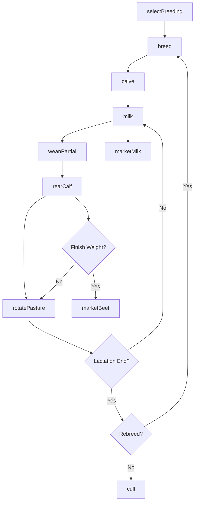
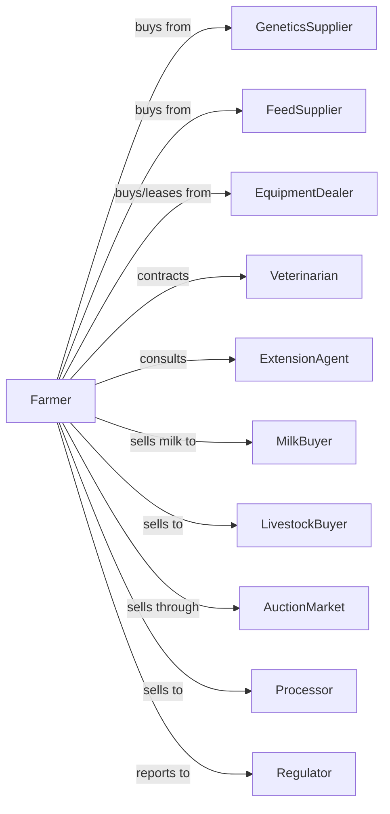

# Dual-Purpose Cattle Ranching and Farming

> Business-as-Code definition for dual-purpose cattle operations. Models the management of breeds raised for both milk and meat production.

## Overview

Dual-purpose cattle ranching involves raising breeds such as Simmental, Normande, and various tropical breeds that produce both milk for sale and calves for beef markets. This definition exposes actions for balanced breeding programs, milking schedules, calf rearing for meat, pasture-based management, and diversified marketing of both milk and beef products.

## Actors

| Actor | Description |
|-------|-------------|
| GeneticsSupplier | Provides dual-purpose genetics and semen |
| FeedSupplier | Provides forages, supplements, and minerals |
| EquipmentDealer | Sells and services milking and handling equipment |
| Veterinarian | Provides health services for dairy and beef aspects |
| MilkBuyer | Purchases milk for processing or direct sale |
| LivestockBuyer | Purchases calves and culled animals |
| AuctionMarket | Facilitates sale of surplus animals |
| ExtensionAgent | Provides technical advice on dual-purpose systems |
| Regulator | Oversees animal health and milk quality |
| Processor | Purchases milk or meat animals |

## Roles

| Role | Description |
|------|-------------|
| FarmOwner | Owns operation and balances milk and meat priorities |
| FarmManager | Coordinates both milking and beef operations |
| MilkingWorker | Performs daily milking and milk handling |
| CalfRearer | Raises calves for beef or replacement |
| Herdsman | Manages grazing, health, and breeding |
| Bookkeeper | Tracks both milk and meat income streams |

## Entities

| Entity | Description |
|--------|-------------|
| Cow | Female producing both milk and calves |
| Calf | Young animal raised for beef or replacement |
| Bull | Male for breeding dual-purpose traits |
| Milk | Raw product harvested from cows |
| Beef | Meat from finished or culled animals |
| Herd | Group of cattle managed together |
| Pasture | Grazing land supporting the operation |
| MilkingSchedule | Timing of milking allowing calf nursing |
| BreedingIndex | Selection criteria balancing milk and meat |
| Revenue | Combined income from milk and meat |

## Actions

| Action | Description |
|--------|-------------|
| selectBreeding | Choose genetics balancing milk and beef traits |
| breed | Mate cows for desired offspring characteristics |
| calve | Assist with birth and pair cow with calf |
| milk | Extract milk while managing calf nursing |
| weanPartial | Allow calf to nurse while harvesting milk |
| rearCalf | Grow calves for beef production |
| rotatePasture | Move cattle to fresh grazing |
| supplementFeed | Provide additional nutrition for production |
| vaccinate | Administer health protocols |
| cull | Remove animals to market |
| marketMilk | Sell milk to buyer or processor |
| marketBeef | Sell calves or finished animals |
| analyzeReturns | Evaluate milk vs beef profitability |

## Events

| Event | Description |
|-------|-------------|
| breedingSelected | Genetics chosen |
| bred | Cow mated |
| calved | Calf born |
| milked | Milk harvested |
| partiallyWeaned | Calf nursing limited |
| calfReared | Calf grown for beef |
| pastureRotated | Cattle moved |
| supplemented | Additional feed provided |
| vaccinated | Health protocol completed |
| culled | Animal removed to market |
| milkMarketed | Milk sold |
| beefMarketed | Animals sold for meat |
| returnsAnalyzed | Profitability assessed |

## Searches

| Search | Description |
|--------|-------------|
| findHerd | List animals by production type and status |
| getMilkProduction | Check daily and monthly milk totals |
| getCalfGrowth | Retrieve calf weights and gains |
| getBreedingRecords | View mating and conception data |
| getMilkPrice | Get current milk market prices |
| getBeefPrice | Get current cattle market prices |
| getPasture | Check grazing availability |
| getRevenueAnalysis | Compare milk and beef income |

## Workflow



## Actor Relationships



## Usage

### Calling Actions

```typescript
import { raiseDualPurposeCattle } from '@headlessly/raise-dual-purpose-cattle'

const farm = raiseDualPurposeCattle()

// Select balanced breeding genetics
const breeding = await farm.selectBreeding({
  breed: 'simmental',
  milkIndex: 0.5,
  beefIndex: 0.5,
  traits: ['milkability', 'muscling', 'docility']
})

// Milk with calf nursing allowance
await farm.milk({
  cowId: 'cow-156',
  method: 'once-daily',
  calfNursing: true,
  nursingHours: 12
})

// Rear calf for beef market
await farm.rearCalf({
  calfId: 'calf-892',
  program: 'grass-finished',
  targetWeight: 1100,
  weaning: 'gradual'
})
```

### Event-Driven Automation

```typescript
// Auto-adjust milking based on calf age
farm.calved(async ({ cowId, calfId, birthDate }) => {
  // Start with calf nursing all milk
  await farm.weanPartial({
    cowId,
    calfId,
    schedule: 'nurse-only',
    startDate: birthDate
  })

  // Schedule gradual weaning
  await scheduleWeaningProgression({
    calfId,
    milkingStart: addDays(birthDate, 14),
    fullWean: addDays(birthDate, 180)
  })
})

// Auto-market calves at target weight
farm.calfReared(async ({ calfId, currentWeight, targetWeight }) => {
  if (currentWeight >= targetWeight) {
    const beefPrice = await farm.getBeefPrice({ weight: currentWeight })

    await farm.marketBeef({
      animalId: calfId,
      weight: currentWeight,
      method: 'direct-sale',
      pricePerCwt: beefPrice.perCwt
    })
  }
})

// Analyze revenue mix quarterly
farm.returnsAnalyzed(async ({ period, milkRevenue, beefRevenue }) => {
  const total = milkRevenue + beefRevenue
  const milkPct = (milkRevenue / total) * 100
  const beefPct = (beefRevenue / total) * 100

  await generateReport({
    period,
    milkPercentage: milkPct,
    beefPercentage: beefPct,
    recommendation: optimizeStrategy(milkPct, beefPct)
  })
})
```

## Related

- [Beef Cattle Ranching and Farming](./112111-BeefCattleRanchingAndFarming.mdx)
- [Dairy Cattle and Milk Production](./112120-DairyCattleAndMilkProduction.mdx)
