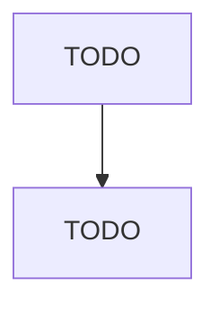

# Hog and Pig Farming

> TODO: Business-as-Code definition

## Overview

This industry comprises establishments primarily engaged in raising hogs and pigs. These establishments may include farming activities, such as breeding, farrowing, and the raising of weanling pigs, feeder pigs, or market size hogs. Cross-References.

## Actors

| Actor | Description |
|-------|-------------|
| TODO | TODO |

## Entities

| Entity | Description |
|--------|-------------|
| TODO | TODO |

## Actions

| Action | Description |
|--------|-------------|
| TODO | TODO |

## Events

| Event | Description |
|-------|-------------|
| TODO | TODO |

## Searches

| Search | Description |
|--------|-------------|
| TODO | TODO |

## Workflow

## Actor Relationships

