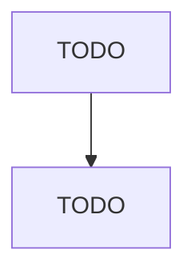

# Broilers and Other Meat Type Chicken Production

> TODO: Business-as-Code definition

## Overview

This industry comprises establishments primarily engaged in raising broilers, fryers, roasters, and other meat type chickens. Cross-References.

## Actors

| Actor | Description |
|-------|-------------|
| TODO | TODO |

## Entities

| Entity | Description |
|--------|-------------|
| TODO | TODO |

## Actions

| Action | Description |
|--------|-------------|
| TODO | TODO |

## Events

| Event | Description |
|-------|-------------|
| TODO | TODO |

## Searches

| Search | Description |
|--------|-------------|
| TODO | TODO |

## Workflow

## Actor Relationships

