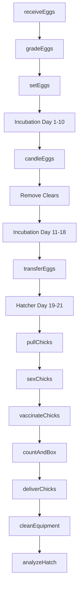
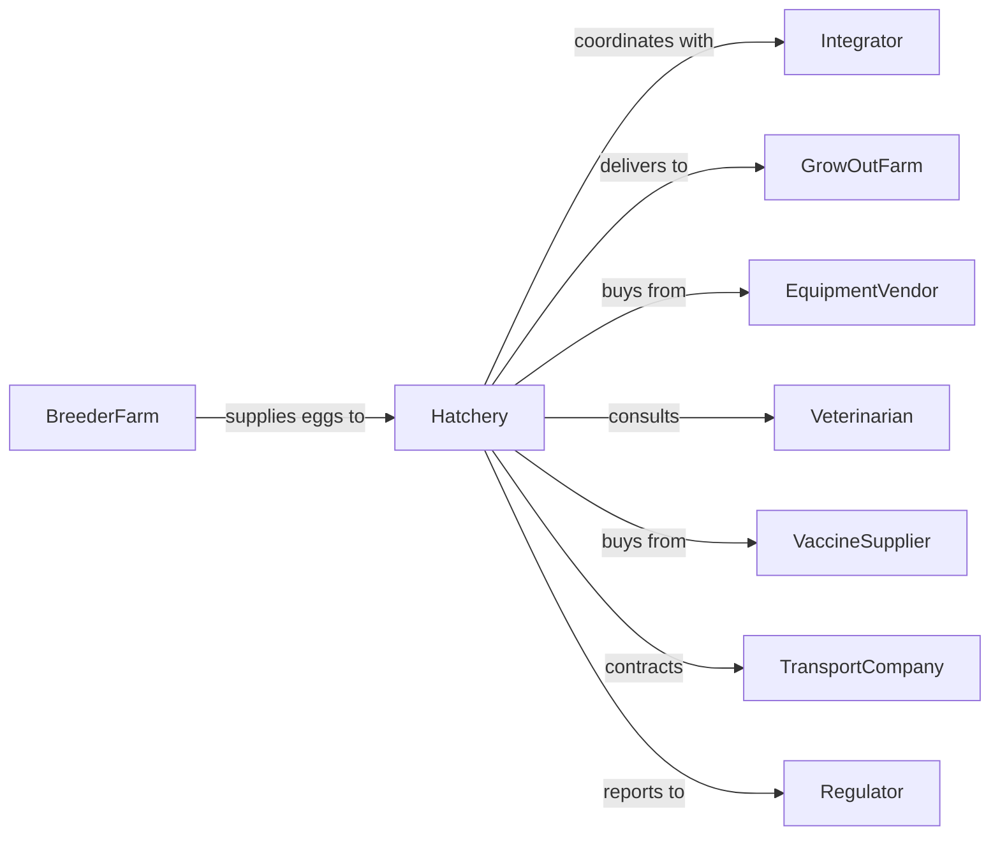

# Poultry Hatcheries

> Business-as-Code definition for poultry hatchery operations. Models the complete incubation cycle from egg receipt through chick delivery including setter management, hatcher operations, and live bird logistics.

## Overview

Poultry hatcheries incubate fertile eggs from breeder flocks and hatch day-old chicks, poults, or ducklings for grow-out operations. Hatcheries maintain precise environmental controls during the 21-day chicken or 28-day turkey incubation cycle. This definition exposes actions for egg handling, incubation management, and chick processing with events for automation and searches for production tracking.

## Actors

| Actor | Description |
|-------|-------------|
| BreederFarm | Supplies fertile eggs from parent stock |
| Integrator | Coordinates egg supply, hatching, and chick placement |
| GrowOutFarm | Receives day-old birds for raising |
| EquipmentVendor | Provides incubators, hatchers, and processing equipment |
| Veterinarian | Provides flock health services and vaccination programs |
| VaccineSupplier | Provides vaccines for in-ovo or spray application |
| TransportCompany | Delivers chicks to grow-out farms |
| Regulator | Oversees biosecurity and animal welfare compliance |

## Roles

| Role | Description |
|------|-------------|
| HatcheryManager | Oversees all hatchery operations and scheduling |
| SetterOperator | Manages incubators during setting phase |
| HatcherOperator | Manages hatchers during final incubation |
| ChickProcessor | Handles sexing, vaccination, and boxing |
| QualityTechnician | Monitors hatchability and chick quality metrics |
| MaintenanceTech | Maintains incubation equipment and HVAC systems |

## Entities

| Entity | Description |
|--------|-------------|
| FertileEgg | Egg from breeder flock for incubation |
| Setter | Incubator for first 18 days of chicken incubation |
| Hatcher | Cabinet for final 3 days including hatching |
| Chick | Day-old bird ready for delivery |
| Tray | Container holding eggs during incubation |
| Hatch | Group of eggs set on same date |
| Vaccine | Product applied in-ovo or post-hatch |
| ChickBox | Container for transporting day-old birds |
| BreederFlock | Source flock providing fertile eggs |
| IncubationProgram | Temperature and humidity settings by day |

## Actions

| Action | Description |
|--------|-------------|
| receiveEggs | Accept and inspect eggs from breeder farms |
| gradeEggs | Sort eggs by size, shell quality, and fertility |
| setEggs | Place eggs in setters to begin incubation |
| candleEggs | Inspect eggs for fertility and embryo development |
| transferEggs | Move eggs from setters to hatchers |
| pullChicks | Remove hatched chicks from hatcher cabinets |
| sexChicks | Separate males and females by vent or feather sexing |
| vaccinateChicks | Apply vaccines via spray, injection, or in-ovo |
| countAndBox | Place chicks in boxes for transport |
| deliverChicks | Transport day-old birds to grow-out farms |
| cleanEquipment | Sanitize trays, cabinets, and processing areas |
| analyzeHatch | Calculate hatchability and quality metrics |

## Events

| Event | Description |
|-------|-------------|
| eggsReceived | Fertile eggs arrived from breeder farm |
| eggsSet | Eggs placed in setters for incubation |
| candlingComplete | Fertility check finished, clears removed |
| eggsTransferred | Eggs moved to hatchers |
| hatchStarted | Chicks beginning to pip and emerge |
| chicksPulled | Chicks removed from hatchers |
| chicksSexed | Gender sorting completed |
| chicksVaccinated | Vaccination program applied |
| chicksShipped | Day-old birds dispatched to farms |
| hatchAnalyzed | Performance metrics calculated |
| biosecurityAlert | Contamination or disease risk detected |

## Searches

| Search | Description |
|--------|-------------|
| getHatchSchedule | List upcoming sets and expected pull dates |
| trackEggInventory | Get eggs on hand by breeder source and age |
| getHatchability | Retrieve hatch percentage by flock and date |
| findAvailableSetters | Query open setter capacity |
| getChickOrders | List customer orders for upcoming hatches |
| getQualityMetrics | Retrieve cull rates and chick quality scores |
| getBreederPerformance | Compare fertility and hatch by source flock |

## Workflow



## Actor Relationships



## Usage

### Calling Actions

```typescript
import { hatchPoultry } from '@headlessly/hatch-poultry'

const hatchery = hatchPoultry()

// Receive and grade eggs from breeder
const receipt = await hatchery.receiveEggs({
  breederFlockId: 'breeder-42',
  quantity: 50000,
  eggAge: 3,
  deliveryDate: new Date()
})

await hatchery.gradeEggs({
  receiptId: receipt.id,
  gradeStandards: ['size', 'shellQuality', 'shape']
})

// Set eggs for incubation
await hatchery.setEggs({
  eggLotId: receipt.id,
  setterId: 'setter-12',
  program: 'standard-broiler',
  quantity: 48500
})

// Deliver chicks to grow-out farm
await hatchery.deliverChicks({
  hatchId: 'hatch-2024-45',
  destinationFarmId: 'growout-farm-8',
  boxCount: 450,
  chicksPerBox: 100
})
```

### Event-Driven Automation

```typescript
// Auto-transfer eggs to hatchers
hatchery.candlingComplete(async ({ hatchId, fertilityRate, viableEggs }) => {
  const hatchers = await hatchery.findAvailableHatchers({
    capacity: viableEggs,
    date: addDays(new Date(), 8)
  })

  if (hatchers.length > 0) {
    await hatchery.transferEggs({
      hatchId,
      hatcherId: hatchers[0].id,
      quantity: viableEggs
    })
  }
})

// Quality alert on poor hatchability
hatchery.hatchAnalyzed(async ({ hatchId, hatchability, breederFlockId }) => {
  if (hatchability < 0.80) {
    await notifyQualityTeam({
      severity: 'high',
      hatchId,
      hatchability,
      breederFlockId,
      message: 'Hatchability below threshold'
    })

    await adjustBreederProgram({
      flockId: breederFlockId,
      issue: 'lowHatchability'
    })
  }
})
```

## Related

- [Chicken Egg Production](./112310-ChickenEggProduction.mdx)
- [Broilers and Other Meat Type Chicken Production](./112320-BroilersAndOtherMeatTypeChickenProduction.mdx)
- [Turkey Production](./112330-TurkeyProduction.mdx)
