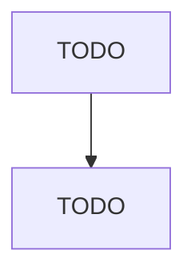

# Other Poultry Production

> TODO: Business-as-Code definition

## Overview

This industry comprises establishments primarily engaged in raising poultry (except chickens for meat or egg production and turkeys). Illustrative Examples: Duck production Ostrich production Emu production Pheasant production Geese production Quail production Cross-References. Establishments primarily engaged in--

## Actors

| Actor | Description |
|-------|-------------|
| TODO | TODO |

## Entities

| Entity | Description |
|--------|-------------|
| TODO | TODO |

## Actions

| Action | Description |
|--------|-------------|
| TODO | TODO |

## Events

| Event | Description |
|-------|-------------|
| TODO | TODO |

## Searches

| Search | Description |
|--------|-------------|
| TODO | TODO |

## Workflow

## Actor Relationships

