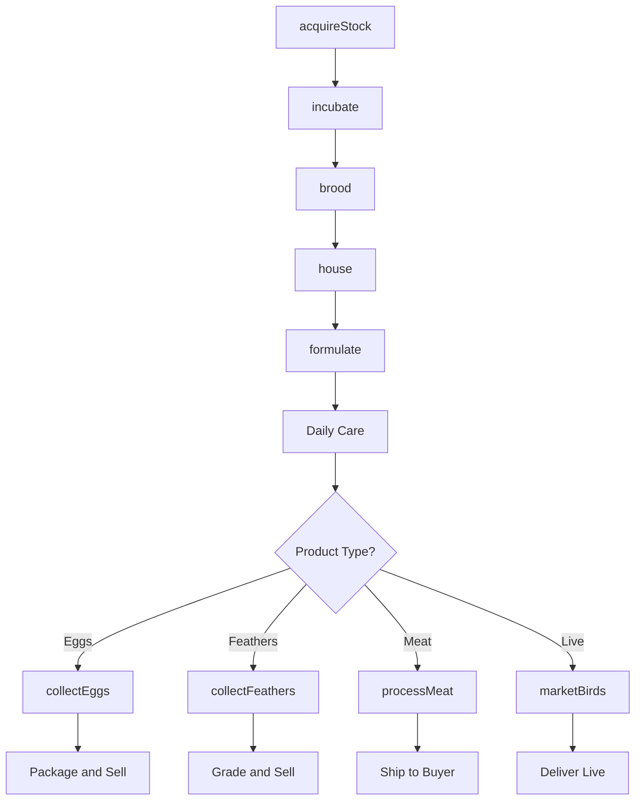
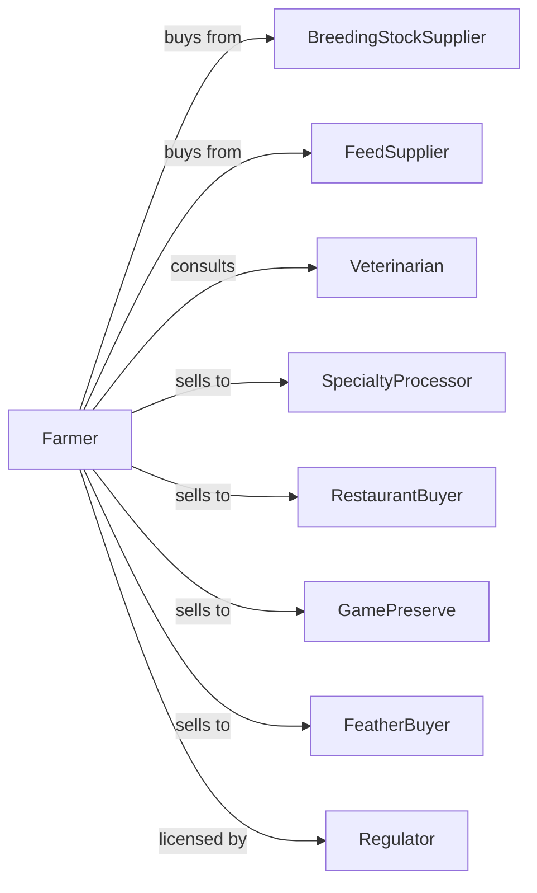

# Other Poultry Production

> Business-as-Code definition for specialty poultry production operations. Models raising ducks, geese, game birds, and ratites from breeding through market including species-specific housing and handling requirements.

## Overview

Other poultry production involves raising specialty birds including ducks, geese, pheasants, quail, emus, and ostriches for meat, eggs, feathers, or breeding stock. These niche operations serve specialty meat markets, game bird reserves, and exotic animal trades. This definition exposes actions for flock management, species-specific handling, and market coordination with events for automation and searches for production analytics.

## Actors

| Actor | Description |
|-------|-------------|
| BreedingStockSupplier | Provides fertile eggs or breeding pairs |
| FeedSupplier | Provides species-specific rations and supplements |
| Veterinarian | Provides avian health services and exotic bird expertise |
| SpecialtyProcessor | Slaughters and processes specialty poultry |
| RestaurantBuyer | Purchases premium specialty meat products |
| GamePreserve | Purchases game birds for hunting operations |
| FeatherBuyer | Purchases down, feathers, or plumes |
| Regulator | Oversees exotic animal permits and food safety |

## Roles

| Role | Description |
|------|-------------|
| FarmOwner | Owns operation and manages marketing strategy |
| FlockManager | Oversees daily bird care and breeding programs |
| Hatchery Technician | Manages incubation for various species |
| BirdHandler | Specializes in safe handling of large ratites |
| QualitySpecialist | Monitors product quality and grading |
| Bookkeeper | Manages finances, permits, and compliance |

## Entities

| Entity | Description |
|--------|-------------|
| Duck | Waterfowl raised for meat, eggs, or foie gras |
| Goose | Large waterfowl raised for meat or down |
| Pheasant | Game bird raised for meat or hunting release |
| Quail | Small game bird raised for meat or eggs |
| Emu | Large ratite raised for meat, oil, and leather |
| Ostrich | Giant ratite raised for meat, feathers, and leather |
| Flock | Group of birds raised together by species |
| Pen | Outdoor or indoor enclosure for birds |
| Incubator | Equipment for hatching species-specific eggs |
| Permit | Required license for exotic species |

## Actions

| Action | Description |
|--------|-------------|
| acquireStock | Purchase breeding pairs or fertile eggs |
| incubate | Hatch eggs with species-specific programs |
| brood | Provide intensive care for newly hatched birds |
| house | Place birds in appropriate pens or enclosures |
| formulate | Create species-specific feed rations |
| collectEggs | Gather eggs for consumption or hatching |
| collectFeathers | Harvest down, feathers, or plumes |
| processOil | Extract emu oil from fat deposits |
| vaccinate | Administer avian health protocols |
| marketBirds | Sell live birds for breeding or release |
| processMeat | Coordinate slaughter and butchering |
| maintainPermits | Renew exotic animal licenses and certifications |

## Events

| Event | Description |
|-------|-------------|
| stockAcquired | New breeding stock received |
| eggsHatched | Incubation cycle completed |
| birdsHoused | Birds placed in grow-out pens |
| eggsCollected | Daily egg collection completed |
| feathersHarvested | Down or feather collection completed |
| birdsMarketReady | Flock reached target weight or age |
| birdsShipped | Live birds or processed meat dispatched |
| permitRenewed | Exotic animal license updated |
| healthIssueDetected | Disease or injury identified |
| buyerContracted | Sale agreement finalized |

## Searches

| Search | Description |
|--------|-------------|
| getFlockInventory | List birds by species, age, and pen |
| trackGrowth | Get weight and development metrics |
| getEggProduction | Retrieve laying rates by species |
| findBuyers | List specialty meat and live bird buyers |
| getPermitStatus | Check license expiration and requirements |
| getHealthRecords | Retrieve vaccination and treatment history |
| getMarketPrices | Query current specialty poultry pricing |
| getFeatherInventory | Track harvested feathers and down |

## Workflow



## Actor Relationships



## Usage

### Calling Actions

```typescript
import { raisePoultry } from '@headlessly/raise-poultry'

const farm = raisePoultry()

// Acquire breeding stock for pheasant operation
const stock = await farm.acquireStock({
  species: 'pheasant',
  breed: 'ring-necked',
  quantity: 50,
  type: 'breedingPairs',
  source: 'midwest-game-birds'
})

// Incubate eggs with species-specific program
await farm.incubate({
  species: 'pheasant',
  eggCount: 500,
  program: 'pheasant-24-day',
  incubatorId: 'incubator-3'
})

// Market birds to game preserve
await farm.marketBirds({
  species: 'pheasant',
  quantity: 2000,
  buyerId: 'rolling-hills-preserve',
  deliveryDate: new Date('2024-09-15'),
  purpose: 'hunting-release'
})
```

### Event-Driven Automation

```typescript
// Auto-notify buyers when birds reach market readiness
farm.birdsMarketReady(async ({ species, quantity, avgWeight, penId }) => {
  const buyers = await farm.findBuyers({
    species,
    minQuantity: quantity,
    productType: 'live'
  })

  for (const buyer of buyers) {
    await notifyBuyer({
      buyerId: buyer.id,
      availability: {
        species,
        quantity,
        avgWeight,
        availableDate: new Date()
      }
    })
  }
})

// Permit renewal reminder
farm.permitRenewed(async ({ permitId, expirationDate }) => {
  const daysUntilExpiry = daysBetween(new Date(), expirationDate)

  if (daysUntilExpiry <= 60) {
    await scheduleRenewal({
      permitId,
      reminderDate: subtractDays(expirationDate, 45)
    })
  }
})
```

## Related

- [Chicken Egg Production](./112310-ChickenEggProduction.mdx)
- [Turkey Production](./112330-TurkeyProduction.mdx)
- [Hunting and Trapping](../../114-FishingHuntingAndTrapping/1142-HuntingAndTrapping/114210-HuntingAndTrapping.mdx)
