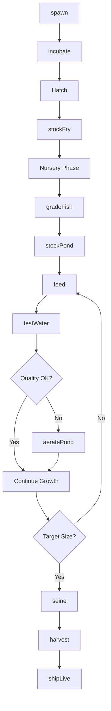
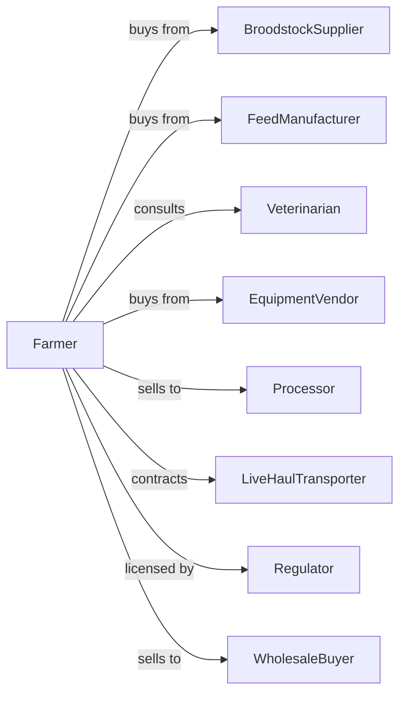

# Finfish Farming and Fish Hatcheries

> Business-as-Code definition for finfish aquaculture operations. Models the complete production cycle from broodstock management through harvest including hatchery operations, grow-out, and live fish sales.

## Overview

Finfish farming involves raising fish species including catfish, trout, salmon, tilapia, and ornamental fish in controlled aquatic environments. Operations span hatcheries producing fry and fingerlings to grow-out facilities raising market-size fish. This definition exposes actions for water quality management, feeding protocols, and harvest coordination with events for automation and searches for production analytics.

## Actors

| Actor | Description |
|-------|-------------|
| BroodstockSupplier | Provides breeding fish or fertilized eggs |
| FeedManufacturer | Supplies species-specific aquaculture feeds |
| Veterinarian | Provides fish health services and disease management |
| EquipmentVendor | Sells tanks, aerators, and monitoring systems |
| Processor | Purchases and processes market-size fish |
| LiveHaulTransporter | Moves live fish between facilities |
| Regulator | Oversees permits, water quality, and food safety |
| WholesaleBuyer | Purchases fish for distribution or retail |

## Roles

| Role | Description |
|------|-------------|
| FarmManager | Oversees all aquaculture operations and planning |
| HatcheryTechnician | Manages spawning, incubation, and fry rearing |
| PondManager | Maintains grow-out ponds and water systems |
| FeedingTechnician | Manages feeding schedules and nutrition |
| QualityController | Monitors water quality and fish health |
| HarvestCrew | Seines, grades, and loads fish for sale |

## Entities

| Entity | Description |
|--------|-------------|
| Broodstock | Mature fish maintained for breeding |
| Egg | Fertilized fish egg in incubation |
| Fry | Newly hatched fish in early development |
| Fingerling | Juvenile fish ready for stocking |
| MarketFish | Fish at harvestable size |
| Pond | Earthen impoundment for grow-out |
| Raceway | Flow-through concrete channel for trout |
| Tank | Recirculating system container |
| Feed | Formulated ration for fish nutrition |
| WaterQuality | Parameters including oxygen, pH, and temperature |
| Harvest | Batch of fish removed for sale |

## Actions

| Action | Description |
|--------|-------------|
| spawn | Induce breeding and collect fertilized eggs |
| incubate | Maintain eggs through hatching |
| stockFry | Transfer fry to nursery systems |
| gradeFish | Sort fish by size for uniform stocking |
| stockPond | Place fingerlings in grow-out facility |
| feed | Distribute feed according to schedule and biomass |
| aeratePond | Operate aerators to maintain oxygen levels |
| testWater | Measure quality parameters and record data |
| treat | Apply therapeutics for disease or parasites |
| seine | Net fish from pond for harvest or transfer |
| harvest | Remove market-size fish for processing |
| shipLive | Transport live fish to buyer or facility |

## Events

| Event | Description |
|-------|-------------|
| spawned | Breeding completed and eggs collected |
| eggsHatched | Fry emerged from incubation |
| fryStocked | Young fish placed in nursery |
| pondStocked | Fingerlings added to grow-out facility |
| feedingComplete | Daily feeding cycle finished |
| waterQualityAlert | Parameters outside acceptable range |
| diseaseDetected | Fish health issue identified |
| targetSizeReached | Fish at market weight |
| harvestComplete | Fish removed and loaded for transport |
| shipmentDelivered | Live fish arrived at destination |
| permitRenewed | Regulatory license updated |

## Searches

| Search | Description |
|--------|-------------|
| getPondInventory | List fish counts by pond, species, and size |
| trackGrowthRate | Get weight gain and feed conversion metrics |
| getWaterQualityLogs | Retrieve parameter readings by facility |
| findBuyers | List processors and live buyers with pricing |
| getHatcherySchedule | View spawning and stocking calendar |
| getHealthRecords | Retrieve disease history and treatments |
| getFeedInventory | Check feed on hand by type |
| getHarvestForecast | Project harvest dates by pond |

## Workflow



## Actor Relationships



## Usage

### Calling Actions

```typescript
import { farmFinfish } from '@headlessly/farm-finfish'

const farm = farmFinfish()

// Spawn broodstock catfish
const spawn = await farm.spawn({
  species: 'channel-catfish',
  broodstockPairCount: 20,
  spawningPondId: 'spawn-pond-1',
  date: new Date()
})

// Stock fingerlings in grow-out pond
await farm.stockPond({
  pondId: 'pond-15',
  fingerlingSource: 'hatchery-batch-42',
  count: 50000,
  avgWeight: 0.1,
  stockingDate: new Date()
})

// Harvest market-size fish
const harvest = await farm.harvest({
  pondId: 'pond-15',
  targetPounds: 25000,
  processorId: 'delta-catfish',
  harvestDate: new Date()
})
```

### Event-Driven Automation

```typescript
// Auto-aerate on low oxygen
farm.waterQualityAlert(async ({ pondId, parameter, value, threshold }) => {
  if (parameter === 'dissolvedOxygen' && value < threshold) {
    await farm.aeratePond({
      pondId,
      intensity: 'high',
      duration: 'untilNormal'
    })

    await notifyPondManager({
      alert: 'lowOxygen',
      pondId,
      currentLevel: value,
      threshold
    })
  }
})

// Schedule harvest when target reached
farm.targetSizeReached(async ({ pondId, avgWeight, biomass }) => {
  const buyers = await farm.findBuyers({
    species: 'catfish',
    minQuantity: biomass
  })

  if (buyers.length > 0) {
    await farm.harvest({
      pondId,
      targetPounds: biomass,
      processorId: buyers[0].id,
      harvestDate: addDays(new Date(), 3)
    })
  }
})
```

## Related

- [Shellfish Farming](./112512-ShellfishFarming.mdx)
- [Other Aquaculture](./112519-OtherAquaculture.mdx)
- [Finfish Fishing](../../114-FishingHuntingAndTrapping/1141-Fishing/114111-FinfishFishing.mdx)
