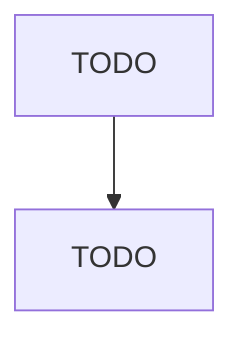

# Apiculture

> TODO: Business-as-Code definition

## Overview

This industry comprises establishments primarily engaged in raising bees. These establishments may collect and gather honey; and/or sell queen bees, packages of bees, royal jelly, bees' wax, propolis, venom, pollen, and/or other bee products.

## Actors

| Actor | Description |
|-------|-------------|
| TODO | TODO |

## Entities

| Entity | Description |
|--------|-------------|
| TODO | TODO |

## Actions

| Action | Description |
|--------|-------------|
| TODO | TODO |

## Events

| Event | Description |
|-------|-------------|
| TODO | TODO |

## Searches

| Search | Description |
|--------|-------------|
| TODO | TODO |

## Workflow

## Actor Relationships

