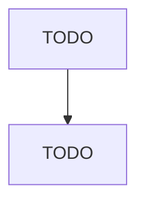

# Fur-Bearing Animal and Rabbit Production

> TODO: Business-as-Code definition

## Overview

This industry comprises establishments primarily engaged in raising fur-bearing animals including rabbits. These animals may be raised for sale or for their pelt production. Cross-References.

## Actors

| Actor | Description |
|-------|-------------|
| TODO | TODO |

## Entities

| Entity | Description |
|--------|-------------|
| TODO | TODO |

## Actions

| Action | Description |
|--------|-------------|
| TODO | TODO |

## Events

| Event | Description |
|-------|-------------|
| TODO | TODO |

## Searches

| Search | Description |
|--------|-------------|
| TODO | TODO |

## Workflow

## Actor Relationships

