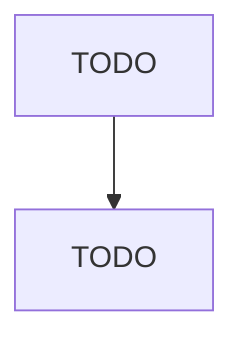
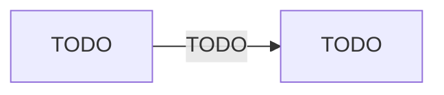

# All Other Animal Production

> TODO: Business-as-Code definition

## Overview

This industry comprises establishments primarily engaged in (1) raising animals (except cattle, hogs and pigs, poultry, sheep and goats, aquaculture, apiculture, horses and other equines; and fur-bearing animals including rabbits) or (2) raising a combination of animals, with no one animal or family of animals accounting for one-half of the establishment's agricultural production (i.e., value of animals for market). Illustrative Examples: Bird production (e.g., canaries, parakeets, parrots) Labo

## Actors

| Actor | Description |
|-------|-------------|
| TODO | TODO |

## Entities

| Entity | Description |
|--------|-------------|
| TODO | TODO |

## Actions

| Action | Description |
|--------|-------------|
| TODO | TODO |

## Events

| Event | Description |
|-------|-------------|
| TODO | TODO |

## Searches

| Search | Description |
|--------|-------------|
| TODO | TODO |

## Workflow

## Actor Relationships

