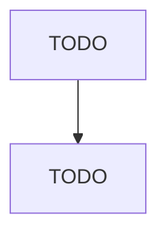

# Forest Nurseries and Gathering of Forest Products

> TODO: Business-as-Code definition

## Overview

This industry comprises establishments primarily engaged in (1) growing trees for reforestation and/or (2) gathering forest products, such as gums, barks, balsam needles, rhizomes, fibers, Spanish moss, ginseng, and truffles. Cross-References. Establishments primarily engaged in--

## Actors

| Actor | Description |
|-------|-------------|
| TODO | TODO |

## Entities

| Entity | Description |
|--------|-------------|
| TODO | TODO |

## Actions

| Action | Description |
|--------|-------------|
| TODO | TODO |

## Events

| Event | Description |
|-------|-------------|
| TODO | TODO |

## Searches

| Search | Description |
|--------|-------------|
| TODO | TODO |

## Workflow

## Actor Relationships

