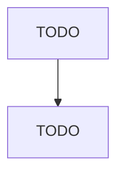

# Finfish Fishing

> TODO: Business-as-Code definition

## Overview

This U.S. industry comprises establishments primarily engaged in the commercial catching or taking of finfish (e.g., bluefish, salmon, trout, tuna) from their natural habitat. Cross-References. Establishments primarily engaged in--

## Actors

| Actor | Description |
|-------|-------------|
| TODO | TODO |

## Entities

| Entity | Description |
|--------|-------------|
| TODO | TODO |

## Actions

| Action | Description |
|--------|-------------|
| TODO | TODO |

## Events

| Event | Description |
|-------|-------------|
| TODO | TODO |

## Searches

| Search | Description |
|--------|-------------|
| TODO | TODO |

## Workflow

## Actor Relationships

