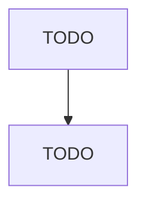

# Hunting and Trapping

> TODO: Business-as-Code definition

## Overview

This industry comprises establishments primarily engaged in one or more of the following: (1) commercial hunting and trapping; (2) operating commercial game preserves, such as game retreats; and (3) operating hunting preserves. Cross-References. Establishments primarily engaged in--

## Actors

| Actor | Description |
|-------|-------------|
| TODO | TODO |

## Entities

| Entity | Description |
|--------|-------------|
| TODO | TODO |

## Actions

| Action | Description |
|--------|-------------|
| TODO | TODO |

## Events

| Event | Description |
|-------|-------------|
| TODO | TODO |

## Searches

| Search | Description |
|--------|-------------|
| TODO | TODO |

## Workflow

## Actor Relationships

