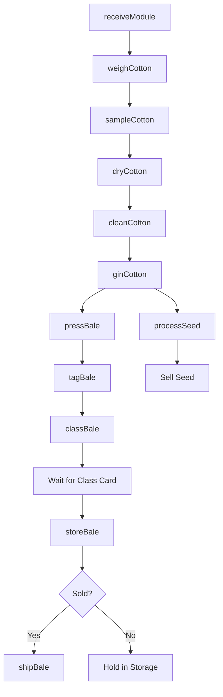
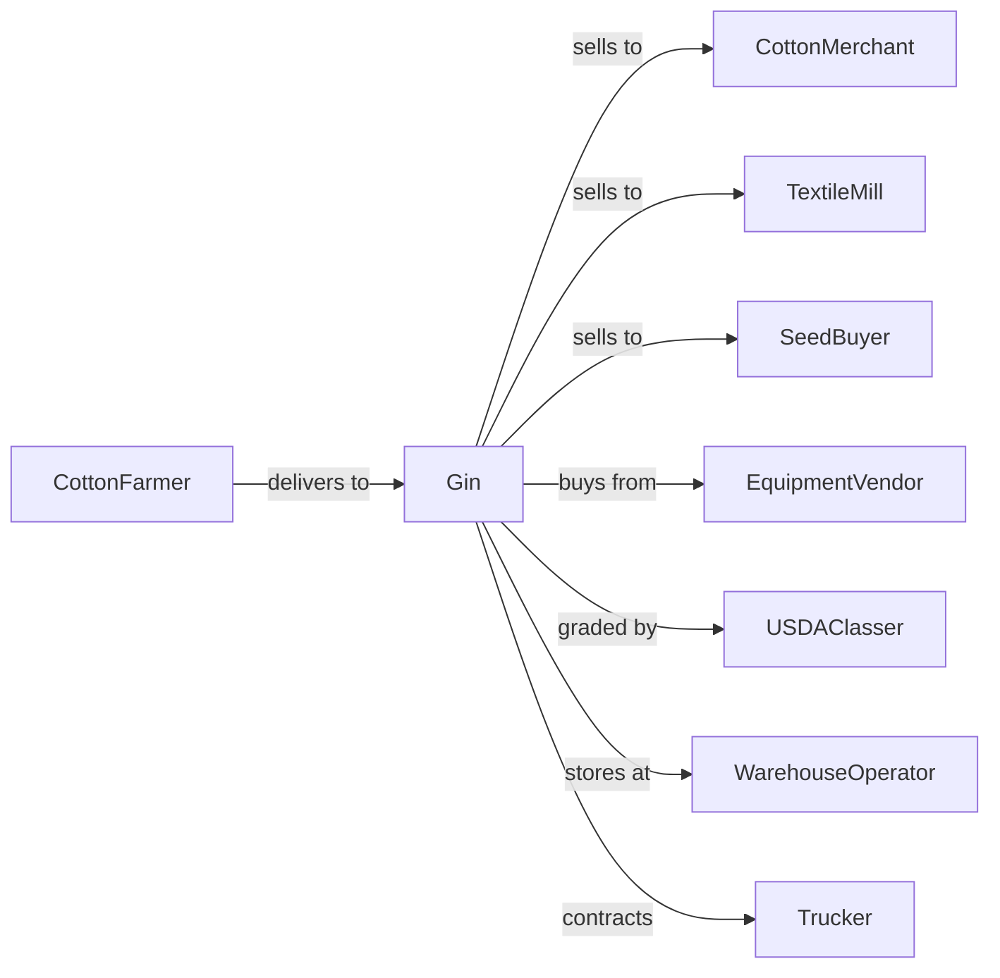

# Cotton Ginning

> Business-as-Code definition for cotton ginning operations. Models the complete ginning process from seed cotton receipt through bale delivery including fiber separation, cleaning, and quality grading.

## Overview

Cotton ginning separates lint cotton from cottonseed and prepares it for sale to textile mills. Gins receive seed cotton from farmers during harvest, process it through cleaning and separation equipment, press the lint into bales, and ship to buyers. This definition exposes actions for cotton processing, quality management, and logistics coordination with events for automation and searches for production analytics.

## Actors

| Actor | Description |
|-------|-------------|
| CottonFarmer | Delivers seed cotton for ginning |
| CottonMerchant | Purchases ginned cotton bales |
| TextileMill | End buyer of cotton lint |
| SeedBuyer | Purchases cottonseed for crushing |
| EquipmentVendor | Sells and services ginning equipment |
| USDAClasser | Grades cotton quality |
| WarehouseOperator | Stores bales before shipment |
| Trucker | Transports cotton to buyers |

## Roles

| Role | Description |
|------|-------------|
| GinOwner | Owns ginning facility and sets pricing |
| GinManager | Oversees daily operations |
| ReceivingClerk | Weighs and samples incoming cotton |
| GinStandOperator | Operates separation equipment |
| PressTender | Operates baling press |
| QualityTech | Monitors fiber quality |

## Entities

| Entity | Description |
|--------|-------------|
| SeedCotton | Raw cotton with seeds and lint |
| Lint | Separated cotton fiber |
| Cottonseed | Seed separated during ginning |
| Bale | Compressed package of lint cotton |
| Module | Large bulk container of seed cotton |
| GinStand | Equipment that separates lint from seed |
| BalePress | Machine that compresses lint into bales |
| Sample | Portion taken for quality testing |
| ClassCard | USDA quality grade certificate |
| GinTicket | Receipt for delivered cotton |

## Actions

| Action | Description |
|--------|-------------|
| receiveModule | Accept seed cotton delivery |
| weighCotton | Determine weight of incoming cotton |
| sampleCotton | Take sample for quality testing |
| dryCotton | Reduce moisture content |
| cleanCotton | Remove trash and foreign matter |
| ginCotton | Separate lint from seed |
| pressBale | Compress lint into standard bale |
| tagBale | Apply identification and tracking |
| classBale | Submit for USDA quality grading |
| storeBale | Hold in warehouse until sale |
| shipBale | Deliver to buyer or warehouse |
| processSeed | Handle cottonseed for sale |

## Events

| Event | Description |
|-------|-------------|
| moduleReceived | Seed cotton delivered |
| cottonWeighed | Weight recorded |
| sampleTaken | Quality sample collected |
| cottonGinned | Lint separated |
| balePressed | Bale completed |
| baleTagged | Identification applied |
| classCardReceived | USDA grade certified |
| baleShipped | Bale delivered to buyer |
| seedSold | Cottonseed transaction completed |
| seasonComplete | Harvest ginning finished |
| equipmentMaintenance | Scheduled service completed |

## Searches

| Search | Description |
|--------|-------------|
| getBaleInventory | List bales by owner and status |
| trackGinTickets | Get farmer delivery records |
| getClassResults | Retrieve USDA grades |
| findBuyers | List cotton merchants and mills |
| getSeasonStats | Retrieve volume and quality metrics |
| getSeedInventory | Check cottonseed on hand |
| getEquipmentStatus | Monitor gin stand condition |
| getPricingHistory | Review past lint prices |

## Workflow



## Actor Relationships



## Usage

### Calling Actions

```typescript
import { ginCotton } from '@headlessly/gin-cotton'

const gin = ginCotton()

// Receive cotton module from farmer
const receipt = await gin.receiveModule({
  farmerId: 'farmer-johnson',
  moduleId: 'module-2024-0542',
  fieldId: 'north-40',
  estimatedWeight: 25000 // pounds
})

// Weigh and sample
const weight = await gin.weighCotton({
  moduleId: receipt.moduleId,
  tareWeight: 2500
})

await gin.sampleCotton({
  moduleId: receipt.moduleId,
  sampleType: 'HVI'
})

// Gin and bale
await gin.ginCotton({
  moduleId: receipt.moduleId,
  ginStandId: 'stand-3'
})

const bale = await gin.pressBale({
  moduleId: receipt.moduleId,
  baleNumber: 'bale-2024-1542',
  targetWeight: 500
})

// Submit for classing
await gin.classBale({
  baleId: bale.id,
  classOffice: 'memphis-usda'
})
```

### Event-Driven Automation

```typescript
// Auto-notify farmer when class results received
gin.classCardReceived(async ({ baleId, grade, staple, strength }) => {
  const bale = await gin.getBale({ baleId })

  await notifyFarmer({
    farmerId: bale.farmerId,
    baleId,
    grade,
    staple,
    strength,
    message: 'Your cotton has been classed'
  })
})

// Auto-ship when buyer requests
gin.baleTagged(async ({ baleId, farmerId }) => {
  const standing Orders = await gin.getStandingOrders({ farmerId })

  if (standingOrders.autoShip) {
    await gin.shipBale({
      baleId,
      buyerId: standingOrders.defaultBuyer,
      shippingDate: addDays(new Date(), 3)
    })
  }
})
```

## Related

- [Cotton Farming](../../111-CropProduction/1119-OtherCropFarming/111920-CottonFarming.mdx)
- [Postharvest Crop Activities](./115114-PostharvestCropActivitiesExceptCottonGinning.mdx)
