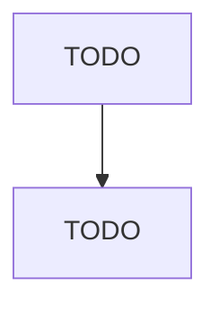

# Soil Preparation, Planting, and Cultivating

> TODO: Business-as-Code definition

## Overview

This U.S. industry comprises establishments primarily engaged in performing a soil preparation activity or crop production service, such as plowing, fertilizing, seed bed preparation, planting, cultivating, and crop protecting services. Cross-References. Establishments primarily engaged in--

## Actors

| Actor | Description |
|-------|-------------|
| TODO | TODO |

## Entities

| Entity | Description |
|--------|-------------|
| TODO | TODO |

## Actions

| Action | Description |
|--------|-------------|
| TODO | TODO |

## Events

| Event | Description |
|-------|-------------|
| TODO | TODO |

## Searches

| Search | Description |
|--------|-------------|
| TODO | TODO |

## Workflow

## Actor Relationships

