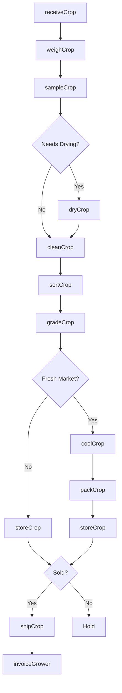
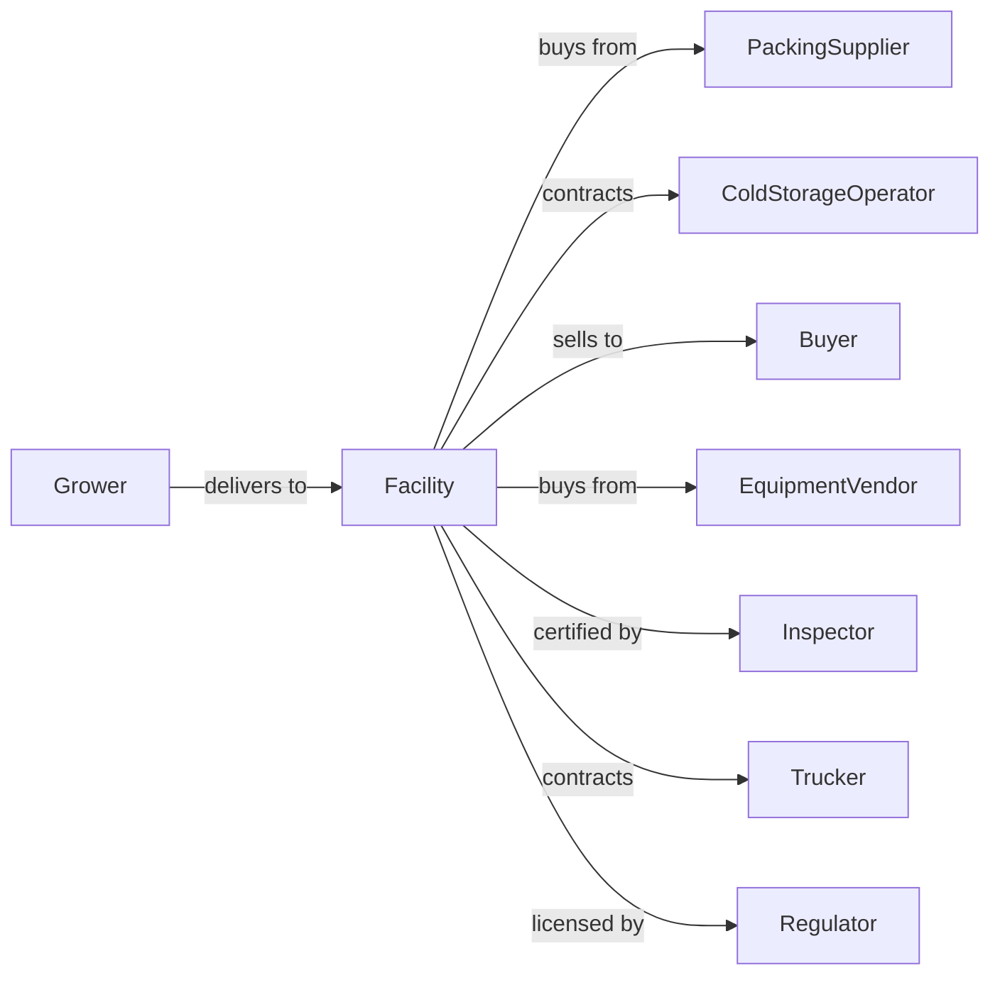

# Postharvest Crop Activities (except Cotton Ginning)

> Business-as-Code definition for postharvest crop processing operations. Models contract services for cleaning, drying, grading, packing, cooling, and preparing crops for market.

## Overview

Postharvest crop activities prepare harvested commodities for storage, transport, and sale. Services include grain drying, cleaning, and conditioning; fruit and vegetable cooling, sorting, grading, and packing; nut hulling and drying; and tobacco curing. These operations bridge the gap between field harvest and market delivery. This definition exposes actions for crop processing, quality assessment, and inventory management with events for automation and searches for production analytics.

## Actors

| Actor | Description |
|-------|-------------|
| Grower | Delivers harvested crops for processing |
| PackingSupplier | Provides boxes, bags, and packaging materials |
| ColdStorageOperator | Provides refrigerated storage facilities |
| Buyer | Purchases processed and graded crops |
| EquipmentVendor | Sells and services processing equipment |
| Inspector | Grades and certifies crop quality |
| Trucker | Transports processed crops to market |
| Regulator | Oversees food safety and grading standards |

## Roles

| Role | Description |
|------|-------------|
| FacilityOwner | Owns postharvest processing facility |
| OperationsManager | Oversees daily processing activities |
| GradingTechnician | Sorts and grades crops by quality |
| PackingLineWorker | Operates packing and processing equipment |
| QualityController | Monitors product quality and safety |
| InventoryClerk | Tracks crop receipts and shipments |

## Entities

| Entity | Description |
|--------|-------------|
| CropLot | Batch of harvested crop for processing |
| ReceiptTicket | Document for incoming crop delivery |
| GrainDryer | Equipment for reducing moisture content |
| SortingLine | Equipment for separating by size and quality |
| PackingLine | Equipment for boxing and labeling |
| Cooler | Refrigerated room for temperature management |
| GradeCard | Quality assessment certificate |
| PackagedUnit | Finished product ready for sale |
| StorageBin | Container for holding processed crop |
| ShipmentOrder | Document for outbound delivery |

## Actions

| Action | Description |
|--------|-------------|
| receiveCrop | Accept harvested crop delivery |
| weighCrop | Determine weight of incoming lot |
| sampleCrop | Take sample for quality assessment |
| dryCrop | Reduce moisture for safe storage |
| cleanCrop | Remove debris and foreign material |
| sortCrop | Separate by size, color, or quality |
| gradeCrop | Assign quality grade to lot |
| packCrop | Place in containers for market |
| coolCrop | Reduce temperature for preservation |
| storeCrop | Hold in appropriate conditions |
| shipCrop | Dispatch to buyer or market |
| invoiceGrower | Bill for processing services |

## Events

| Event | Description |
|-------|-------------|
| cropReceived | Delivery accepted at facility |
| cropWeighed | Weight recorded |
| cropSampled | Quality sample collected |
| cropDried | Moisture reduction completed |
| cropCleaned | Cleaning process finished |
| cropSorted | Sorting completed |
| cropGraded | Quality grade assigned |
| cropPacked | Packaging completed |
| cropCooled | Temperature target achieved |
| cropStored | Placed in storage |
| cropShipped | Dispatched to destination |
| invoiceSent | Processing bill transmitted |

## Searches

| Search | Description |
|--------|-------------|
| getLotStatus | Track processing status of crop lots |
| getInventory | View crops in storage by type and grade |
| findGrowers | List active grower accounts |
| getGradeResults | Retrieve quality assessments |
| getCapacity | Check available processing and storage space |
| getShipmentSchedule | View upcoming outbound deliveries |
| getPriceByGrade | Get current market prices by quality |
| getProcessingHistory | Retrieve past lot records |

## Workflow



## Actor Relationships



## Usage

### Calling Actions

```typescript
import { processHarvestedCrops } from '@headlessly/process-harvested-crops'

const facility = processHarvestedCrops()

// Receive apple delivery from grower
const receipt = await facility.receiveCrop({
  growerId: 'orchard-hill-farms',
  crop: 'apples',
  variety: 'honeycrisp',
  estimatedWeight: 40000, // pounds
  fieldId: 'block-7'
})

// Weigh and sample
const weight = await facility.weighCrop({
  lotId: receipt.lotId,
  tareWeight: 12000
})

await facility.sampleCrop({
  lotId: receipt.lotId,
  tests: ['brix', 'pressure', 'defects']
})

// Sort and grade
await facility.sortCrop({
  lotId: receipt.lotId,
  criteria: ['size', 'color', 'defects']
})

const grade = await facility.gradeCrop({
  lotId: receipt.lotId,
  standard: 'usda-fancy'
})

// Pack for fresh market
await facility.coolCrop({
  lotId: receipt.lotId,
  targetTemp: 34 // degrees F
})

await facility.packCrop({
  lotId: receipt.lotId,
  container: 'bushel-tray-pack',
  label: 'premium-honeycrisp'
})
```

### Event-Driven Automation

```typescript
// Auto-cool fresh produce after grading
facility.cropGraded(async ({ lotId, crop, grade }) => {
  const freshMarketCrops = ['apples', 'peaches', 'berries', 'lettuce']

  if (freshMarketCrops.includes(crop)) {
    await facility.coolCrop({
      lotId,
      targetTemp: getCoolTemp(crop),
      method: 'forced-air'
    })
  }
})

// Alert grower on low grade
facility.cropGraded(async ({ lotId, growerId, grade, expectedGrade }) => {
  if (grade < expectedGrade) {
    await notifyGrower({
      growerId,
      lotId,
      actualGrade: grade,
      expectedGrade,
      message: 'Lot graded below expectations, review recommended'
    })
  }
})
```

## Related

- [Crop Harvesting, Primarily by Machine](./115113-CropHarvestingPrimarilyByMachine.mdx)
- [Cotton Ginning](./115111-CottonGinning.mdx)
