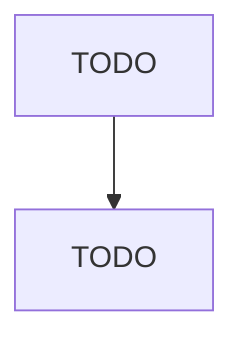

# Postharvest Crop Activities (except Cotton Ginning)

> TODO: Business-as-Code definition

## Overview

This U.S. industry comprises establishments primarily engaged in performing services on crops, subsequent to their harvest, with the intent of preparing them for market or further processing. These establishments provide postharvest activities, such as crop cleaning, sun drying, shelling, fumigating, curing, sorting, grading, packing, and cooling. Cross-References. Establishments primarily engaged in--

## Actors

| Actor | Description |
|-------|-------------|
| TODO | TODO |

## Entities

| Entity | Description |
|--------|-------------|
| TODO | TODO |

## Actions

| Action | Description |
|--------|-------------|
| TODO | TODO |

## Events

| Event | Description |
|-------|-------------|
| TODO | TODO |

## Searches

| Search | Description |
|--------|-------------|
| TODO | TODO |

## Workflow

## Actor Relationships

