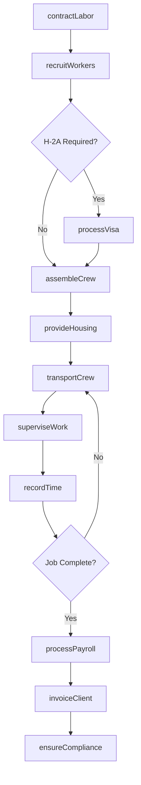
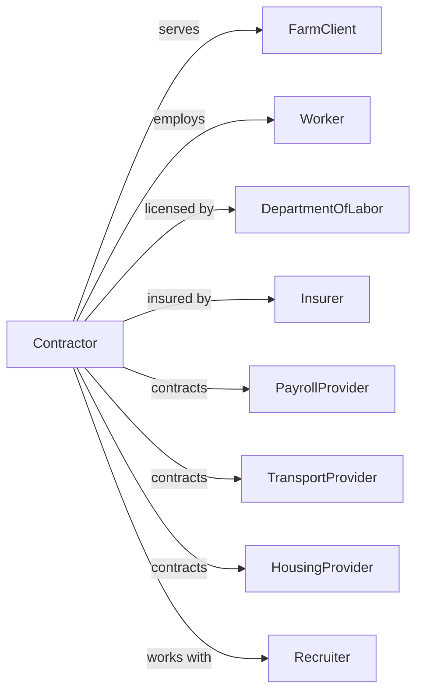

# Farm Labor Contractors and Crew Leaders

> Business-as-Code definition for farm labor contracting operations. Models the recruitment, management, and deployment of agricultural workers for farm clients including payroll, transportation, and compliance.

## Overview

Farm labor contractors supply temporary and seasonal agricultural workers to farms for planting, cultivation, and harvest operations. Contractors recruit workers, handle payroll and benefits, provide transportation, and ensure regulatory compliance including H-2A visa programs. This definition exposes actions for workforce management, client services, and compliance tracking with events for automation and searches for operational analytics.

## Actors

| Actor | Description |
|-------|-------------|
| FarmClient | Hires labor crews for agricultural work |
| Worker | Performs agricultural labor tasks |
| DepartmentOfLabor | Oversees labor laws and H-2A program |
| Insurer | Provides workers compensation coverage |
| PayrollProvider | Processes wages and tax withholdings |
| TransportProvider | Supplies vehicles for worker transport |
| HousingProvider | Offers worker housing facilities |
| Recruiter | Sources workers for employment |

## Roles

| Role | Description |
|------|-------------|
| LaborContractor | Owns contracting business and holds licenses |
| CrewLeader | Supervises work crews in the field |
| FieldSupervisor | Coordinates multiple crews across sites |
| PayrollClerk | Processes timesheets and wages |
| ComplianceOfficer | Ensures regulatory adherence |
| TransportDriver | Transports workers to job sites |

## Entities

| Entity | Description |
|--------|-------------|
| LaborContract | Agreement with farm client for workers |
| WorkCrew | Group of workers assigned to a job |
| Worker | Individual employed for agricultural work |
| Timesheet | Record of hours worked |
| Paycheck | Worker wage payment |
| H2AVisa | Temporary agricultural worker visa |
| Housing | Accommodations for seasonal workers |
| Vehicle | Transportation for work crews |
| License | Farm labor contractor registration |
| Insurance | Workers compensation and liability coverage |

## Actions

| Action | Description |
|--------|-------------|
| recruitWorkers | Source and screen agricultural workers |
| processVisa | Handle H-2A visa applications |
| contractLabor | Establish agreement with farm client |
| assembleCrew | Assign workers to job site |
| transportCrew | Move workers to and from fields |
| superviseWork | Oversee crew performance in field |
| recordTime | Track worker hours and tasks |
| processPayroll | Calculate wages and deductions |
| provideHousing | Arrange worker accommodations |
| ensureCompliance | Verify adherence to labor regulations |
| invoiceClient | Bill farm for labor services |
| resolveDispute | Handle worker or client issues |

## Events

| Event | Description |
|-------|-------------|
| workersRecruited | New workers added to roster |
| visaApproved | H-2A authorization received |
| contractSigned | Client agreement executed |
| crewAssembled | Workers assigned to job |
| crewTransported | Workers delivered to site |
| workCompleted | Daily or job tasks finished |
| timeRecorded | Hours logged for payroll |
| payrollProcessed | Wages calculated and paid |
| housingProvided | Workers accommodated |
| complianceVerified | Regulatory check completed |
| invoiceSent | Client bill transmitted |
| disputeResolved | Issue settled |

## Searches

| Search | Description |
|--------|-------------|
| getWorkerRoster | List available workers by skill and status |
| getCrewAssignments | View current crew deployments |
| findClients | List active farm customers |
| getTimesheets | Retrieve worker hours by period |
| getPayrollSummary | Review wages paid by period |
| getVisaStatus | Check H-2A application progress |
| getComplianceStatus | Review regulatory standing |
| getHousingAvailability | Check worker housing capacity |

## Workflow



## Actor Relationships



## Usage

### Calling Actions

```typescript
import { supplyFarmLabor } from '@headlessly/supply-farm-labor'

const contractor = supplyFarmLabor()

// Establish labor contract with farm
const contract = await contractor.contractLabor({
  clientId: 'valley-orchards',
  jobType: 'apple-harvest',
  workersNeeded: 50,
  startDate: new Date('2024-09-15'),
  endDate: new Date('2024-10-31'),
  ratePerHour: 18.50
})

// Recruit and assemble crew
await contractor.recruitWorkers({
  contractId: contract.id,
  skills: ['tree-fruit-picking'],
  quantity: 50,
  source: 'h2a-program'
})

const crew = await contractor.assembleCrew({
  contractId: contract.id,
  crewSize: 25,
  crewLeaderId: 'leader-garcia'
})

// Deploy crew to field
await contractor.transportCrew({
  crewId: crew.id,
  destination: 'valley-orchards-block-12',
  departureTime: new Date('2024-09-15T06:00:00')
})

// Track and process work
await contractor.recordTime({
  crewId: crew.id,
  date: new Date(),
  hoursWorked: 9,
  tasksCompleted: ['picked-block-12']
})

await contractor.processPayroll({
  periodEnd: new Date('2024-09-21'),
  crewId: crew.id
})
```

### Event-Driven Automation

```typescript
// Auto-process payroll on schedule
contractor.timeRecorded(async ({ crewId, date }) => {
  // Check if it's payroll day (Friday)
  if (date.getDay() === 5) {
    await contractor.processPayroll({
      crewId,
      periodEnd: date
    })
  }
})

// Alert on compliance issues
contractor.complianceVerified(async ({ contractId, issues }) => {
  if (issues.length > 0) {
    await notifyContractor({
      alert: 'complianceIssue',
      contractId,
      issues,
      message: 'Regulatory compliance issues detected, review required'
    })

    await notifyClient({
      contractId,
      message: 'Contractor addressing compliance items'
    })
  }
})
```

## Related

- [Farm Management Services](./115116-FarmManagementServices.mdx)
- [Soil Preparation, Planting, and Cultivating](./115112-SoilPreparationPlantingAndCultivating.mdx)
