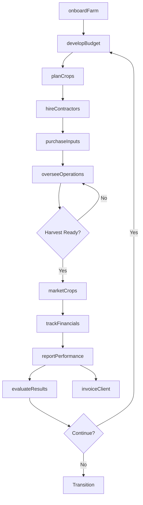
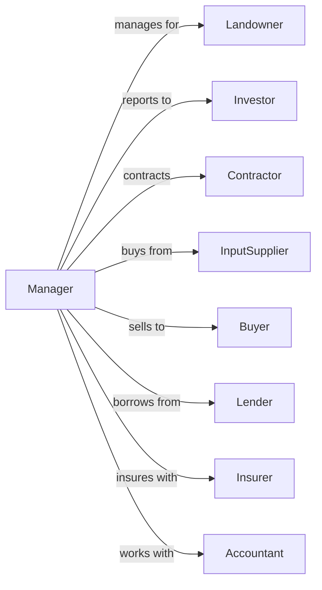

# Farm Management Services

> Business-as-Code definition for farm management service operations. Models contract management of orchards, vineyards, and other agricultural operations including oversight of cultivation, harvest, and business functions.

## Overview

Farm management services provide comprehensive oversight of agricultural operations on behalf of landowners and investors. Managers handle all aspects of farm operations including budgeting, hiring contractors, scheduling field activities, marketing crops, and financial reporting. Common clients include absentee landowners, investment groups, and those lacking agricultural expertise. This definition exposes actions for operational management, financial oversight, and performance reporting with events for automation and searches for analytics.

## Actors

| Actor | Description |
|-------|-------------|
| Landowner | Owns agricultural property under management |
| Investor | Holds financial interest in farm operations |
| Contractor | Performs field operations under management |
| InputSupplier | Provides seeds, fertilizers, and chemicals |
| Buyer | Purchases harvested crops |
| Lender | Provides operating or real estate financing |
| Insurer | Provides crop and liability coverage |
| Accountant | Prepares tax returns and financial statements |

## Roles

| Role | Description |
|------|-------------|
| FarmManager | Oversees all aspects of farm operations |
| OperationsDirector | Coordinates field activities and contractors |
| FinancialAnalyst | Manages budgets and financial reporting |
| MarketingSpecialist | Handles crop sales and buyer relationships |
| Agronomist | Provides technical crop recommendations |
| AccountManager | Maintains client relationships |

## Entities

| Entity | Description |
|--------|-------------|
| ManagementContract | Agreement for farm oversight services |
| Farm | Agricultural property under management |
| Budget | Annual operating plan and financials |
| CropPlan | Planting and cultivation schedule |
| ServiceAgreement | Contract with field service provider |
| MarketingPlan | Strategy for crop sales |
| PerformanceReport | Financial and operational results |
| CashFlowStatement | Income and expense tracking |
| Invoice | Bill for management services |
| Lease | Land rental agreement |

## Actions

| Action | Description |
|--------|-------------|
| onboardFarm | Begin management of new property |
| developBudget | Create annual operating plan |
| planCrops | Design planting and rotation schedule |
| hireContractors | Engage service providers for field work |
| overseeOperations | Monitor and direct farm activities |
| purchaseInputs | Procure seeds, fertilizers, and supplies |
| marketCrops | Negotiate sales and arrange delivery |
| trackFinancials | Record income and expenses |
| reportPerformance | Deliver results to owners |
| renewLease | Negotiate land rental terms |
| invoiceClient | Bill for management services |
| evaluateResults | Assess season performance |

## Events

| Event | Description |
|-------|-------------|
| farmOnboarded | New property added to portfolio |
| budgetApproved | Annual plan accepted by owner |
| cropPlanFinalized | Planting schedule confirmed |
| contractorHired | Service provider engaged |
| operationCompleted | Field activity finished |
| inputsPurchased | Supplies procured |
| cropSold | Sale transaction completed |
| financialsRecorded | Transactions logged |
| reportDelivered | Performance report sent to owner |
| leaseRenewed | Land agreement extended |
| invoiceSent | Management fee billed |
| seasonEvaluated | Year-end review completed |

## Searches

| Search | Description |
|--------|-------------|
| getPortfolio | List farms under management |
| getBudgetStatus | Compare actual vs planned expenses |
| getCropSchedule | View planting and harvest dates |
| getContractorStatus | Check service provider activities |
| getMarketPrices | Query current commodity prices |
| getCashFlow | Review income and expense summary |
| getPerformanceHistory | Retrieve past season results |
| getLeaseTerms | Check land rental agreements |

## Workflow



## Actor Relationships



## Usage

### Calling Actions

```typescript
import { manageFarmOperations } from '@headlessly/manage-farm-operations'

const manager = manageFarmOperations()

// Onboard new vineyard property
const farm = await manager.onboardFarm({
  ownerId: 'napa-investors-llc',
  propertyId: 'hillside-vineyard',
  acres: 120,
  cropType: 'wine-grapes',
  varieties: ['cabernet-sauvignon', 'merlot']
})

// Develop annual budget
const budget = await manager.developBudget({
  farmId: farm.id,
  year: 2024,
  projectedRevenue: 960000,
  operatingExpenses: {
    labor: 180000,
    materials: 120000,
    equipment: 80000,
    overhead: 60000
  },
  managementFee: 48000
})

// Plan crop activities
await manager.planCrops({
  farmId: farm.id,
  season: 2024,
  activities: [
    { task: 'pruning', startDate: '2024-01-15' },
    { task: 'canopyManagement', startDate: '2024-05-01' },
    { task: 'harvest', startDate: '2024-09-15' }
  ]
})

// Hire contractors
await manager.hireContractors({
  farmId: farm.id,
  services: [
    { type: 'pruning', contractorId: 'vine-care-pros', rate: 150 },
    { type: 'harvest', contractorId: 'napa-harvest-crew', rate: 200 }
  ]
})

// Market the harvest
await manager.marketCrops({
  farmId: farm.id,
  crop: 'cabernet-sauvignon',
  tons: 180,
  buyerId: 'premium-winery',
  pricePerTon: 4500
})
```

### Event-Driven Automation

```typescript
// Auto-report after crop sale
manager.cropSold(async ({ farmId, crop, revenue, buyerId }) => {
  await manager.trackFinancials({
    farmId,
    transaction: {
      type: 'income',
      category: 'crop-sales',
      amount: revenue,
      description: `${crop} sold to ${buyerId}`
    }
  })

  // Generate performance update
  await manager.reportPerformance({
    farmId,
    reportType: 'sale-notification',
    data: { crop, revenue, buyerId }
  })
})

// Budget variance alert
manager.financialsRecorded(async ({ farmId, category, amount }) => {
  const budget = await manager.getBudgetStatus({ farmId })

  if (budget.variance[category] > 0.1) {
    await notifyOwner({
      farmId,
      alert: 'budgetVariance',
      category,
      variance: budget.variance[category],
      message: 'Spending exceeds budget by more than 10%'
    })
  }
})
```

## Related

- [Farm Labor Contractors and Crew Leaders](./115115-FarmLaborContractorsAndCrewLeaders.mdx)
- [Soil Preparation, Planting, and Cultivating](./115112-SoilPreparationPlantingAndCultivating.mdx)
