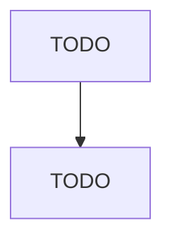

# Farm Management Services

> TODO: Business-as-Code definition

## Overview

This U.S. industry comprises establishments primarily engaged in providing farm management services on a contract or fee basis usually to citrus groves, orchards, or vineyards. These establishments always provide management and may arrange or contract for the partial or the complete operations of the farm establishment(s) they manage. Operational activities may include cultivating, harvesting, and/or other specialized agricultural support activities. Cross-References.

## Actors

| Actor | Description |
|-------|-------------|
| TODO | TODO |

## Entities

| Entity | Description |
|--------|-------------|
| TODO | TODO |

## Actions

| Action | Description |
|--------|-------------|
| TODO | TODO |

## Events

| Event | Description |
|-------|-------------|
| TODO | TODO |

## Searches

| Search | Description |
|--------|-------------|
| TODO | TODO |

## Workflow

## Actor Relationships

