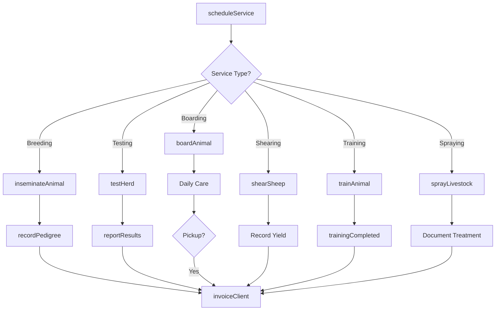
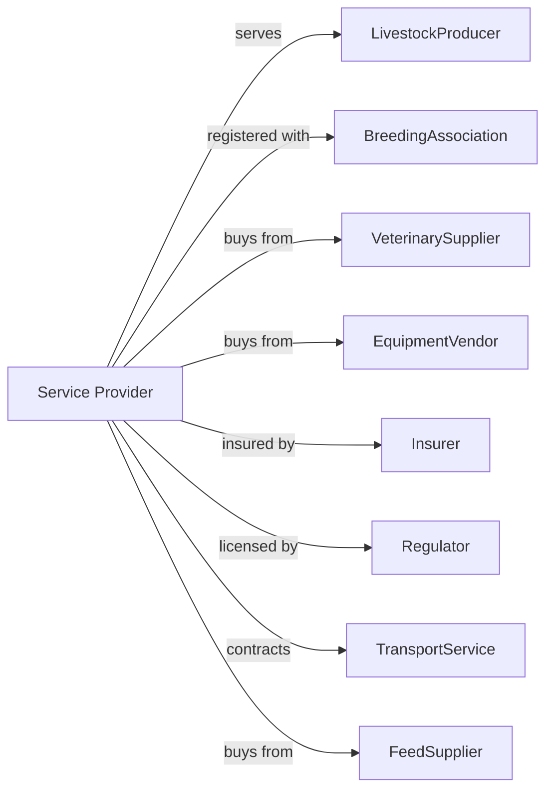

# Support Activities for Animal Production

> Business-as-Code definition for livestock support service operations. Models contract services for breeding, herd improvement, boarding, shearing, and other animal production support activities.

## Overview

Support activities for animal production include specialized services provided to livestock operations on a contract basis. Services include artificial insemination and breeding, pedigree record keeping, dairy herd testing and improvement, horse boarding and training, sheep shearing, livestock spraying, and branding. This definition exposes actions for service delivery, animal management, and client coordination with events for automation and searches for operational analytics.

## Actors

| Actor | Description |
|-------|-------------|
| LivestockProducer | Hires animal production services |
| BreedingAssociation | Maintains breed registries and standards |
| VeterinarySupplier | Provides semen, medications, and supplies |
| EquipmentVendor | Sells and services livestock equipment |
| Insurer | Provides liability and animal coverage |
| Regulator | Oversees animal health and welfare |
| TransportService | Moves animals between locations |
| FeedSupplier | Provides feed for boarded animals |

## Roles

| Role | Description |
|------|-------------|
| ServiceOwner | Owns livestock service business |
| BreedingTechnician | Performs artificial insemination |
| HerdTester | Conducts milk production testing |
| Shearer | Shears wool from sheep |
| TrainerHandler | Trains and conditions horses |
| RecordKeeper | Maintains pedigree and production records |

## Entities

| Entity | Description |
|--------|-------------|
| ServiceContract | Agreement for livestock services |
| Animal | Individual animal receiving service |
| Herd | Group of animals under management |
| BreedingRecord | Insemination and conception data |
| PedigreeRecord | Ancestry and registration information |
| TestResult | Production or health test data |
| BoardingStall | Facility for housing animals |
| ShearingRecord | Wool harvest documentation |
| Invoice | Bill for services rendered |
| Certificate | Registration or health document |

## Actions

| Action | Description |
|--------|-------------|
| scheduleService | Book appointment for livestock service |
| inseminateAnimal | Perform artificial insemination |
| testHerd | Conduct production or health testing |
| recordPedigree | Document ancestry and registration |
| boardAnimal | House animal at facility |
| trainAnimal | Condition animal for performance |
| shearSheep | Harvest wool from sheep |
| sprayLivestock | Apply pest control treatments |
| brandAnimal | Apply identification marks |
| certifyAnimal | Issue registration or health certificate |
| invoiceClient | Bill for services rendered |
| reportResults | Deliver test or service results |

## Events

| Event | Description |
|-------|-------------|
| serviceScheduled | Appointment booked |
| inseminationCompleted | Breeding service performed |
| herdTested | Production testing finished |
| pedigreeRecorded | Ancestry documented |
| animalBoarded | Animal checked into facility |
| trainingCompleted | Conditioning session finished |
| sheepSheared | Wool harvested |
| livestockSprayed | Pest treatment applied |
| animalBranded | Identification applied |
| certificateIssued | Documentation provided |
| invoiceSent | Service bill transmitted |
| resultsReported | Test data delivered |

## Searches

| Search | Description |
|--------|-------------|
| getSchedule | View booked services by date |
| findClients | List active livestock customers |
| getBreedingRecords | Retrieve insemination history |
| getTestResults | Query production test data |
| getPedigrees | Search ancestry records |
| getBoardingStatus | Check animal housing occupancy |
| getTrainingProgress | Review conditioning records |
| getServiceHistory | Retrieve past services by animal |

## Workflow



## Actor Relationships



## Usage

### Calling Actions

```typescript
import { provideLivestockServices } from '@headlessly/provide-livestock-services'

const services = provideLivestockServices()

// Schedule artificial insemination
const appointment = await services.scheduleService({
  clientId: 'dairy-valley-farm',
  serviceType: 'artificial-insemination',
  animalCount: 25,
  date: new Date('2024-03-15'),
  breed: 'holstein'
})

// Perform insemination
await services.inseminateAnimal({
  appointmentId: appointment.id,
  animalId: 'cow-1247',
  sireId: 'bull-paramount',
  semenLotId: 'lot-2024-0342',
  technicianId: 'tech-johnson'
})

// Record breeding for pedigree
await services.recordPedigree({
  animalId: 'cow-1247',
  sireId: 'bull-paramount',
  breedingDate: new Date('2024-03-15'),
  expectedCalvingDate: new Date('2024-12-20')
})

// Conduct herd testing
const testResults = await services.testHerd({
  clientId: 'dairy-valley-farm',
  testType: 'dhia-milk-test',
  date: new Date(),
  herdSize: 150
})

// Report results
await services.reportResults({
  testId: testResults.id,
  clientId: 'dairy-valley-farm',
  format: 'dhia-standard',
  deliveryMethod: 'email'
})
```

### Event-Driven Automation

```typescript
// Auto-record pedigree after insemination
services.inseminationCompleted(async ({ animalId, sireId, date }) => {
  await services.recordPedigree({
    animalId,
    sireId,
    breedingDate: date,
    expectedCalvingDate: addDays(date, 283) // Cattle gestation
  })
})

// Schedule follow-up after breeding
services.inseminationCompleted(async ({ appointmentId, animalId, date }) => {
  // Schedule pregnancy check at 30 days
  await services.scheduleService({
    relatedAppointmentId: appointmentId,
    serviceType: 'pregnancy-check',
    animalId,
    date: addDays(date, 30),
    notes: 'Follow-up to insemination'
  })
})

// Alert on boarding capacity
services.animalBoarded(async ({ facilityId }) => {
  const status = await services.getBoardingStatus({ facilityId })

  if (status.occupancy > 0.9) {
    await notifyManager({
      alert: 'capacityWarning',
      facilityId,
      occupancy: status.occupancy,
      message: 'Boarding facility approaching capacity'
    })
  }
})
```

## Related

- [Dairy Cattle and Milk Production](../../112-AnimalProductionAndAquaculture/1121-CattleRanchingAndFarming/112120-DairyCattleAndMilkProduction.mdx)
- [Horses and Other Equine Production](../../112-AnimalProductionAndAquaculture/1129-OtherAnimalProduction/112920-HorsesAndOtherEquineProduction.mdx)
