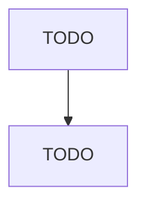
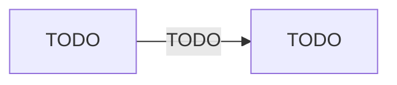

# Support Activities for Animal Production

> TODO: Business-as-Code definition

## Overview

This industry comprises establishments primarily engaged in performing support activities related to raising livestock (e.g., cattle, goats, hogs, horses, poultry, sheep). These establishments may perform one or more of the following: (1) breeding services for animals, including companion animals (e.g., cats, dogs, pet birds); (2) pedigree record services; (3) boarding horses; (4) dairy herd improvement activities; (5) livestock spraying; and (6) sheep dipping and shearing. Cross-References.

## Actors

| Actor | Description |
|-------|-------------|
| TODO | TODO |

## Entities

| Entity | Description |
|--------|-------------|
| TODO | TODO |

## Actions

| Action | Description |
|--------|-------------|
| TODO | TODO |

## Events

| Event | Description |
|-------|-------------|
| TODO | TODO |

## Searches

| Search | Description |
|--------|-------------|
| TODO | TODO |

## Workflow

## Actor Relationships

