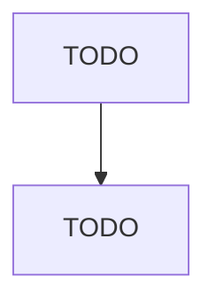

# Support Activities for Forestry

> TODO: Business-as-Code definition

## Overview

This industry comprises establishments primarily engaged in performing particular support activities related to timber production, wood technology, forestry economics and marketing, and forest protection. These establishments may provide support activities for forestry, such as estimating timber, forest firefighting, forest pest control, treating burned forests from the air for reforestation or on an emergency basis, and consulting on wood attributes and reforestation. Cross-References. Establis

## Actors

| Actor | Description |
|-------|-------------|
| TODO | TODO |

## Entities

| Entity | Description |
|--------|-------------|
| TODO | TODO |

## Actions

| Action | Description |
|--------|-------------|
| TODO | TODO |

## Events

| Event | Description |
|-------|-------------|
| TODO | TODO |

## Searches

| Search | Description |
|--------|-------------|
| TODO | TODO |

## Workflow

## Actor Relationships

