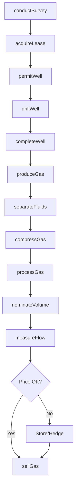
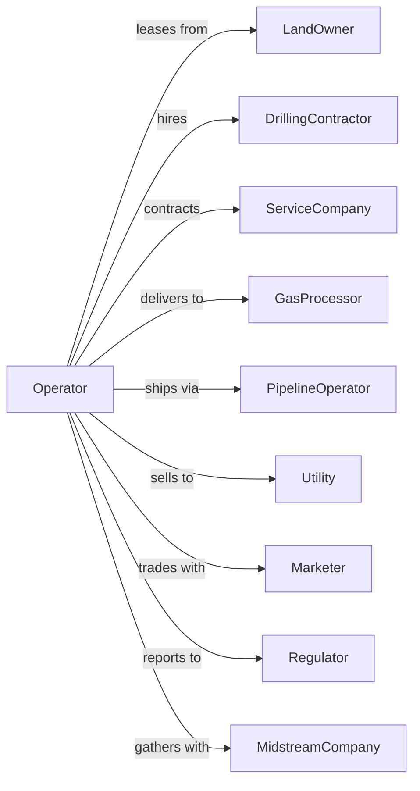

# Natural Gas Extraction

> Business-as-Code definition for natural gas extraction operations. Models the complete lifecycle from exploration and drilling through production, processing, and sale of natural gas.

## Overview

Natural gas extraction involves the exploration, development, and production of natural gas from conventional and unconventional reservoirs. Operations include geological surveying, well drilling, gas processing to remove impurities and liquids, and delivery to pipelines. This definition exposes actions for each phase of gas production, events for workflow automation, and searches for data retrieval.

## Actors

| Actor | Description |
|-------|-------------|
| LandOwner | Holds mineral rights and grants leases for gas exploration and production |
| DrillingContractor | Provides drilling rigs and crews for well construction |
| ServiceCompany | Supplies specialized services including fracturing, cementing, and logging |
| GasProcessor | Removes impurities and extracts natural gas liquids |
| PipelineOperator | Transports processed gas to markets and distribution hubs |
| Utility | Purchases gas for power generation or distribution to consumers |
| Marketer | Trades natural gas contracts and arranges sales |
| Regulator | Oversees permits, emissions, and environmental compliance |
| MidstreamCompany | Gathers, compresses, and transports gas from wellhead |

## Roles

| Role | Description |
|------|-------------|
| FieldOperator | Manages daily production operations and well performance |
| ReservoirEngineer | Optimizes recovery and manages reservoir pressure |
| CompletionsEngineer | Designs well stimulation and completion programs |
| GasController | Monitors pipeline nominations and gas deliveries |
| LandManager | Negotiates leases and manages mineral rights |
| EnvironmentalSpecialist | Monitors emissions and ensures regulatory compliance |

## Entities

| Entity | Description |
|--------|-------------|
| Well | A drilled hole for accessing underground gas reservoirs |
| Lease | Legal agreement granting rights to explore and produce gas |
| Reservoir | Underground formation containing recoverable natural gas |
| Compressor | Equipment that pressurizes gas for pipeline transport |
| Separator | Equipment that separates gas from liquids and water |
| Pipeline | Infrastructure for transporting natural gas |
| ProcessingPlant | Facility that removes impurities and extracts NGLs |
| Meter | Device measuring gas volume and quality |
| GatheringSystem | Network of small pipelines collecting gas from wells |
| NGL | Natural gas liquids extracted during processing |

## Actions

| Action | Description |
|--------|-------------|
| conductSurvey | Perform seismic surveys to identify gas-bearing formations |
| acquireLease | Negotiate and secure mineral rights from landowners |
| permitWell | Submit applications and obtain regulatory drilling permits |
| drillWell | Construct wellbore to target gas-bearing formation |
| completeWell | Install production equipment and stimulate the well |
| produceGas | Extract natural gas from reservoir to surface |
| separateFluids | Remove water and condensate from gas stream |
| compressGas | Increase gas pressure for pipeline transport |
| processGas | Remove impurities and extract natural gas liquids |
| nominateVolume | Schedule gas deliveries to pipeline |
| measureFlow | Record daily volumes and test gas quality |
| sellGas | Execute sales contract with buyer at market price |
| workoverWell | Perform remedial operations to improve production |
| abandonWell | Plug and decommission wells at end of life |

## Events

| Event | Description |
|-------|-------------|
| surveyCompleted | Seismic data acquisition and processing finished |
| leaseAcquired | Mineral rights secured from landowner |
| permitApproved | Regulatory drilling authorization received |
| wellDrilled | Wellbore construction completed to target depth |
| wellCompleted | Well ready for production after stimulation |
| productionStarted | First gas produced from well |
| gasProcessed | Gas cleaned and NGLs extracted |
| volumeNominated | Daily delivery scheduled with pipeline |
| gasSold | Sales transaction completed with buyer |
| pressureDeclined | Reservoir pressure dropped requiring intervention |
| emissionDetected | Methane leak identified requiring repair |
| compressorFailed | Compression equipment requires maintenance |
| wellAbandoned | Well plugged and site reclaimed |
| contractExecuted | New sales or gathering agreement signed |

## Searches

| Search | Description |
|--------|-------------|
| findWells | List wells with filters for status, production, or location |
| getProduction | Retrieve production volumes by well or date range |
| getLeases | Query active leases by expiration or owner |
| getNominations | Retrieve scheduled pipeline deliveries |
| checkPrices | Get current natural gas spot and futures prices |
| getReserves | Query estimated recoverable reserves by property |
| findBuyers | List potential gas purchasers and current bids |
| getEmissions | Retrieve methane emission monitoring data |

## Workflow



## Actor Relationships



## Usage

### Calling Actions

```typescript
import { extractNaturalGas } from '@headlessly/extract-natural-gas'

const operation = extractNaturalGas()

// Conduct seismic survey to identify prospects
const survey = await operation.conductSurvey({
  areaId: 'marcellus-block-15',
  type: '3D',
  squareMiles: 30
})

// Acquire mineral lease
const lease = await operation.acquireLease({
  landOwnerId: 'jones-minerals-llc',
  acreage: 1280,
  royaltyRate: 0.18,
  bonusPerAcre: 4000,
  termYears: 5
})

// Drill and complete horizontal gas well
await operation.drillWell({
  leaseId: lease.id,
  wellName: 'Jones Unit 1H',
  targetDepth: 8500,
  type: 'horizontal',
  lateralLength: 12000
})
```

### Event-Driven Automation

```typescript
// Auto-schedule workover when pressure declines
operation.pressureDeclined(async ({ wellId, currentPressure, threshold }) => {
  if (currentPressure < threshold * 0.7) {
    await operation.workoverWell({
      wellId,
      type: 'restimulation',
      priority: 'medium'
    })
  }
})

// Auto-respond to emission detection
operation.emissionDetected(async ({ wellId, source, rate }) => {
  if (rate > 100) { // mcf/day
    await operation.workoverWell({
      wellId,
      type: 'leak-repair',
      priority: 'high',
      notifyRegulator: true
    })
  }
})
```
