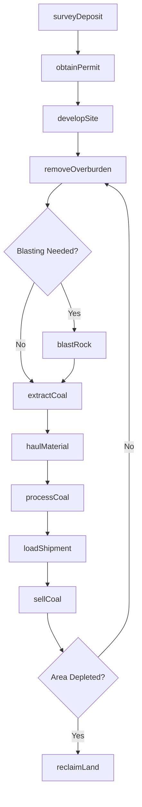
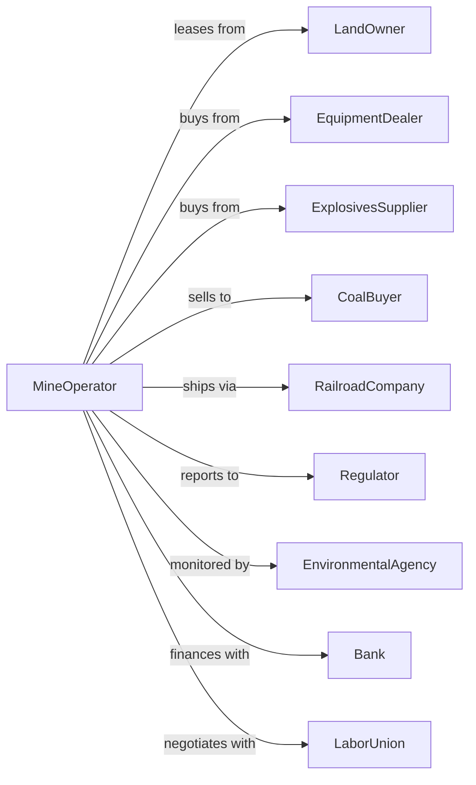

# Surface Coal Mining

> Business-as-Code definition for surface coal mining operations. Models the complete lifecycle from site development through extraction, processing, and reclamation.

## Overview

Surface coal mining involves the extraction of coal from open-pit mines and strip mines where coal seams are accessible near the earth's surface. Operations include overburden removal, coal extraction, beneficiation (washing and sizing), and land reclamation. This definition exposes actions for each phase of surface mining, events for workflow automation, and searches for data retrieval.

## Actors

| Actor | Description |
|-------|-------------|
| LandOwner | Holds surface and mineral rights for mining operations |
| EquipmentDealer | Sells and services draglines, trucks, and mining equipment |
| ExplosivesSupplier | Provides blasting materials and technical support |
| CoalBuyer | Purchases coal for power generation or export |
| RailroadCompany | Transports coal from mine to customer |
| Regulator | Oversees permits, safety, and reclamation compliance |
| EnvironmentalAgency | Monitors air quality, water discharge, and land restoration |
| Bank | Provides project financing and reclamation bonds |
| LaborUnion | Represents mine workers in collective bargaining |

## Roles

| Role | Description |
|------|-------------|
| MineManager | Oversees all mining operations and production targets |
| MiningEngineer | Designs pit layouts and extraction sequences |
| BlastingSpecialist | Plans and executes drilling and blasting operations |
| EquipmentOperator | Operates draglines, shovels, and haul trucks |
| SafetyDirector | Ensures compliance with MSHA regulations |
| ReclamationManager | Plans and executes land restoration activities |

## Entities

| Entity | Description |
|--------|-------------|
| Pit | Open excavation where coal is extracted |
| Seam | Layer of coal being mined |
| Overburden | Rock and soil covering the coal seam |
| Dragline | Large excavator for removing overburden |
| HaulTruck | Vehicle for transporting coal and waste |
| Preparation Plant | Facility for washing, sizing, and sorting coal |
| Stockpile | Storage area for processed coal awaiting shipment |
| Permit | Regulatory authorization for mining activities |
| ReclamationPlan | Schedule for restoring mined land |
| Bond | Financial guarantee for reclamation obligations |

## Actions

| Action | Description |
|--------|-------------|
| surveyDeposit | Map coal seams and calculate extractable reserves |
| obtainPermit | Secure mining permits and environmental approvals |
| developSite | Construct access roads, buildings, and infrastructure |
| removeOverburden | Excavate and relocate rock covering coal seam |
| blastRock | Use explosives to fragment overburden or coal |
| extractCoal | Load coal from pit using shovels or loaders |
| haulMaterial | Transport coal and waste to designated areas |
| processCoal | Wash, crush, and size coal at preparation plant |
| loadShipment | Transfer coal to rail cars or trucks |
| sellCoal | Execute sales contract with buyer |
| reclaimLand | Restore mined areas with grading and revegetation |
| monitorCompliance | Track environmental and safety requirements |
| maintainEquipment | Service and repair mining machinery |
| reportProduction | Submit required data to regulators |

## Events

| Event | Description |
|-------|-------------|
| depositSurveyed | Coal reserves mapped and quantified |
| permitGranted | Mining authorization received from regulators |
| siteDeveloped | Infrastructure ready for mining operations |
| overburdenRemoved | Coal seam exposed for extraction |
| coalExtracted | Coal removed from pit and loaded |
| coalProcessed | Coal washed and sized at preparation plant |
| shipmentLoaded | Coal transferred to transportation |
| coalSold | Sales transaction completed with buyer |
| landReclaimed | Mined area restored and approved |
| safetyIncident | Accident or near-miss reported |
| equipmentDown | Major equipment requires unplanned maintenance |
| inspectionCompleted | Regulatory review conducted |
| bondReleased | Reclamation bond returned after approval |

## Searches

| Search | Description |
|--------|-------------|
| findPits | List active pits with production and reserve data |
| getProduction | Retrieve tonnage by date range, pit, or seam |
| getInventory | Check coal stockpile quantities by grade |
| findBuyers | List potential customers and contract opportunities |
| getPermits | Retrieve permit status and compliance records |
| checkEquipment | Query equipment availability and maintenance status |
| getReclamation | Track reclamation progress by area |
| getSafetyMetrics | Retrieve incident rates and safety statistics |

## Workflow



## Actor Relationships



## Usage

### Calling Actions

```typescript
import { mineSurfaceCoal } from '@headlessly/mine-surface-coal'

const mine = mineSurfaceCoal()

// Survey coal deposit
const survey = await mine.surveyDeposit({
  siteId: 'powder-river-block-7',
  method: 'core-drilling',
  targetSeams: ['wyodak', 'anderson']
})

// Obtain mining permit
const permit = await mine.obtainPermit({
  siteId: survey.siteId,
  acreage: 2500,
  estimatedTonnage: 50000000,
  miningMethod: 'strip',
  reclamationBond: 15000000
})

// Begin overburden removal
await mine.removeOverburden({
  pitId: 'pit-1',
  method: 'dragline',
  cubicYards: 500000,
  spoilLocation: 'spoil-area-1'
})
```

### Event-Driven Automation

```typescript
// Auto-schedule reclamation when area depleted
mine.coalExtracted(async ({ pitId, remainingReserves }) => {
  if (remainingReserves === 0) {
    await mine.reclaimLand({
      pitId,
      gradingSpec: 'approximate-original-contour',
      seedMix: 'native-grassland',
      priority: 'standard'
    })
  }
})

// Auto-report safety incidents
mine.safetyIncident(async ({ type, severity, location }) => {
  await mine.reportProduction({
    incidentType: type,
    severity,
    location,
    notifyMSHA: severity === 'serious'
  })
})
```
