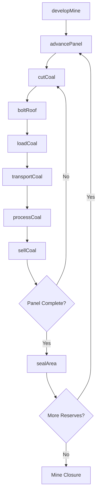
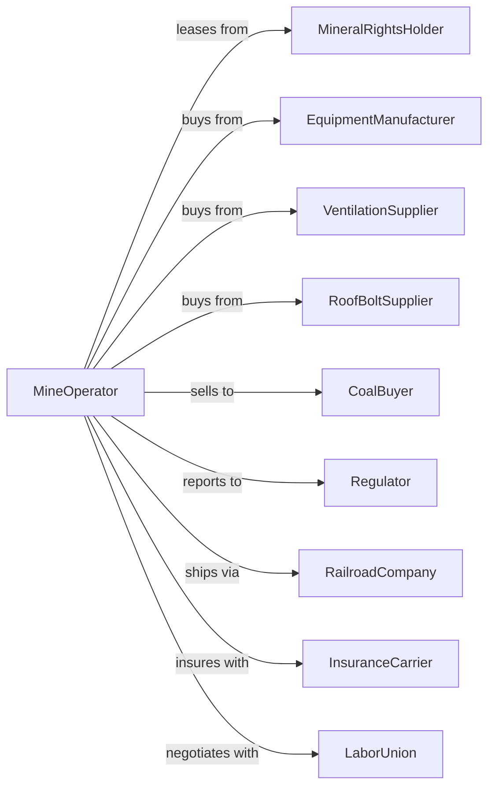

# Underground Coal Mining

> Business-as-Code definition for underground coal mining operations. Models the complete lifecycle from mine development through extraction, ventilation, and safety management.

## Overview

Underground coal mining involves the extraction of coal from deep seams through shaft or drift access. Operations include mine development, continuous mining or longwall extraction, roof support, ventilation, and coal transport to the surface. This definition exposes actions for each phase of underground mining, events for workflow automation, and searches for data retrieval.

## Actors

| Actor | Description |
|-------|-------------|
| MineralRightsHolder | Owns subsurface coal rights and grants mining leases |
| EquipmentManufacturer | Supplies continuous miners, longwall systems, and shuttle cars |
| VentilationSupplier | Provides fans, ducting, and atmospheric monitoring equipment |
| RoofBoltSupplier | Supplies roof support materials and installation equipment |
| CoalBuyer | Purchases coal for power generation or industrial use |
| Regulator | Oversees MSHA compliance and mine safety standards |
| RailroadCompany | Transports coal from mine loadout to customers |
| InsuranceCarrier | Provides workers compensation and mine liability coverage |
| LaborUnion | Represents underground miners in labor negotiations |

## Roles

| Role | Description |
|------|-------------|
| MineForeman | Supervises underground operations on each shift |
| MiningEngineer | Designs extraction plans and ventilation systems |
| ContinuousMinerOperator | Operates cutting equipment at the working face |
| RoofBolter | Installs roof support systems in newly mined areas |
| Electrician | Maintains underground electrical systems and equipment |
| SafetyInspector | Conducts atmospheric monitoring and safety checks |

## Entities

| Entity | Description |
|--------|-------------|
| Shaft | Vertical access to underground workings |
| Entry | Horizontal tunnel providing access to coal seams |
| Panel | Section of coal seam being actively mined |
| ContinuousMiner | Machine that cuts and loads coal at the face |
| LongwallShearer | Equipment for high-volume longwall extraction |
| ShuttleCar | Vehicle transporting coal from face to conveyor |
| RoofBolt | Steel support installed to prevent roof collapse |
| Ventilation | System providing fresh air and removing gas |
| Conveyor | Belt system moving coal to the surface |
| Methane Monitor | Device detecting dangerous gas concentrations |

## Actions

| Action | Description |
|--------|-------------|
| developMine | Construct shafts, entries, and underground infrastructure |
| advancePanel | Extend mining into new coal reserves |
| cutCoal | Extract coal from the working face using mining equipment |
| boltRoof | Install roof support systems for ground control |
| loadCoal | Transfer cut coal onto shuttle cars or conveyors |
| ventilateWorkings | Maintain airflow to dilute methane and provide oxygen |
| monitorAtmosphere | Check gas levels, dust, and air quality |
| transportCoal | Move coal via conveyor and hoist to surface |
| processCoal | Wash, crush, and size coal at preparation plant |
| sellCoal | Execute sales contract with buyer |
| maintainEquipment | Service continuous miners, conveyors, and support systems |
| conductSafetyDrill | Practice emergency evacuation procedures |
| sealArea | Close off worked-out or hazardous sections |
| reportConditions | Submit required safety and production data |

## Events

| Event | Description |
|-------|-------------|
| mineDeveloped | Shafts and entries completed for production |
| panelAdvanced | New mining section opened |
| coalCut | Coal extracted from working face |
| roofBolted | Support installed in newly mined area |
| coalTransported | Coal moved to surface stockpile |
| coalProcessed | Coal washed and prepared for shipment |
| coalSold | Sales transaction completed with buyer |
| methaneDetected | Gas concentration exceeded threshold |
| roofFallOccurred | Ground control failure in underground area |
| equipmentDown | Mining equipment requires repair |
| evacuationOrdered | Underground personnel withdrawn for safety |
| inspectionCompleted | MSHA review conducted and findings documented |
| panelCompleted | All coal extracted from mining section |

## Searches

| Search | Description |
|--------|-------------|
| findPanels | List active panels with production and reserve data |
| getProduction | Retrieve tonnage by shift, section, or date range |
| getVentilation | Query airflow readings and atmospheric conditions |
| getEquipmentStatus | Check availability and location of mining equipment |
| getSafetyMetrics | Retrieve incident rates and inspection results |
| findBuyers | List potential customers and contract opportunities |
| getRoofConditions | Query ground control monitoring data |
| getInventory | Check surface stockpile quantities by grade |

## Workflow



## Actor Relationships



## Usage

### Calling Actions

```typescript
import { mineUndergroundCoal } from '@headlessly/mine-underground-coal'

const mine = mineUndergroundCoal()

// Develop new mine section
const development = await mine.developMine({
  siteId: 'central-appalachian-seam-5',
  accessType: 'drift',
  entries: 5,
  seam: 'pocahontas-3',
  seamThickness: 54 // inches
})

// Advance into new panel
const panel = await mine.advancePanel({
  mineId: development.mineId,
  panelName: 'panel-1-left',
  method: 'continuous',
  width: 20,
  length: 10000
})

// Begin coal extraction
await mine.cutCoal({
  panelId: panel.id,
  equipment: 'continuous-miner-12cm',
  targetTons: 1200,
  shift: 'day'
})
```

### Event-Driven Automation

```typescript
// Auto-respond to methane detection
mine.methaneDetected(async ({ location, concentration, threshold }) => {
  if (concentration > threshold * 0.8) {
    await mine.ventilateWorkings({
      location,
      action: 'increase-airflow',
      targetCFM: 15000,
      alert: 'high-methane'
    })
  }
  if (concentration > threshold) {
    await mine.evacuationOrdered({
      location,
      reason: 'methane-exceedance',
      notifyMSHA: true
    })
  }
})

// Auto-schedule maintenance on equipment failure
mine.equipmentDown(async ({ equipmentId, type, location }) => {
  await mine.maintainEquipment({
    equipmentId,
    priority: type === 'continuous-miner' ? 'critical' : 'high',
    dispatchCrew: true
  })
})
```
