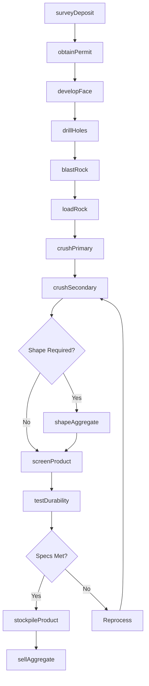
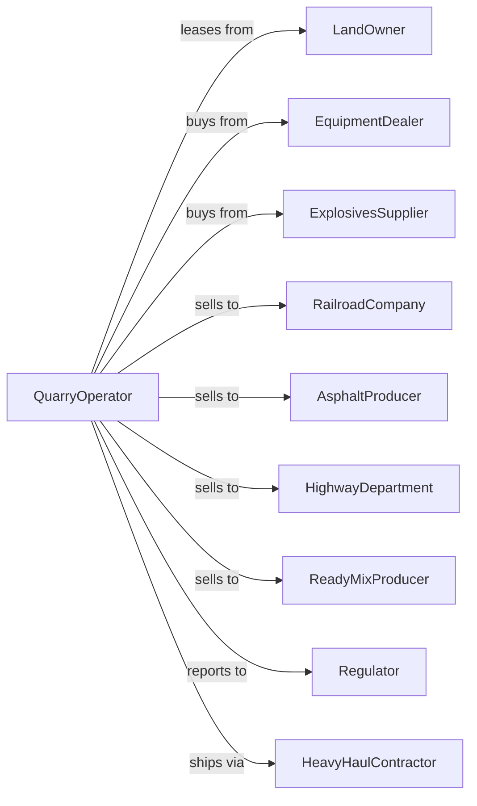

# Crushed and Broken Granite Mining and Quarrying

> Business-as-Code definition for crushed granite quarrying operations. Models the complete lifecycle from extraction through crushing, screening, and sale of granite aggregate for construction and infrastructure applications.

## Overview

Crushed and broken granite mining and quarrying involves the extraction and processing of granite and related igneous rocks (gneiss, diorite, syenite) for use as high-quality construction aggregate. Granite's hardness and durability make it ideal for road base, railway ballast, concrete, and asphalt applications. This definition exposes actions for each phase of granite aggregate production, events for workflow automation, and searches for data retrieval.

## Actors

| Actor | Description |
|-------|-------------|
| LandOwner | Holds surface and mineral rights for quarry operations |
| EquipmentDealer | Sells and services crushers, screens, and drilling equipment |
| ExplosivesSupplier | Provides blasting materials and technical services |
| RailroadCompany | Purchases ballast for track construction and maintenance |
| AsphaltProducer | Buys crushed granite for hot mix asphalt |
| HighwayDepartment | Procures aggregate for road construction |
| ReadyMixProducer | Purchases aggregate for high-strength concrete |
| Regulator | Oversees permits, safety, and environmental compliance |
| HeavyHaulContractor | Transports aggregate to distant job sites |

## Roles

| Role | Description |
|------|-------------|
| QuarryManager | Oversees all extraction and processing operations |
| DrillBlastSupervisor | Manages drilling and blasting operations |
| CrusherOperator | Operates primary and secondary crushing equipment |
| QualityEngineer | Tests aggregate properties and certifies products |
| MaintenanceTechnician | Maintains crushing and screening equipment |
| DispatchCoordinator | Schedules truck loading and deliveries |

## Entities

| Entity | Description |
|--------|-------------|
| Quarry | Open excavation where granite is extracted |
| Face | Vertical or sloped surface of exposed rock |
| DrillRig | Equipment for creating blast holes in hard rock |
| JawCrusher | Primary crusher for reducing large rock |
| ConeCrusher | Secondary crusher for further size reduction |
| ImpactCrusher | Equipment producing cubical aggregate shapes |
| Stockpile | Storage area for sized aggregate products |
| Ballast | Large, angular stone used for railroad track support |
| RipRap | Large stone used for erosion control |
| Specification | Technical requirements for aggregate products |

## Actions

| Action | Description |
|--------|-------------|
| surveyDeposit | Map granite formation and assess quality |
| obtainPermit | Secure quarrying permits and environmental approvals |
| developFace | Establish working face for extraction |
| drillHoles | Create blast holes in hard granite rock |
| blastRock | Use explosives to fragment granite |
| loadRock | Excavate blasted material and haul to crusher |
| crushPrimary | Reduce large rock through jaw crusher |
| crushSecondary | Further reduce material in cone crusher |
| shapeAggregate | Produce cubical particles through impact crusher |
| screenProduct | Separate crushed granite into sized fractions |
| washAggregate | Remove fines and dust from product |
| stockpileProduct | Store finished aggregate by size and grade |
| testDurability | Verify hardness, abrasion resistance, and quality |
| sellAggregate | Execute sales and schedule deliveries |

## Events

| Event | Description |
|-------|-------------|
| depositSurveyed | Granite formation mapped and quality assessed |
| permitObtained | Quarrying authorization received |
| faceDeveloped | Working face established for extraction |
| holesCompleted | Blast holes drilled per pattern |
| rockBlasted | Granite fragmented and ready for loading |
| rockLoaded | Material excavated and hauled to crusher |
| primaryCrushed | Large rock reduced through jaw crusher |
| secondaryCrushed | Material reduced through cone crusher |
| aggregateShaped | Product processed for cubical shape |
| productScreened | Crushed granite separated into sizes |
| aggregateWashed | Fines removed from product |
| productStockpiled | Finished aggregate placed in inventory |
| durabilityTested | Quality verified against specifications |
| aggregateSold | Sales transaction completed |

## Searches

| Search | Description |
|--------|-------------|
| getInventory | Check stockpile quantities by product size |
| getProduction | Retrieve tonnage by date range or product |
| findCustomers | List buyers and bid opportunities |
| getQuality | Query durability and gradation test results |
| checkPrices | Get current granite aggregate prices |
| getPermits | Retrieve permit status and compliance records |
| getEquipment | Monitor crusher and equipment availability |
| trackDeliveries | Monitor truck and rail shipments |

## Workflow



## Actor Relationships



## Usage

### Calling Actions

```typescript
import { quarryCrushedBroken } from '@headlessly/quarry-crushed-broken'

const quarry = quarryCrushedBroken()

// Survey granite deposit
const survey = await quarry.surveyDeposit({
  siteId: 'piedmont-granite-formation',
  rockType: 'biotite-granite',
  method: 'core-sampling',
  assessQuality: ['hardness', 'mineral-composition']
})

// Drill blast pattern in hard rock
const drilling = await quarry.drillHoles({
  faceId: 'face-north-3',
  pattern: '10x12',
  depth: 35, // feet
  diameter: 4.5, // inches
  holes: 60
})

// Process for railroad ballast
await quarry.crushPrimary({
  feedTons: 3000,
  targetSize: 8, // inches
  product: 'ballast'
})
```

### Event-Driven Automation

```typescript
// Auto-test durability for premium products
quarry.productScreened(async ({ productId, productType, stockpileId }) => {
  if (['ballast', 'riprap'].includes(productType)) {
    const result = await quarry.testDurability({
      productId,
      tests: ['los-angeles-abrasion', 'soundness', 'specific-gravity']
    })

    if (result.laAbrasion < 40) {
      await quarry.stockpileProduct({
        productId,
        stockpileId,
        grade: 'premium',
        certify: true
      })
    }
  }
})

// Auto-dispatch for railroad orders
quarry.aggregateSold(async ({ orderId, product, tons, destination }) => {
  if (product === 'ballast' && tons > 5000) {
    await quarry.loadRock({
      orderId,
      transportMode: 'rail',
      carCount: Math.ceil(tons / 100),
      destination
    })
  }
})
```
