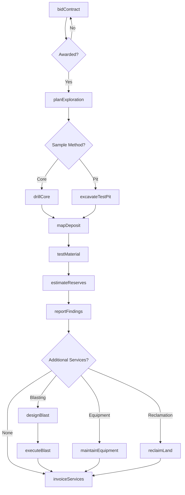
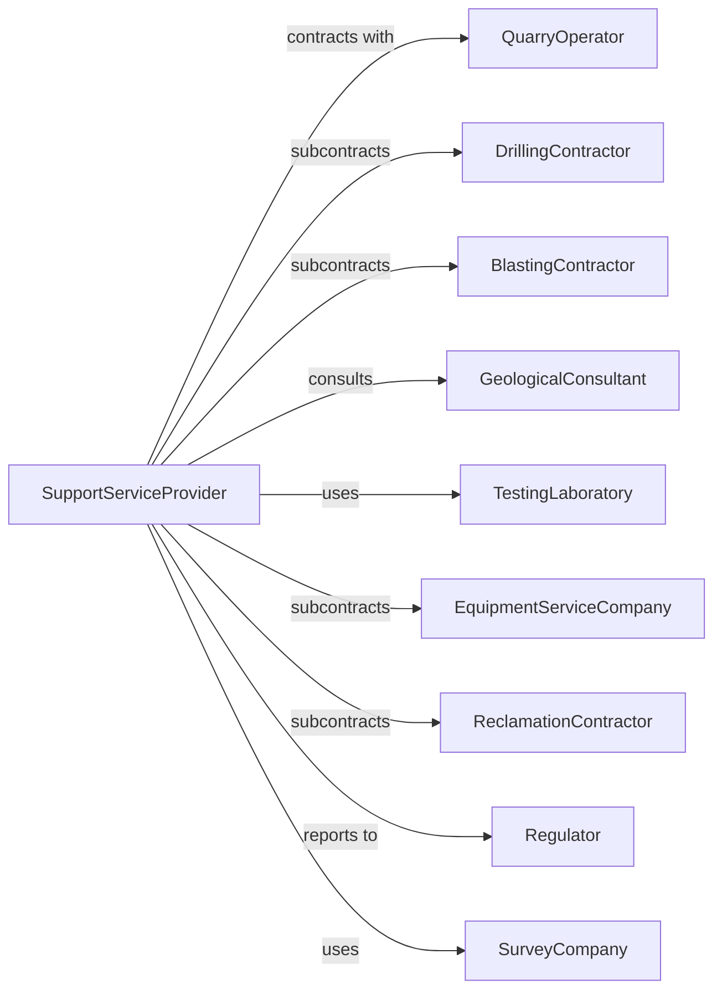

# Support Activities for Nonmetallic Minerals (except Fuels) Mining

> Business-as-Code definition for nonmetallic mineral mining support services. Models the complete lifecycle from exploration through quarry development, equipment services, and reclamation support for aggregate and industrial mineral operators.

## Overview

Support activities for nonmetallic minerals mining involve providing specialized services to quarry and industrial mineral operations on a contract or fee basis. Services include exploration drilling, geological consulting, blasting services, equipment maintenance, quality testing, and reclamation support. This definition exposes actions for each phase of mineral support services, events for workflow automation, and searches for data retrieval.

## Actors

| Actor | Description |
|-------|-------------|
| QuarryOperator | Mining company contracting for support services |
| DrillingContractor | Provides core drilling and test pit services |
| BlastingContractor | Provides drilling and blasting services |
| GeologicalConsultant | Provides deposit mapping and resource estimation |
| TestingLaboratory | Analyzes mineral samples for quality specifications |
| EquipmentServiceCompany | Maintains and repairs processing equipment |
| ReclamationContractor | Performs land restoration and revegetation |
| Regulator | Oversees permits and environmental compliance |
| SurveyCompany | Provides topographic and volume surveying |

## Roles

| Role | Description |
|------|-------------|
| ProjectManager | Oversees support service contracts |
| DrillingSupervisor | Manages exploration drilling operations |
| BlastingEngineer | Designs blast patterns and supervises execution |
| Geologist | Maps deposits and estimates reserves |
| QualityTechnician | Tests material properties and specifications |
| ReclamationSpecialist | Plans and executes land restoration |

## Entities

| Entity | Description |
|--------|-------------|
| DrillRig | Equipment for core drilling and test holes |
| CoreSample | Cylindrical sample from exploration drilling |
| TestPit | Shallow excavation for sampling deposits |
| BlastHole | Drilled hole for explosive placement |
| BlastPattern | Layout of holes for rock fragmentation |
| QualityTest | Laboratory analysis of material properties |
| ResourceEstimate | Calculated tonnes of mineral reserves |
| SurveyData | Topographic and volumetric measurements |
| Equipment | Processing machinery requiring service |
| ReclamationPlan | Schedule for restoring mined areas |

## Actions

| Action | Description |
|--------|-------------|
| bidContract | Submit proposal for support services |
| planExploration | Design sampling and drilling program |
| drillCore | Extract core samples from mineral deposit |
| excavateTestPit | Dig shallow pits for bulk sampling |
| mapDeposit | Create geological maps of mineral formation |
| estimateReserves | Calculate tonnage and quality of reserves |
| designBlast | Plan drill pattern and explosive loading |
| executeBlast | Drill holes and detonate explosives |
| testMaterial | Analyze samples for specifications |
| maintainEquipment | Service and repair processing machinery |
| surveyVolumes | Measure stockpiles and excavated volumes |
| reclaimLand | Restore mined areas per permit requirements |
| reportFindings | Deliver exploration and analysis results |
| invoiceServices | Bill operator for support services |

## Events

| Event | Description |
|-------|-------------|
| contractAwarded | Support services agreement signed |
| explorationPlanned | Sampling program designed |
| coreRecovered | Core samples extracted from deposit |
| testPitExcavated | Bulk samples collected |
| depositMapped | Geological interpretation completed |
| reservesEstimated | Resource calculation completed |
| blastDesigned | Drill pattern and loading plan approved |
| blastExecuted | Rock fragmented successfully |
| materialTested | Quality specifications verified |
| equipmentServiced | Machinery repaired and operational |
| volumesSurveyed | Measurements completed |
| landReclaimed | Restoration work finished |
| findingsReported | Results document delivered |
| invoiceSent | Billing submitted to client |

## Searches

| Search | Description |
|--------|-------------|
| findContracts | List available service opportunities |
| getDrillRigs | Check drilling equipment availability |
| getProjects | Monitor active support contracts |
| getTestResults | Retrieve material quality data |
| getReserves | Query reserve estimates by deposit |
| getEquipmentStatus | Check machinery service status |
| getBlastRecords | Retrieve blast design and results data |
| getReclamationProgress | Track land restoration activities |

## Workflow



## Actor Relationships



## Usage

### Calling Actions

```typescript
import { supportSupportActivities } from '@headlessly/support-support-activities'

const mineralSupport = supportSupportActivities()

// Bid on exploration contract
const bid = await mineralSupport.bidContract({
  operatorId: 'vulcan-materials',
  projectName: 'limestone-expansion',
  services: ['exploration', 'reserve-estimation', 'blasting'],
  estimatedDuration: 30 // days
})

// Plan and execute exploration
const exploration = await mineralSupport.planExploration({
  contractId: bid.contractId,
  deposit: 'north-quarry-extension',
  coreHoles: 10,
  testPits: 5
})

// Drill core samples
await mineralSupport.drillCore({
  projectId: exploration.projectId,
  holeId: 'NQE-01',
  depth: 100, // feet
  coreSize: 'nq',
  targetFormation: 'salem-limestone'
})
```

### Event-Driven Automation

```typescript
// Auto-test recovered samples
mineralSupport.coreRecovered(async ({ holeId, deposit }) => {
  await mineralSupport.testMaterial({
    holeId,
    tests: ['gradation', 'specific-gravity', 'absorption', 'soundness'],
    specification: 'aashto-m43'
  })
})

// Auto-estimate reserves when mapping complete
mineralSupport.depositMapped(async ({ projectId }) => {
  const tests = await mineralSupport.getTestResults({ projectId })

  if (tests.every(t => t.complete)) {
    await mineralSupport.estimateReserves({
      projectId,
      method: 'cross-section',
      includeQuality: true
    })
  }
})
```
