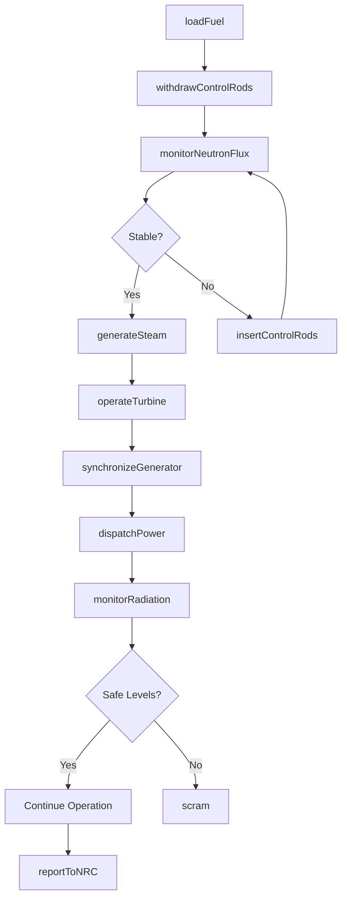
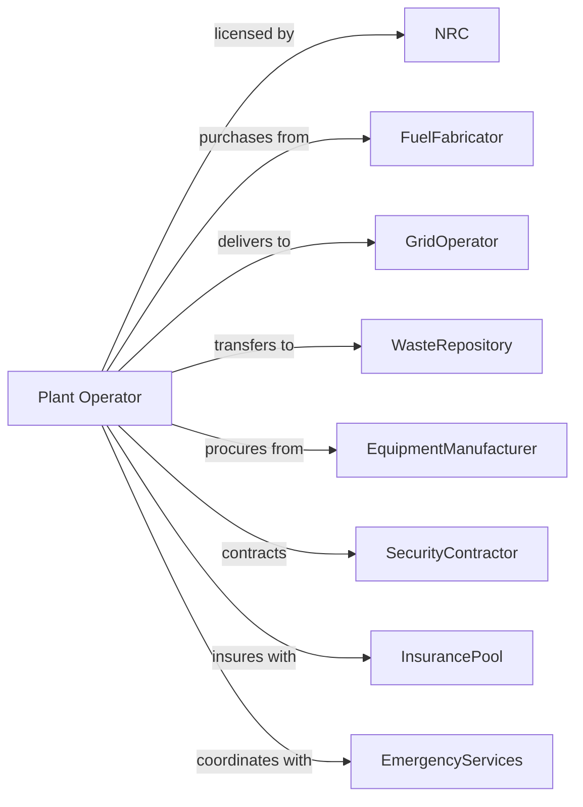

# Nuclear Electric Power Generation

> Business-as-Code definition for nuclear power generation operations. Models the complete fission-to-electricity lifecycle from fuel loading through grid delivery and waste management.

## Overview

Nuclear electric power generation uses controlled nuclear fission to produce heat that generates steam for turbine-driven electricity production. This definition exposes actions for reactor operations, fuel management, radiation monitoring, and safety compliance, with events for automation and searches for operational and safety data retrieval.

## Actors

| Actor | Description |
|-------|-------------|
| NRC | Nuclear Regulatory Commission oversees licensing and safety |
| FuelFabricator | Manufactures enriched uranium fuel assemblies |
| GridOperator | Receives generated power and coordinates dispatch |
| WasteRepository | Receives and stores spent nuclear fuel |
| EquipmentManufacturer | Supplies reactor components and control systems |
| SecurityContractor | Provides armed security for plant protection |
| InsurancePool | Provides liability coverage through industry mutual pool |
| EmergencyServices | Local first responders trained for nuclear incidents |
| INPO | Institute of Nuclear Power Operations promotes safety excellence |

## Roles

| Role | Description |
|------|-------------|
| PlantManager | Oversees all facility operations and NRC compliance |
| ReactorOperator | Licensed operator controlling reactor systems |
| SeniorReactorOperator | Licensed supervisor directing control room operations |
| RadiationProtectionTechnician | Monitors radiation levels and worker exposure |
| NuclearEngineer | Manages reactor physics and fuel cycle planning |
| SecurityOfficer | Protects plant from unauthorized access and threats |

## Entities

| Entity | Description |
|--------|-------------|
| Reactor | Vessel containing nuclear fuel and moderator |
| FuelAssembly | Bundle of fuel rods containing enriched uranium |
| ControlRod | Neutron-absorbing rod regulating fission rate |
| Containment | Structure preventing release of radioactive materials |
| CoolingSystem | Removes heat from reactor via primary and secondary loops |
| Turbine | Steam-driven rotating machine for power generation |
| Generator | Converts mechanical rotation to electrical power |
| SpentFuelPool | Water-filled storage for used fuel assemblies |
| EmergencyCore | Backup cooling systems for accident mitigation |
| DosimeterRecord | Worker radiation exposure tracking |
| RefuelingOutage | Scheduled shutdown for fuel replacement |

## Actions

| Action | Description |
|--------|-------------|
| loadFuel | Insert new fuel assemblies into reactor core |
| withdrawControlRods | Raise control rods to increase reactor power |
| insertControlRods | Lower control rods to decrease power or shut down |
| monitorNeutronFlux | Track neutron levels to verify reactor stability |
| generateSteam | Produce steam through heat transfer from reactor |
| operateTurbine | Control steam flow for power generation |
| synchronizeGenerator | Match generator output to grid frequency |
| dispatchPower | Deliver electricity to transmission grid |
| monitorRadiation | Track radiation levels throughout facility |
| manageDosimetry | Record and limit worker radiation exposure |
| transferSpentFuel | Move used assemblies to spent fuel pool |
| conductDrill | Execute emergency response training exercises |
| reportToNRC | Submit required safety and operational reports |
| performOutage | Execute refueling and maintenance during shutdown |
| securePerimeter | Maintain physical security of protected area |

## Events

| Event | Description |
|-------|-------------|
| reactorStarted | Reactor achieved criticality and began generating |
| controlRodsAdjusted | Control rod position changed affecting power level |
| generatorSynchronized | Generator connected to grid at matching frequency |
| powerDispatched | Electricity delivered to transmission system |
| radiationAlarmTriggered | Radiation level exceeded monitoring threshold |
| scram | Automatic emergency shutdown of reactor |
| refuelingCompleted | New fuel loaded and outage work finished |
| spentFuelTransferred | Used fuel moved to storage pool |
| securityBreachDetected | Unauthorized access attempt identified |
| NRCInspectionCompleted | Regulatory inspection finished |
| emergencyDrillConducted | Training exercise completed and evaluated |
| doseLimitApproached | Worker nearing radiation exposure limit |
| licenseeEventReported | Reportable event submitted to NRC |

## Searches

| Search | Description |
|--------|-------------|
| getReactorStatus | Retrieve current reactor power and operating mode |
| getRadiationLevels | Get radiation readings from plant monitors |
| getDosimetryRecords | Retrieve worker exposure history |
| getFuelStatus | Check fuel burnup and remaining core life |
| getOutageSchedule | List planned refueling and maintenance outages |
| getSecurityStatus | Get current security posture and alerts |
| getGenerationHistory | Retrieve power output records |
| getNRCFindings | Get regulatory inspection results and open items |

## Workflow



## Actor Relationships



## Usage

### Calling Actions

```typescript
import { generateNuclearElectric } from '@headlessly/generate-nuclear-electric'

const plant = generateNuclearElectric()

// Monitor reactor status
const reactor = await plant.getReactorStatus({
  unitId: 'unit-1',
  metrics: ['power', 'coolantTemp', 'neutronFlux', 'controlRodPosition']
})

// Adjust reactor power level
await plant.withdrawControlRods({
  unitId: 'unit-1',
  targetPower: 100, // percent
  rampRate: 0.5 // percent per minute
})

// Dispatch baseload power
await plant.dispatchPower({
  gridOperatorId: 'midwest-iso',
  amount: 1100, // MW
  duration: 24, // hours
  scheduledStart: '2024-08-01T00:00:00Z'
})
```

### Event-Driven Automation

```typescript
// Auto-respond to radiation alarm
plant.radiationAlarmTriggered(async ({ location, level, threshold }) => {
  if (level > threshold * 2) {
    await plant.scram({
      reason: 'radiationExceedance',
      location
    })
  }

  await plant.reportToNRC({
    eventType: 'radiationAlarm',
    location,
    level,
    timestamp: new Date()
  })
})

// Track worker dose limits
plant.doseLimitApproached(async ({ workerId, currentDose, limit }) => {
  const remaining = limit - currentDose

  if (remaining < 100) { // mrem
    await plant.manageDosimetry({
      workerId,
      action: 'restrictAccess',
      zones: ['containment', 'auxiliaryBuilding']
    })
  }
})
```
