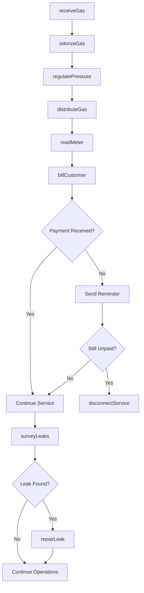
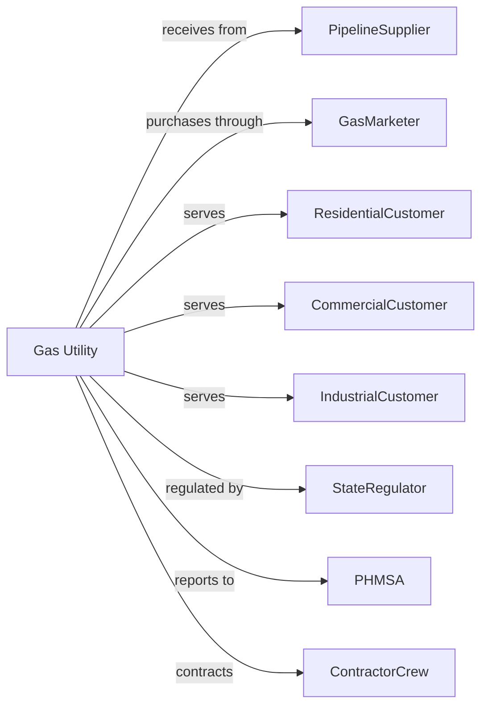

# Natural Gas Distribution

> Business-as-Code definition for natural gas distribution operations. Models the delivery of gas from transmission pipelines to end-use customers through local distribution networks.

## Overview

Natural gas distribution delivers gas from interstate pipelines to residential, commercial, and industrial customers through local distribution networks. This definition exposes actions for gas delivery, pressure management, metering, and safety compliance, with events for automation and searches for customer and system data retrieval.

## Actors

| Actor | Description |
|-------|-------------|
| PipelineSupplier | Interstate pipeline delivering gas to city gate |
| GasMarketer | Wholesale buyer and seller arranging gas supply |
| ResidentialCustomer | Household using gas for heating, cooking, and hot water |
| CommercialCustomer | Business using gas for heating and commercial processes |
| IndustrialCustomer | Manufacturing facility with large gas requirements |
| StateRegulator | Public utility commission setting rates and safety standards |
| PHMSA | Pipeline and Hazardous Materials Safety Administration |
| ContractorCrew | Performs pipeline construction and repair work |
| MeterManufacturer | Supplies gas meters and measurement equipment |

## Roles

| Role | Description |
|------|-------------|
| GasController | Monitors and controls gas flow through distribution system |
| FieldTechnician | Performs service connections and meter installations |
| LeakSurveyTechnician | Conducts pipeline leak detection patrols |
| CustomerServiceRep | Handles customer inquiries and service requests |
| SafetyCoordinator | Manages pipeline integrity and emergency response |
| SystemPlanner | Forecasts demand and plans infrastructure upgrades |

## Entities

| Entity | Description |
|--------|-------------|
| CityGate | Point where gas enters distribution system from transmission |
| DistributionMain | Pipeline carrying gas through service area |
| ServiceLine | Pipe connecting main to customer meter |
| Meter | Device measuring customer gas consumption |
| Regulator | Device reducing pressure for safe distribution |
| Odorizer | Equipment adding mercaptan for leak detection |
| Valve | Device controlling gas flow in pipelines |
| CustomerAccount | Record of customer service and billing |
| Leak | Unintended release of gas from pipeline or equipment |
| Pressure | Gas pressure maintained in distribution system |
| Therm | Unit of gas measurement for billing |

## Actions

| Action | Description |
|--------|-------------|
| receiveGas | Accept gas delivery at city gate metering station |
| distributeGas | Deliver gas through mains to customer service lines |
| regulatePressure | Maintain safe operating pressure in distribution system |
| odorizeGas | Add mercaptan odorant for safety leak detection |
| connectService | Install meter and establish new gas service |
| disconnectService | Terminate service for move-out or safety reasons |
| readMeter | Collect consumption data from customer meters |
| billCustomer | Generate invoice based on metered usage |
| surveyLeaks | Patrol pipelines to detect gas leaks |
| repairLeak | Fix identified gas leak in pipeline or equipment |
| respondToEmergency | Dispatch crews for gas odor or leak reports |
| replaceMain | Install new pipeline to replace aging infrastructure |
| validateMeter | Test meter accuracy and calibrate as needed |
| reportSafety | Submit pipeline safety data to PHMSA |

## Events

| Event | Description |
|-------|-------------|
| gasReceived | Gas accepted at city gate from pipeline |
| pressureAdjusted | System pressure changed via regulator |
| serviceConnected | New customer gas service established |
| serviceDisconnected | Customer gas service terminated |
| meterRead | Consumption data collected from customer |
| billGenerated | Customer invoice created |
| paymentReceived | Customer payment processed |
| leakDetected | Gas leak identified during survey or report |
| leakRepaired | Gas leak fixed and area made safe |
| emergencyDispatched | Crew sent to respond to gas emergency |
| mainReplaced | Section of distribution pipeline renewed |
| coldWeatherAlert | Increased demand expected due to weather |
| supplyConstraint | Gas availability limited at city gate |

## Searches

| Search | Description |
|--------|-------------|
| getCustomerAccount | Retrieve customer service and billing information |
| getMeterReading | Get consumption data for specific meter |
| getSystemPressure | Check pressure at points in distribution network |
| getLeakSurveySchedule | List upcoming leak detection patrols |
| getLeakHistory | Review past leak locations and repairs |
| getSupplyStatus | Check gas availability at city gate |
| getDemandForecast | Get predicted gas demand for planning |
| getMainInventory | Review pipeline age and condition data |

## Workflow



## Actor Relationships



## Usage

### Calling Actions

```typescript
import { distributeNaturalGas } from '@headlessly/distribute-natural-gas'

const utility = distributeNaturalGas()

// Receive gas at city gate
const receipt = await utility.receiveGas({
  cityGateId: 'north-gate-01',
  volume: 50000, // therms
  pressure: 300, // psi
  supplierId: 'transco-pipeline'
})

// Connect new customer service
await utility.connectService({
  customerId: 'CUST-2025-89012',
  serviceAddress: '567 Maple Avenue',
  serviceType: 'residential',
  meterNumber: 'GAS-789456',
  effectiveDate: '2025-03-01'
})

// Respond to emergency gas odor report
await utility.respondToEmergency({
  callId: 'EMG-2025-0234',
  location: '890 Pine Street',
  reportType: 'gasOdor',
  priority: 'immediate'
})
```

### Event-Driven Automation

```typescript
// Auto-respond to leak detection
utility.leakDetected(async ({ location, severity, source }) => {
  if (severity === 'hazardous') {
    await utility.respondToEmergency({
      location,
      action: 'evacuate',
      isolateValve: true
    })
  }

  await utility.repairLeak({
    location,
    priority: severity === 'hazardous' ? 'immediate' : 'scheduled',
    reportToPHMSA: severity !== 'minor'
  })
})

// Manage cold weather demand
utility.coldWeatherAlert(async ({ forecast, duration, severity }) => {
  if (severity === 'extreme') {
    // Check supply adequacy
    const supply = await utility.getSupplyStatus()

    if (supply.available < supply.projected * 1.1) {
      await utility.receiveGas({
        source: 'peakShaving',
        volume: supply.projected - supply.available
      })
    }
  }
})

// Track main replacement priorities
utility.leakRepaired(async ({ mainId, leakCount, mainAge }) => {
  const history = await utility.getLeakHistory({ mainId })

  if (history.leaksPerMile > 2 || mainAge > 50) {
    await utility.replaceMain({
      mainId,
      priority: 'high',
      scheduleYear: new Date().getFullYear() + 1
    })
  }
})
```
