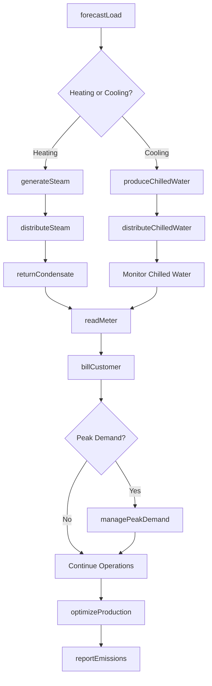
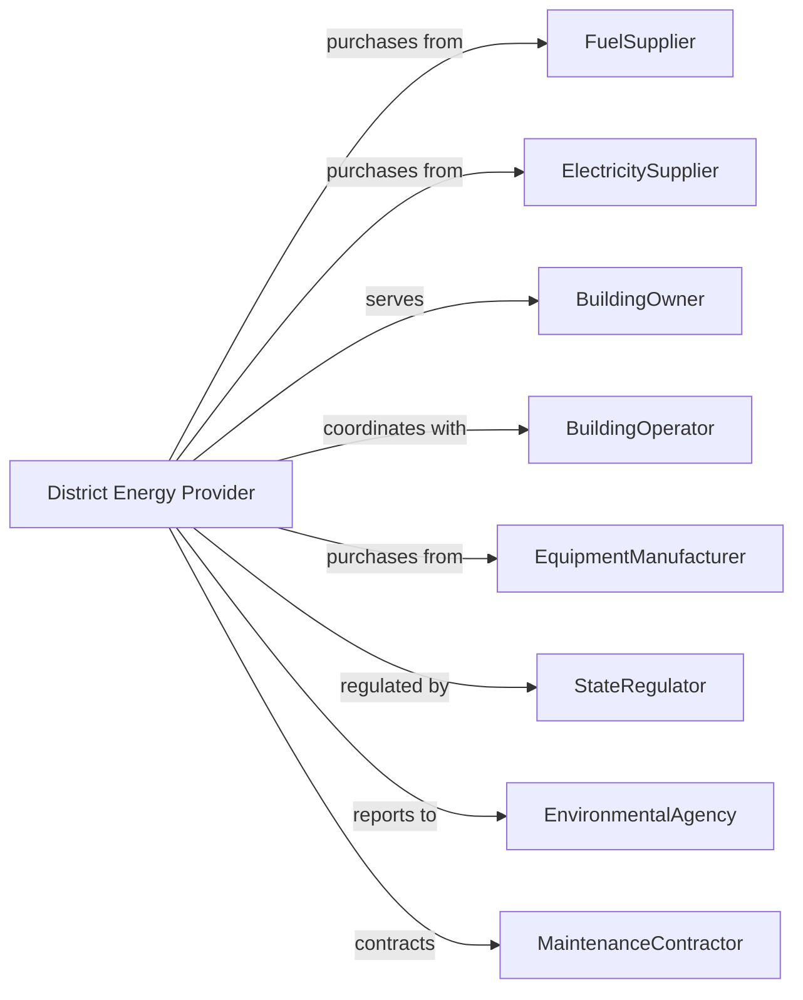

# Steam and Air-Conditioning Supply

> Business-as-Code definition for district energy operations. Models the production and distribution of steam, heated water, and chilled water for building climate control.

## Overview

Steam and air-conditioning supply provides thermal energy through district heating and cooling networks to commercial, institutional, and industrial buildings. This definition exposes actions for steam generation, chilled water production, distribution management, and customer metering, with events for automation and searches for system data retrieval.

## Actors

| Actor | Description |
|-------|-------------|
| FuelSupplier | Provides natural gas, oil, or other fuels for steam generation |
| ElectricitySupplier | Provides power for chillers and pumping equipment |
| BuildingOwner | Property owner connecting to district energy system |
| BuildingOperator | Manages building HVAC systems interfacing with district supply |
| EquipmentManufacturer | Supplies boilers, chillers, and distribution equipment |
| StateRegulator | Public utility commission overseeing rates and service |
| EnvironmentalAgency | Regulates emissions and water discharge |
| MaintenanceContractor | Provides specialized equipment service and repairs |
| CityPlanning | Coordinates underground infrastructure access |

## Roles

| Role | Description |
|------|-------------|
| PlantOperator | Operates boilers, chillers, and production equipment |
| DistributionEngineer | Monitors and controls steam and chilled water networks |
| MeterTechnician | Installs and services customer thermal meters |
| CustomerAccountManager | Manages customer relationships and service contracts |
| MaintenanceTechnician | Repairs and maintains production and distribution equipment |
| EnergyAnalyst | Optimizes system efficiency and forecasts demand |

## Entities

| Entity | Description |
|--------|-------------|
| Boiler | Equipment generating steam from fuel combustion |
| Chiller | Equipment producing chilled water for cooling |
| SteamMain | Underground pipe distributing steam to customers |
| ChilledWaterMain | Underground pipe distributing chilled water |
| CondensateReturn | System returning condensed steam to plant |
| HeatExchanger | Equipment transferring thermal energy at customer |
| ThermalMeter | Device measuring customer energy consumption |
| PumpStation | Facility maintaining pressure in distribution network |
| ThermalStorage | Tank storing chilled water for peak demand |
| ServiceContract | Agreement defining customer service terms |
| LoadProfile | Pattern of customer thermal energy demand |
| EnergyUnit | Measurement of thermal energy delivered (Mlb, ton-hour) |

## Actions

| Action | Description |
|--------|-------------|
| generateSteam | Produce steam by burning fuel in boilers |
| produceChilledWater | Generate chilled water using electric chillers |
| distributeSteam | Deliver steam through underground mains to customers |
| distributeChilledWater | Deliver chilled water to customers for cooling |
| returnCondensate | Collect and return steam condensate to plant |
| connectCustomer | Install metering and connect building to network |
| disconnectCustomer | Terminate service and isolate customer connection |
| readMeter | Collect thermal energy consumption data |
| billCustomer | Generate invoice based on metered usage |
| maintainDistribution | Inspect and repair underground piping and vaults |
| optimizeProduction | Adjust boiler and chiller operations for efficiency |
| managePeakDemand | Use thermal storage to meet peak loads |
| forecastLoad | Predict thermal demand based on weather and usage |
| reportEmissions | Submit air quality data to environmental agency |

## Events

| Event | Description |
|-------|-------------|
| steamGenerated | Boiler producing steam at required pressure |
| chilledWaterProduced | Chiller generating chilled water at setpoint |
| steamDistributed | Thermal energy delivered to customer buildings |
| chilledWaterDistributed | Cooling energy delivered to customers |
| condensateReturned | Steam condensate received back at plant |
| customerConnected | New building joined district energy network |
| customerDisconnected | Building removed from service |
| meterRead | Consumption data collected from thermal meter |
| billGenerated | Customer invoice created |
| peakDemandReached | System load hit maximum capacity |
| leakDetected | Steam or water leak identified in distribution |
| equipmentFailed | Boiler, chiller, or pump experienced malfunction |
| weatherAlertReceived | Extreme temperature forecast requiring preparation |

## Searches

| Search | Description |
|--------|-------------|
| getPlantStatus | Retrieve boiler and chiller operational status |
| getDistributionPressure | Check pressure in steam and chilled water mains |
| getCustomerAccount | Retrieve customer service and billing information |
| getMeterReading | Get thermal consumption data for specific meter |
| getLoadForecast | Get predicted thermal demand for planning |
| getEfficiencyMetrics | Review production efficiency and losses |
| getLeakHistory | Review past leak locations and repairs |
| getEmissionsData | Retrieve air emissions monitoring data |

## Workflow



## Actor Relationships



## Usage

### Calling Actions

```typescript
import { supplySteamAirConditioning } from '@headlessly/supply-steam-air-conditioning'

const district = supplySteamAirConditioning()

// Generate steam for heating season
await district.generateSteam({
  boilerId: 'boiler-1',
  pressure: 125, // psi
  capacity: 80, // percent
  fuelType: 'naturalGas'
})

// Produce chilled water for cooling season
await district.produceChilledWater({
  chillerId: 'chiller-array-1',
  supplyTemp: 42, // degrees F
  returnTemp: 56, // degrees F
  tonnage: 5000 // tons of refrigeration
})

// Connect new customer building
await district.connectCustomer({
  customerId: 'CUST-2025-45678',
  buildingAddress: '100 Financial Plaza',
  serviceType: 'steamAndChilledWater',
  meterIds: ['STEAM-789', 'CHW-456'],
  effectiveDate: '2025-05-01'
})
```

### Event-Driven Automation

```typescript
// Respond to peak demand conditions
district.peakDemandReached(async ({ systemLoad, capacity, serviceType }) => {
  if (serviceType === 'chilledWater') {
    await district.managePeakDemand({
      action: 'deployThermalStorage',
      tankId: 'storage-tank-1',
      dischargeRate: capacity - systemLoad
    })
  }

  if (systemLoad / capacity > 0.95) {
    await district.optimizeProduction({
      mode: 'peakShaving',
      notifyLargeCustomers: true
    })
  }
})

// Handle equipment failures
district.equipmentFailed(async ({ equipmentId, equipmentType, severity }) => {
  if (equipmentType === 'boiler' && severity === 'major') {
    // Start backup equipment
    const backups = await district.getPlantStatus({
      type: 'boiler',
      status: 'standby'
    })

    if (backups.length > 0) {
      await district.generateSteam({
        boilerId: backups[0].id,
        mode: 'emergency'
      })
    }
  }
})

// Prepare for extreme weather
district.weatherAlertReceived(async ({ type, severity, startTime }) => {
  const forecast = await district.getLoadForecast({
    startTime,
    duration: 72 // hours
  })

  if (type === 'coldSnap') {
    await district.generateSteam({
      mode: 'preheat',
      targetCapacity: forecast.peakDemand * 1.1
    })
  } else if (type === 'heatWave') {
    await district.produceChilledWater({
      mode: 'precool',
      chargeThermalStorage: true
    })
  }
})
```
