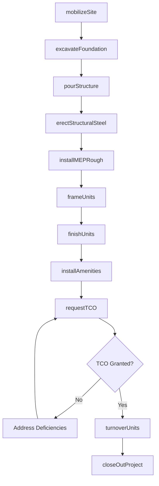
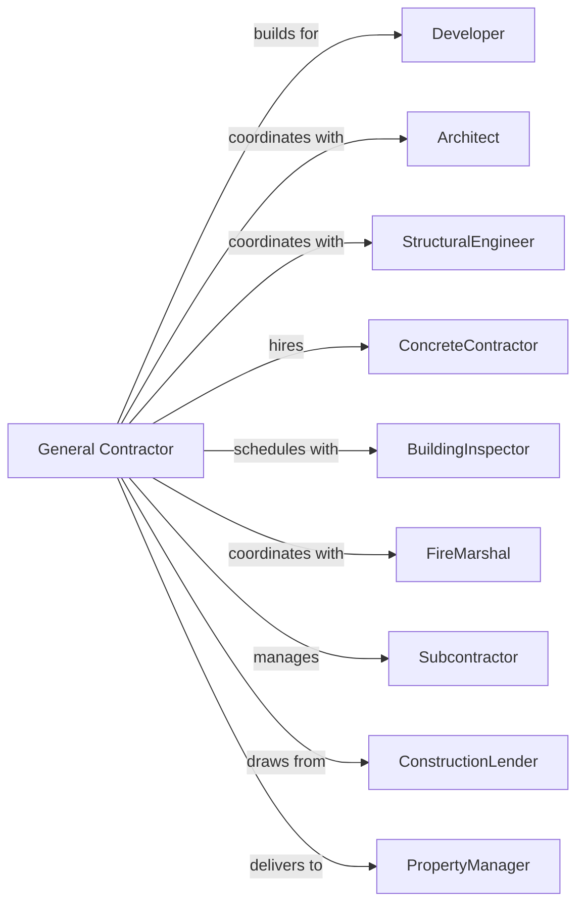

# New Multifamily Housing Construction (except For-Sale Builders)

> Business-as-Code definition for multifamily residential construction operations. Models the complete development lifecycle from site acquisition through tenant occupancy for apartments, condominiums, and high-rise residential buildings.

## Overview

Multifamily housing construction involves building apartment complexes, condominiums, and high-rise residential buildings typically for rental or investor ownership. This definition exposes actions for phased construction, unit tracking, amenity installation, and certificate of occupancy acquisition. General contractors coordinate multiple trades across hundreds of units while managing complex schedules and owner draw requirements.

## Actors

| Actor | Description |
|-------|-------------|
| Developer | Property owner or investment group commissioning the project |
| Architect | Designs building plans, unit layouts, and common areas |
| StructuralEngineer | Provides structural calculations and specifications |
| ConcreteContractor | Handles foundations, parking structures, and podiums |
| BuildingInspector | Municipal official verifying code compliance |
| FireMarshal | Reviews and approves life safety systems |
| Subcontractor | Specialty trade contractors for mechanical and finishes |
| ConstructionLender | Provides construction financing with monthly draws |
| PropertyManager | Prepares for tenant occupancy and building operations |

## Roles

| Role | Description |
|------|-------------|
| GeneralContractor | Oversees entire project and holds prime contract |
| ProjectExecutive | Senior manager responsible for project profitability |
| ProjectManager | Manages schedules, budgets, and subcontractor coordination |
| SiteSuperintendent | On-site supervisor for daily operations and safety |
| QualityControlManager | Ensures workmanship meets specifications and standards |
| SafetyManager | Implements and monitors jobsite safety programs |

## Entities

| Entity | Description |
|--------|-------------|
| Project | The multifamily development with budget and timeline |
| Building | Individual structure within a multi-building project |
| Unit | Single residential apartment or condominium |
| Phase | Construction stage grouping multiple buildings or units |
| DrawSchedule | Payment milestones tied to completion percentages |
| Submittal | Product data and samples for architect approval |
| RFI | Request for information to clarify plans or specs |
| DailyLog | Record of workers, weather, and activities on site |
| Punchlist | Deficiency list by unit requiring correction |
| TCO | Temporary Certificate of Occupancy for phased move-in |

## Actions

| Action | Description |
|--------|-------------|
| mobilizeSite | Set up jobsite facilities, fencing, and access |
| excavateFoundation | Complete bulk excavation and foundation preparation |
| pourStructure | Cast concrete for podium, columns, and floor plates |
| erectStructuralSteel | Install steel framing for mid-rise and high-rise |
| installMEPRough | Complete mechanical, electrical, plumbing rough-in |
| frameUnits | Build interior partition walls and unit separations |
| processSubmittal | Review and approve product submittals |
| respondToRFI | Answer contractor questions about plans |
| finishUnits | Complete flooring, paint, fixtures, and appliances |
| installAmenities | Build common areas, fitness rooms, and pools |
| requestTCO | Apply for temporary certificate of occupancy |
| turnoverUnits | Deliver completed units to property manager |
| closeOutProject | Complete all punch items and final documentation |

## Events

| Event | Description |
|-------|-------------|
| siteMobilized | Jobsite setup complete and ready for construction |
| foundationComplete | All foundation work finished and inspected |
| structureTopped | Structural frame reached highest point |
| roughInsComplete | All mechanical rough-in inspections passed |
| submittalApproved | Product submittal accepted by design team |
| rfiAnswered | Request for information resolved |
| unitsFinished | Specified units completed and cleaned |
| amenitiesComplete | Common area amenities ready for use |
| tcoIssued | Temporary occupancy certificate received |
| unitsDelivered | Units turned over to property management |
| projectClosedOut | All punch items complete and retainage released |

## Searches

| Search | Description |
|--------|-------------|
| findProjects | List projects by status, developer, or location |
| getPhaseStatus | Retrieve completion percentage by phase |
| findUnits | List units filtered by building, floor, or status |
| getSubmittals | Retrieve submittals by status or trade |
| findOpenRFIs | List unanswered requests for information |
| getPunchlistByUnit | Get deficiency items for specific units |
| getDrawStatus | Check current draw request and payment status |

## Workflow



## Actor Relationships



## Usage

### Calling Actions

```typescript
import { buildNewMultifamily } from '@headlessly/build-new-multifamily'

const builder = buildNewMultifamily()

// Initialize new multifamily project
const project = await builder.mobilizeSite({
  developerId: 'dev-456',
  projectName: 'The Heights at Riverside',
  totalUnits: 280,
  buildings: 3,
  stories: 5,
  startDate: '2024-02-01'
})

// Process product submittal
await builder.processSubmittal({
  projectId: project.id,
  trade: 'flooring',
  productName: 'LVP - Driftwood Oak',
  manufacturer: 'Shaw',
  documents: ['spec-sheet.pdf', 'warranty.pdf']
})

// Request temporary occupancy for Phase 1
await builder.requestTCO({
  projectId: project.id,
  phase: 1,
  buildings: ['A'],
  unitRange: '101-148',
  requestDate: '2024-11-15'
})
```

### Event-Driven Automation

```typescript
// Auto-notify developer when TCO issued
builder.tcoIssued(async ({ projectId, phase, unitCount }) => {
  const project = await builder.findProjects({ id: projectId })

  await builder.turnoverUnits({
    projectId,
    phase,
    propertyManagerId: project.propertyManagerId,
    keyHandoffDate: addDays(new Date(), 7)
  })
})

// Auto-schedule inspections when rough-ins complete
builder.roughInsComplete(async ({ projectId, building }) => {
  await builder.frameUnits({
    projectId,
    building,
    startDate: getNextBusinessDay()
  })
})
```
