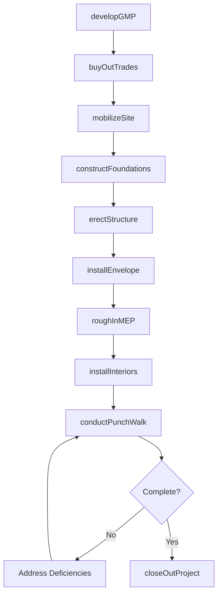
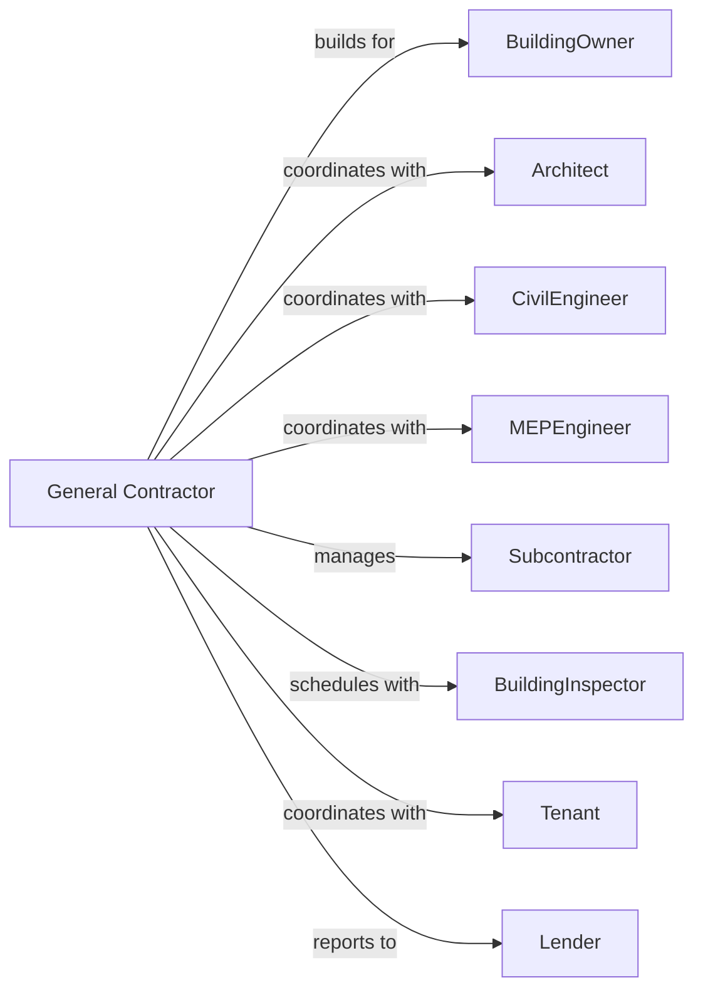

# Commercial and Institutional Building Construction

> Business-as-Code definition for commercial and institutional building construction operations. Models the complete lifecycle from preconstruction through occupancy for offices, retail centers, schools, hospitals, and public buildings.

## Overview

Commercial and institutional construction encompasses office buildings, retail centers, schools, hospitals, government facilities, and religious buildings. Projects require coordination across architectural design, structural systems, and complex MEP installations. This definition exposes actions for preconstruction services, construction management, quality control, and commissioning while managing stakeholder requirements and public-facing schedules.

## Actors

| Actor | Description |
|-------|-------------|
| BuildingOwner | Entity commissioning the commercial or institutional facility |
| Architect | Provides design documents and construction administration |
| CivilEngineer | Designs site work, grading, and utilities |
| MEPEngineer | Designs mechanical, electrical, and plumbing systems |
| Subcontractor | Specialty trades performing specific scopes of work |
| ConstructionManager | Manages project on behalf of owner (CM at-risk) |
| BuildingInspector | Municipal official verifying code compliance |
| Tenant | Future occupant requiring build-out coordination |
| Lender | Provides construction financing and monitors progress |

## Roles

| Role | Description |
|------|-------------|
| ProjectExecutive | Senior leader accountable for project success |
| ProjectManager | Manages budget, schedule, and team coordination |
| Superintendent | On-site leader for construction activities |
| ProjectEngineer | Handles submittals, RFIs, and technical coordination |
| FieldEngineer | Supports layout, quality control, and documentation |
| Scheduler | Develops and maintains project schedule |

## Entities

| Entity | Description |
|--------|-------------|
| Project | The commercial building with budget and schedule |
| Building | Physical structure with floors, areas, and systems |
| Contract | Prime contract or GMP agreement with owner |
| Schedule | CPM schedule with milestones and activities |
| Budget | Cost breakdown with contingency and allowances |
| Submittal | Product data for architect approval |
| RFI | Request for information to clarify documents |
| ChangeOrder | Modification to contract scope or price |
| PayApplication | Monthly request for payment |
| Punchlist | Deficiency items for completion |

## Actions

| Action | Description |
|--------|-------------|
| developGMP | Establish guaranteed maximum price with owner |
| buyOutTrades | Procure subcontractors and suppliers |
| mobilizeSite | Set up jobsite facilities and logistics |
| constructFoundations | Install footings, foundations, and slabs |
| erectStructure | Build structural frame and floor systems |
| installEnvelope | Complete exterior walls, windows, and roofing |
| roughInMEP | Install mechanical, electrical, and plumbing |
| installInteriors | Complete drywall, ceilings, and finishes |
| processSubmittal | Review and route product submittals |
| manageRFI | Coordinate requests for information |
| submitPayApp | Prepare and submit monthly pay application |
| conductPunchWalk | Identify deficiencies for correction |
| closeOutProject | Complete final documentation and warranties |

## Events

| Event | Description |
|-------|-------------|
| gmpEstablished | Guaranteed maximum price agreed with owner |
| tradesBoughtOut | All subcontracts executed |
| siteMobilized | Jobsite setup complete |
| foundationsComplete | Foundation work finished |
| structureComplete | Building frame topped out |
| envelopeClosed | Building weather-tight |
| roughInComplete | MEP rough-in inspections passed |
| interiorsComplete | Finish work completed |
| submittalApproved | Product data accepted |
| rfiResolved | Information request answered |
| payAppApproved | Payment application processed |
| punchlistComplete | All deficiencies corrected |
| projectClosedOut | Final documentation delivered |

## Searches

| Search | Description |
|--------|-------------|
| findProjects | List projects by status, owner, or type |
| getSchedule | Retrieve schedule with current status |
| getBudgetStatus | View budget with costs and forecasts |
| getSubmittals | List submittals by trade or status |
| findOpenRFIs | Retrieve unanswered RFIs |
| getPunchlist | Get deficiency items by area |
| getPayAppHistory | View payment application history |

## Workflow



## Actor Relationships



## Usage

### Calling Actions

```typescript
import { buildCommercialInstitutional } from '@headlessly/build-commercial-institutional'

const builder = buildCommercialInstitutional()

// Establish guaranteed maximum price
const gmp = await builder.developGMP({
  ownerId: 'school-district-123',
  projectName: 'Lincoln Elementary School',
  squareFootage: 85000,
  stories: 2,
  projectType: 'K-12-education',
  targetBudget: 32000000
})

// Buy out trade packages
await builder.buyOutTrades({
  projectId: gmp.projectId,
  trades: [
    { scope: 'concrete', budget: 2800000 },
    { scope: 'structural-steel', budget: 3200000 },
    { scope: 'mechanical', budget: 4500000 },
    { scope: 'electrical', budget: 3800000 }
  ]
})

// Submit monthly pay application
await builder.submitPayApp({
  projectId: gmp.projectId,
  period: '2024-06',
  completedWork: 4250000,
  storedMaterials: 380000,
  retainage: 0.10
})
```

### Event-Driven Automation

```typescript
// Auto-notify when structure complete
builder.structureComplete(async ({ projectId }) => {
  const project = await builder.findProjects({ id: projectId })

  await notifyStakeholders({
    projectId,
    milestone: 'topping-out',
    message: 'Structural frame complete. Envelope work beginning.'
  })
})

// Auto-generate punchlist report
builder.punchlistComplete(async ({ projectId }) => {
  await builder.closeOutProject({
    projectId,
    deliverables: ['as-builts', 'warranties', 'O&M-manuals'],
    finalPayApp: true
  })
})
```
