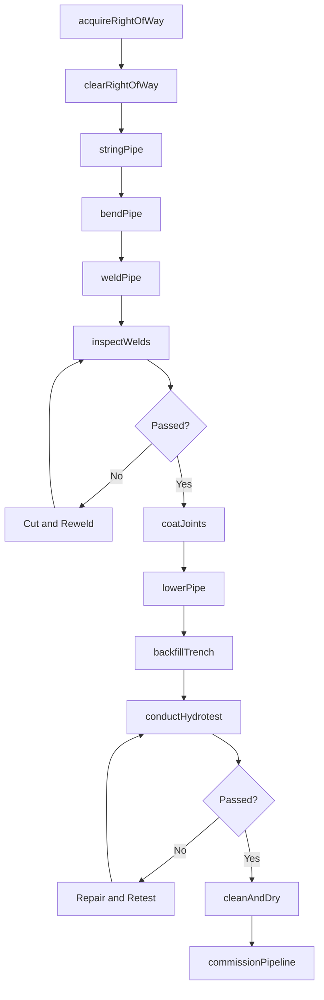
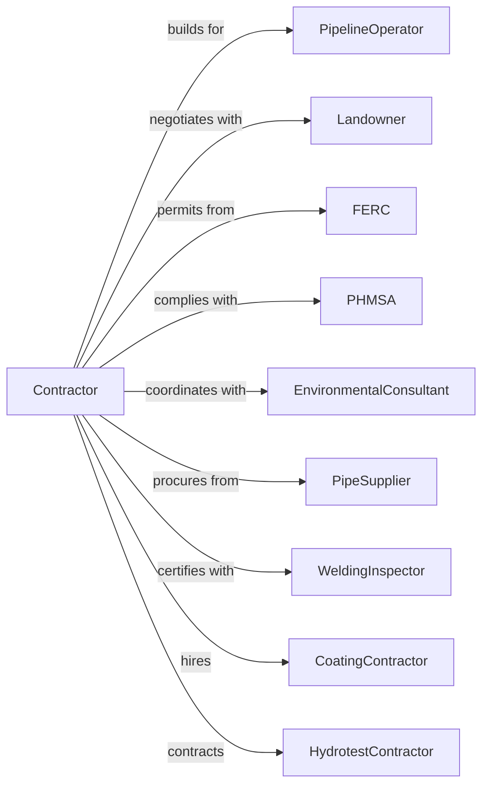

# Oil and Gas Pipeline and Related Structures Construction

> Business-as-Code definition for oil and gas pipeline construction operations. Models the complete lifecycle from right-of-way acquisition through pipeline commissioning for transmission lines, gathering systems, and related facilities.

## Overview

Oil and gas pipeline construction involves installing transmission pipelines, gathering lines, compressor stations, and storage facilities. Projects require specialized welding, coating, and testing across long distances through varied terrain. This definition exposes actions for right-of-way clearing, pipe stringing, welding, coating, and hydrostatic testing while managing environmental compliance and landowner relations.

## Actors

| Actor | Description |
|-------|-------------|
| PipelineOperator | Company commissioning the pipeline system |
| Landowner | Property owner granting right-of-way access |
| FERC | Federal Energy Regulatory Commission for permitting |
| PHMSA | Pipeline and Hazardous Materials Safety Administration |
| EnvironmentalConsultant | Manages environmental permits and compliance |
| PipeSupplier | Provides coated line pipe and fittings |
| WeldingInspector | Certifies welder qualifications and inspects joints |
| CoatingContractor | Applies field joint coating |
| HydrotestContractor | Performs hydrostatic pressure testing |

## Roles

| Role | Description |
|------|-------------|
| ProjectManager | Manages contract, budget, and stakeholder coordination |
| SpreadSuperintendent | Oversees construction spread operations |
| RightOfWayAgent | Negotiates land access agreements |
| WeldingForeman | Supervises pipe welding operations |
| EquipmentManager | Manages sidebooms, benders, and specialty equipment |
| EnvironmentalInspector | Monitors environmental compliance on site |

## Entities

| Entity | Description |
|--------|-------------|
| Project | The pipeline construction with specifications |
| Pipeline | Linear infrastructure with diameter, pressure, and material |
| Spread | Construction segment with dedicated crew and equipment |
| RightOfWay | Land easement for pipeline installation |
| WeldJoint | Welded connection between pipe sections |
| Coating | Protective layer applied to pipe exterior |
| CompressorStation | Facility housing compressors and controls |
| PigLauncher | Pipeline cleaning and inspection tool launcher |
| HydrotestSection | Segment isolated for pressure testing |
| CrossingPermit | Authorization for road, rail, or water crossings |

## Actions

| Action | Description |
|--------|-------------|
| acquireRightOfWay | Negotiate and secure land easements |
| clearRightOfWay | Clear vegetation and grade work area |
| stringPipe | Distribute pipe sections along right-of-way |
| bendPipe | Field bend pipe to match terrain contours |
| weldPipe | Join pipe sections with certified welders |
| inspectWelds | Radiograph and test weld quality |
| coatJoints | Apply protective coating to field welds |
| lowerPipe | Place welded pipe string in trench |
| backfillTrench | Cover pipe and restore grade |
| conductHydrotest | Perform hydrostatic pressure test |
| installCrossing | Complete horizontal directional drill or bore |
| installStation | Build compressor or metering station |
| cleanAndDry | Pig and dry pipeline before service |
| commissionPipeline | Introduce product and begin operations |

## Events

| Event | Description |
|-------|-------------|
| rightOfWayAcquired | Land easements secured for construction |
| rightOfWayCleared | Work area prepared for construction |
| pipeStrung | Pipe sections distributed along route |
| pipeBent | Field bends completed to specification |
| pipeWelded | All welds completed on spread |
| weldsInspected | Radiographic testing complete |
| jointsCoated | Field joint coating applied |
| pipeLowered | Pipe placed in trench |
| trenchBackfilled | Pipeline buried and grade restored |
| hydrotestPassed | Pressure test successful |
| crossingComplete | HDD or bore crossing installed |
| stationComplete | Compressor or meter station operational |
| pipelineCleaned | Cleaning and drying complete |
| pipelineCommissioned | Pipeline in service |

## Searches

| Search | Description |
|--------|-------------|
| findProjects | List projects by status, operator, or region |
| getSpreadProgress | Retrieve construction progress by spread |
| getWeldLog | View weld records with inspection status |
| findOpenCrossings | List crossings under construction |
| getHydrotestResults | Retrieve pressure test documentation |
| getRightOfWayStatus | Check easement acquisition progress |
| getPermitStatus | View permit applications and approvals |

## Workflow



## Actor Relationships



## Usage

### Calling Actions

```typescript
import { installOilGas } from '@headlessly/install-oil-gas'

const contractor = installOilGas()

// Acquire right-of-way easements
const row = await contractor.acquireRightOfWay({
  projectId: 'pipeline-456',
  segment: 'MP-0-50',
  tracts: 145,
  targetDate: '2024-06-01'
})

// Weld pipe sections
await contractor.weldPipe({
  projectId: 'pipeline-456',
  spread: 'spread-1',
  stationRange: 'MP-5-15',
  pipeSize: 36,
  wallThickness: 0.625,
  weldProcedure: 'WPS-001'
})

// Conduct hydrostatic pressure test
const hydrotest = await contractor.conductHydrotest({
  projectId: 'pipeline-456',
  testSection: 'HT-001',
  stationRange: 'MP-0-25',
  testPressure: 1800,
  duration: 8,
  fillSource: 'approved-water-source'
})
```

### Event-Driven Automation

```typescript
// Auto-coat joints when welds pass inspection
contractor.weldsInspected(async ({ projectId, spread, passedWelds }) => {
  await contractor.coatJoints({
    projectId,
    spread,
    joints: passedWelds,
    coatingType: 'fusion-bonded-epoxy'
  })
})

// Auto-commission when hydrotest passes
contractor.hydrotestPassed(async ({ projectId, testSection }) => {
  await contractor.cleanAndDry({
    projectId,
    testSection,
    piggingRuns: 3,
    dryingMethod: 'air-dry'
  })
})
```
