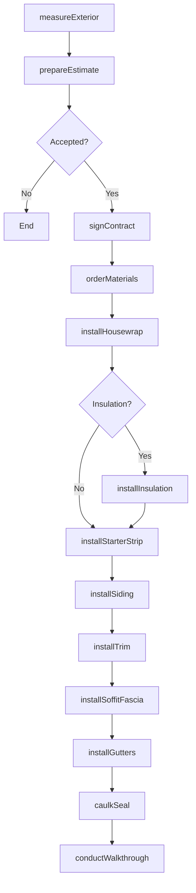
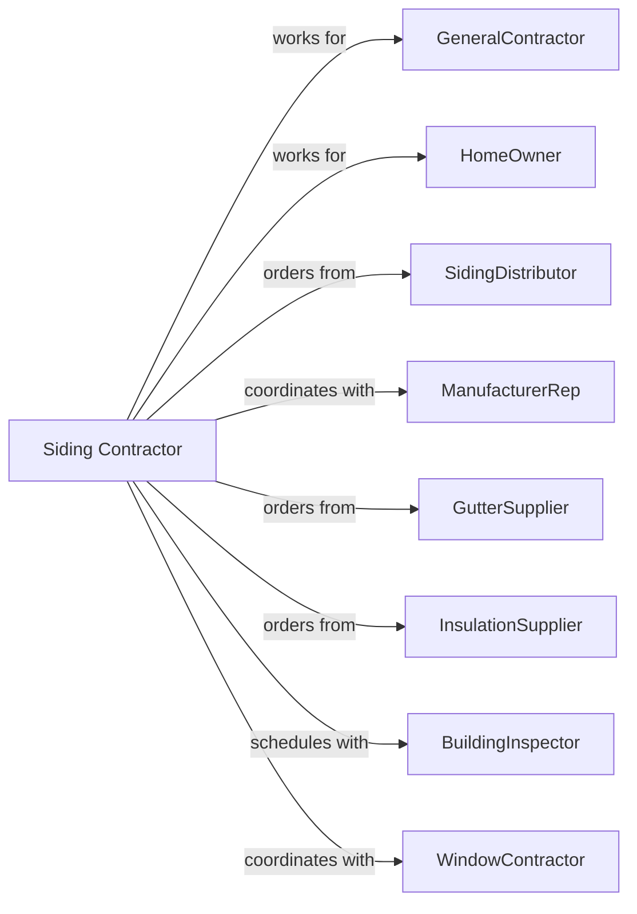

# Siding Contractors

> Business-as-Code definition for siding contracting operations. Models the complete lifecycle from measurement through installation for vinyl, fiber cement, wood, and aluminum siding systems including gutters and trim.

## Overview

Siding contractors specialize in installing exterior cladding systems including vinyl siding, fiber cement, wood siding, and aluminum products. Work includes housewrap, trim, soffits, fascia, and gutter systems. This definition exposes actions for measurement, material takeoff, and installation while managing weather protection, ventilation, and aesthetic coordination.

## Actors

| Actor | Description |
|-------|-------------|
| GeneralContractor | Prime contractor on new construction |
| HomeOwner | Property owner for residing projects |
| SidingDistributor | Supplies siding, trim, and accessories |
| ManufacturerRep | Provides technical support and specifications |
| GutterSupplier | Provides gutters and downspouts |
| InsulationSupplier | Provides foam board and housewrap |
| BuildingInspector | Verifies code compliance |
| WindowContractor | Coordinates flashing at window installations |

## Roles

| Role | Description |
|------|-------------|
| SidingContractor | Business owner managing operations |
| Estimator | Measures and prepares proposals |
| ProjectManager | Coordinates materials and crews |
| LeadInstaller | Senior tradesperson leading crew |
| Installer | Skilled worker cutting and fastening siding |
| Laborer | Supports material handling and cleanup |

## Entities

| Entity | Description |
|--------|-------------|
| Project | The siding scope with specifications |
| Estimate | Cost proposal with materials and labor |
| SidingSystem | Complete wall cladding assembly |
| Housewrap | Weather-resistant barrier under siding |
| Siding | Primary exterior cladding material |
| Trim | Corners, J-channel, and finish pieces |
| Soffit | Underside of roof overhang covering |
| Fascia | Board covering rafter ends |
| Gutter | Rainwater collection and drainage system |
| Flashing | Waterproofing at transitions and openings |

## Actions

| Action | Description |
|--------|-------------|
| measureExterior | Document wall areas and details |
| prepareEstimate | Calculate materials and labor costs |
| signContract | Execute siding agreement |
| orderMaterials | Purchase siding, trim, and accessories |
| installHousewrap | Apply weather-resistant barrier |
| installInsulation | Add foam board if specified |
| installStarterStrip | Set base course alignment |
| installSiding | Attach siding panels to walls |
| installTrim | Apply corners, J-channel, and casings |
| installSoffitFascia | Complete overhang enclosure |
| installGutters | Mount gutters and downspouts |
| caulkSeal | Apply sealant at penetrations |
| conductWalkthrough | Review completed work with customer |

## Events

| Event | Description |
|-------|-------------|
| exteriorMeasured | Site measurements complete |
| estimatePresented | Proposal delivered to customer |
| contractSigned | Agreement executed |
| materialsDelivered | Siding and accessories on site |
| housewrapInstalled | Weather barrier applied |
| insulationInstalled | Foam board in place |
| starterInstalled | Base course set |
| sidingInstalled | Primary cladding complete |
| trimInstalled | All trim pieces applied |
| soffitFasciaInstalled | Overhangs enclosed |
| guttersInstalled | Drainage system complete |
| sealingComplete | All penetrations caulked |
| walkthroughComplete | Customer accepted work |

## Searches

| Search | Description |
|--------|-------------|
| findProjects | List projects by status or customer |
| getEstimates | View pending proposals |
| getMaterialOrders | Track siding deliveries |
| getCrewSchedule | View crew assignments |
| getWeatherForecast | Check conditions for scheduling |
| getColorOptions | Retrieve available siding colors |
| getWarrantyInfo | View manufacturer warranty terms |

## Workflow



## Actor Relationships



## Usage

### Calling Actions

```typescript
import { installSidingContractors } from '@headlessly/install-siding-contractors'

const sider = installSidingContractors()

// Measure exterior for estimate
const measurements = await sider.measureExterior({
  propertyId: 'home-123',
  address: '456 Elm Avenue',
  stories: 2,
  elevations: ['front', 'back', 'left', 'right'],
  windows: 14,
  doors: 3
})

// Install fiber cement siding
await sider.installSiding({
  projectId: 'reside-456',
  sidingType: 'fiber-cement',
  manufacturer: 'James-Hardie',
  profile: 'HardiePlank',
  color: 'Arctic-White',
  squares: 28
})

// Install seamless gutters
await sider.installGutters({
  projectId: 'reside-456',
  gutterSize: '5-inch-K-style',
  material: 'aluminum',
  color: 'white',
  downspouts: 6,
  leafGuards: true
})
```

### Event-Driven Automation

```typescript
// Auto-install starter when housewrap complete
sider.housewrapInstalled(async ({ projectId }) => {
  await sider.installStarterStrip({
    projectId,
    starterType: 'universal',
    startDate: addDays(new Date(), 1)
  })
})

// Auto-schedule gutter install when soffit complete
sider.soffitFasciaInstalled(async ({ projectId }) => {
  await sider.installGutters({
    projectId,
    installDate: addDays(new Date(), 2)
  })
})
```
