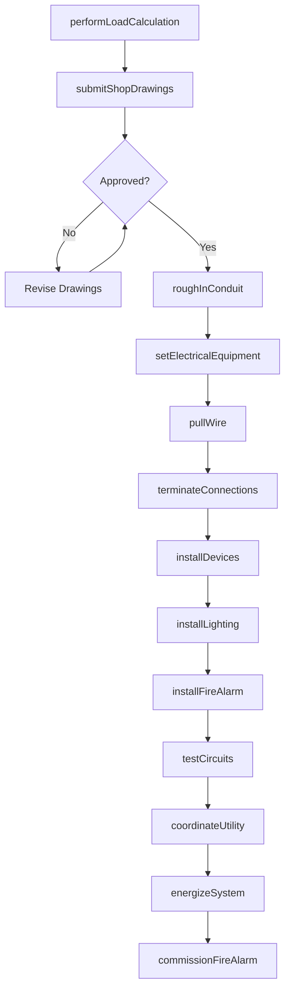
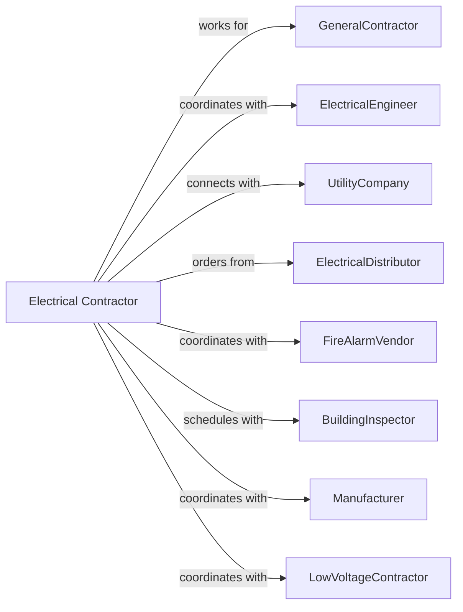

# Electrical Contractors and Other Wiring Installation Contractors

> Business-as-Code definition for electrical contracting operations. Models the complete lifecycle from design coordination through energization for power distribution, lighting, fire alarm, and low-voltage systems.

## Overview

Electrical contractors specialize in installing and servicing power distribution, lighting, fire alarm, telecommunications, and security systems. Work includes rough-in wiring, panel installation, device termination, and system commissioning. This definition exposes actions for load calculations, conduit installation, wire pulling, and final connections while managing code compliance, coordination drawings, and energization procedures.

## Actors

| Actor | Description |
|-------|-------------|
| GeneralContractor | Prime contractor managing overall construction |
| ElectricalEngineer | Designs electrical systems and specifications |
| UtilityCompany | Provides permanent power service connection |
| ElectricalDistributor | Supplies wire, conduit, panels, and devices |
| FireAlarmVendor | Provides fire alarm equipment and programming |
| BuildingInspector | Verifies electrical code compliance |
| Manufacturer | Provides technical support for specialty equipment |
| LowVoltageContractor | Installs data, security, and AV systems |

## Roles

| Role | Description |
|------|-------------|
| ElectricalContractor | Business owner managing operations |
| ProjectManager | Coordinates schedule, budget, and submittals |
| Foreman | Leads electrical crew on site |
| Journeyman | Licensed electrician performing installations |
| Apprentice | Electrician in training supporting journeymen |
| FireAlarmTechnician | Specializes in fire alarm system installation |

## Entities

| Entity | Description |
|--------|-------------|
| Project | The electrical scope with specifications |
| Estimate | Cost proposal with labor and materials |
| Panel | Electrical distribution panel or switchgear |
| Circuit | Wiring from panel to devices or equipment |
| Conduit | Raceway protecting electrical conductors |
| Device | Receptacle, switch, or other termination |
| Fixture | Lighting fixture or ceiling fan |
| FireAlarmSystem | Detection and notification equipment |
| LoadCalculation | Analysis of electrical demand |
| AsBuilt | Documentation of installed conditions |

## Actions

| Action | Description |
|--------|-------------|
| performLoadCalculation | Calculate electrical service requirements |
| submitShopDrawings | Prepare coordination and equipment drawings |
| roughInConduit | Install raceways and boxes before walls close |
| setElectricalEquipment | Mount panels, switchgear, and transformers |
| pullWire | Install conductors through conduit |
| terminateConnections | Make connections at panels and devices |
| installDevices | Mount receptacles, switches, and plates |
| installLighting | Mount and connect light fixtures |
| installFireAlarm | Install detection and notification devices |
| testCircuits | Verify wiring and connections |
| coordinateUtility | Arrange permanent service connection |
| energizeSystem | Turn on power and verify operation |
| commissionFireAlarm | Test and program fire alarm system |

## Events

| Event | Description |
|-------|-------------|
| loadCalculationComplete | Service requirements determined |
| shopDrawingsApproved | Coordination drawings accepted |
| roughInComplete | Conduit and boxes installed |
| equipmentSet | Panels and switchgear mounted |
| wirePulled | Conductors installed in conduit |
| terminationsComplete | All connections made |
| devicesInstalled | Receptacles and switches mounted |
| lightingInstalled | Fixtures hung and connected |
| fireAlarmInstalled | Detection devices mounted |
| circuitsTested | Wiring verified correct |
| utilityConnected | Permanent service energized |
| systemEnergized | Power on throughout building |
| fireAlarmCommissioned | Fire alarm accepted by AHJ |

## Searches

| Search | Description |
|--------|-------------|
| findProjects | List projects by status or GC |
| getCircuitSchedule | View panel schedule with circuits |
| getInspectionStatus | Check inspection requests and results |
| getMaterialOrders | Track electrical material deliveries |
| getCrewSchedule | View electrician assignments |
| getFireAlarmDevices | List installed detection devices |
| getAsBuiltStatus | Track as-built documentation |

## Workflow



## Actor Relationships



## Usage

### Calling Actions

```typescript
import { installElectricalContractors } from '@headlessly/install-electrical-contractors'

const electrician = installElectricalContractors()

// Calculate electrical load
const loadCalc = await electrician.performLoadCalculation({
  projectId: 'office-building-456',
  squareFootage: 25000,
  occupancyType: 'office',
  hvacLoad: 150000,
  lightingDensity: 1.0
})

// Rough-in electrical conduit
await electrician.roughInConduit({
  projectId: 'office-building-456',
  area: 'second-floor',
  conduitType: 'EMT',
  branchCircuits: 85,
  feeders: 4
})

// Commission fire alarm system
await electrician.commissionFireAlarm({
  projectId: 'office-building-456',
  systemType: 'addressable',
  devices: 145,
  zones: 12,
  monitoringCompany: 'central-station-inc'
})
```

### Event-Driven Automation

```typescript
// Auto-pull wire when rough-in complete
electrician.roughInComplete(async ({ projectId, area }) => {
  await electrician.pullWire({
    projectId,
    area,
    startDate: addDays(new Date(), 2)
  })
})

// Auto-coordinate utility when circuits tested
electrician.circuitsTested(async ({ projectId }) => {
  await electrician.coordinateUtility({
    projectId,
    requestType: 'permanent-service',
    targetDate: addDays(new Date(), 14)
  })
})
```
