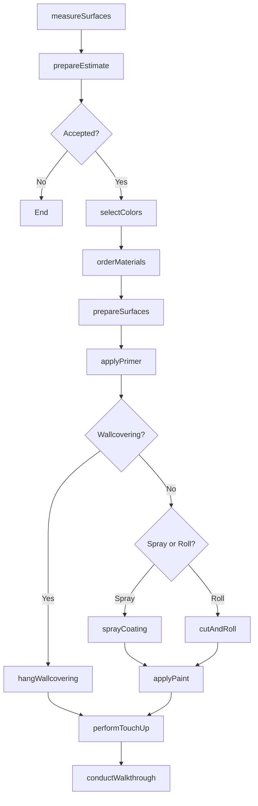
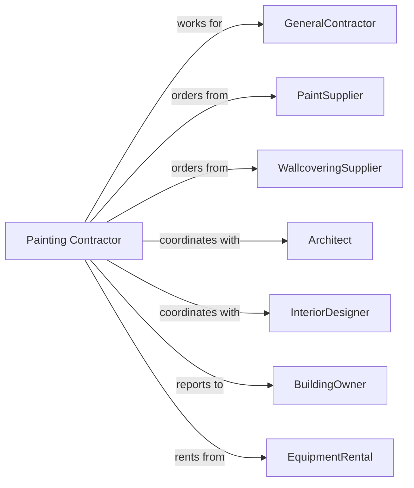

# Painting and Wall Covering Contractors

> Business-as-Code definition for painting and wall covering contracting operations. Models the complete lifecycle from surface preparation through final coat application for interior and exterior painting, wallpaper, and specialty finishes.

## Overview

Painting and wall covering contractors specialize in applying paint, stain, wallpaper, and specialty coatings to interior and exterior surfaces. Work includes surface preparation, priming, coating application, and decorative finishes. This definition exposes actions for color selection, surface prep, and coating application while managing drying times, VOC requirements, and aesthetic coordination.

## Actors

| Actor | Description |
|-------|-------------|
| GeneralContractor | Prime contractor managing overall construction |
| PaintSupplier | Provides paints, primers, and coatings |
| WallcoveringSupplier | Provides wallpaper and specialty materials |
| Architect | Specifies colors and finish requirements |
| InteriorDesigner | Selects colors and patterns |
| BuildingOwner | Approves final color selections |
| EquipmentRental | Provides lifts and spraying equipment |
| VOCInspector | Verifies coating compliance |

## Roles

| Role | Description |
|------|-------------|
| PaintingContractor | Business owner managing operations |
| Estimator | Measures and prepares proposals |
| ProjectManager | Coordinates crews and schedules |
| Foreman | Leads painting crew on site |
| Painter | Skilled tradesperson applying coatings |
| Paperhanger | Specializes in wallcovering installation |

## Entities

| Entity | Description |
|--------|-------------|
| Project | The painting scope with specifications |
| Estimate | Cost proposal with labor and materials |
| Paint | Coating material with color and sheen |
| Primer | Base coat for adhesion and coverage |
| Wallcovering | Wallpaper or vinyl wall material |
| SurfacePrep | Preparation work before coating |
| ColorSchedule | Document listing colors by room |
| Sheen | Paint finish level from flat to gloss |
| Coat | Individual application layer |
| TouchUp | Final corrections and repairs |

## Actions

| Action | Description |
|--------|-------------|
| measureSurfaces | Calculate square footage by area |
| prepareEstimate | Calculate materials and labor costs |
| selectColors | Coordinate color selection with designer |
| orderMaterials | Purchase paint and wallcoverings |
| prepareSurfaces | Clean, patch, and sand surfaces |
| applyPrimer | Apply base coat to surfaces |
| applyPaint | Apply finish coats to surfaces |
| cutAndRoll | Apply paint by brush and roller |
| sprayCoating | Apply paint by airless sprayer |
| hangWallcovering | Install wallpaper and vinyl |
| applySpecialtyFinish | Create faux or decorative effects |
| performTouchUp | Correct defects and missed areas |
| conductWalkthrough | Review finished work with customer |

## Events

| Event | Description |
|-------|-------------|
| surfacesMeasured | Square footage calculated |
| estimatePresented | Proposal delivered |
| colorsSelected | Color schedule approved |
| materialsDelivered | Paint and supplies on site |
| surfacesPrepared | Prep work complete |
| primerApplied | Base coat complete |
| firstCoatApplied | Initial finish coat complete |
| finalCoatApplied | Final finish coat complete |
| wallcoveringHung | Wallpaper installation complete |
| specialtyFinishComplete | Decorative finish complete |
| touchUpComplete | Corrections finished |
| walkthroughComplete | Customer accepted work |

## Searches

| Search | Description |
|--------|-------------|
| findProjects | List projects by status or GC |
| getColorSchedule | View approved colors by area |
| getMaterialOrders | Track paint deliveries |
| getCrewSchedule | View painter assignments |
| getCoatageRates | Check coverage progress |
| getWeatherForecast | Check exterior painting conditions |
| getTouchUpList | View items requiring correction |

## Workflow



## Actor Relationships



## Usage

### Calling Actions

```typescript
import { finishPaintingWall } from '@headlessly/finish-painting-wall'

const painter = finishPaintingWall()

// Prepare surfaces for painting
await painter.prepareSurfaces({
  projectId: 'office-repaint-456',
  area: 'main-lobby',
  tasks: ['patch-holes', 'sand-repairs', 'clean-surfaces'],
  primerNeeded: true
})

// Apply paint by spray method
await painter.sprayCoating({
  projectId: 'office-repaint-456',
  area: 'main-lobby',
  surface: 'walls',
  paintProduct: 'Sherwin-Williams-ProMar-200',
  color: 'SW-7015-Repose-Gray',
  sheen: 'eggshell',
  coats: 2
})

// Hang commercial wallcovering
await painter.hangWallcovering({
  projectId: 'hotel-renovation-789',
  area: 'corridor-floors-2-5',
  product: 'Wolf-Gordon-Type-II',
  pattern: 'WG-5432',
  linearYards: 450
})
```

### Event-Driven Automation

```typescript
// Auto-apply primer when surfaces prepped
painter.surfacesPrepared(async ({ projectId, area }) => {
  await painter.applyPrimer({
    projectId,
    area,
    primerType: 'high-build',
    startDate: addDays(new Date(), 1)
  })
})

// Auto-schedule walkthrough when touch-up complete
painter.touchUpComplete(async ({ projectId }) => {
  await painter.conductWalkthrough({
    projectId,
    walkthroughDate: addDays(new Date(), 2)
  })
})
```
