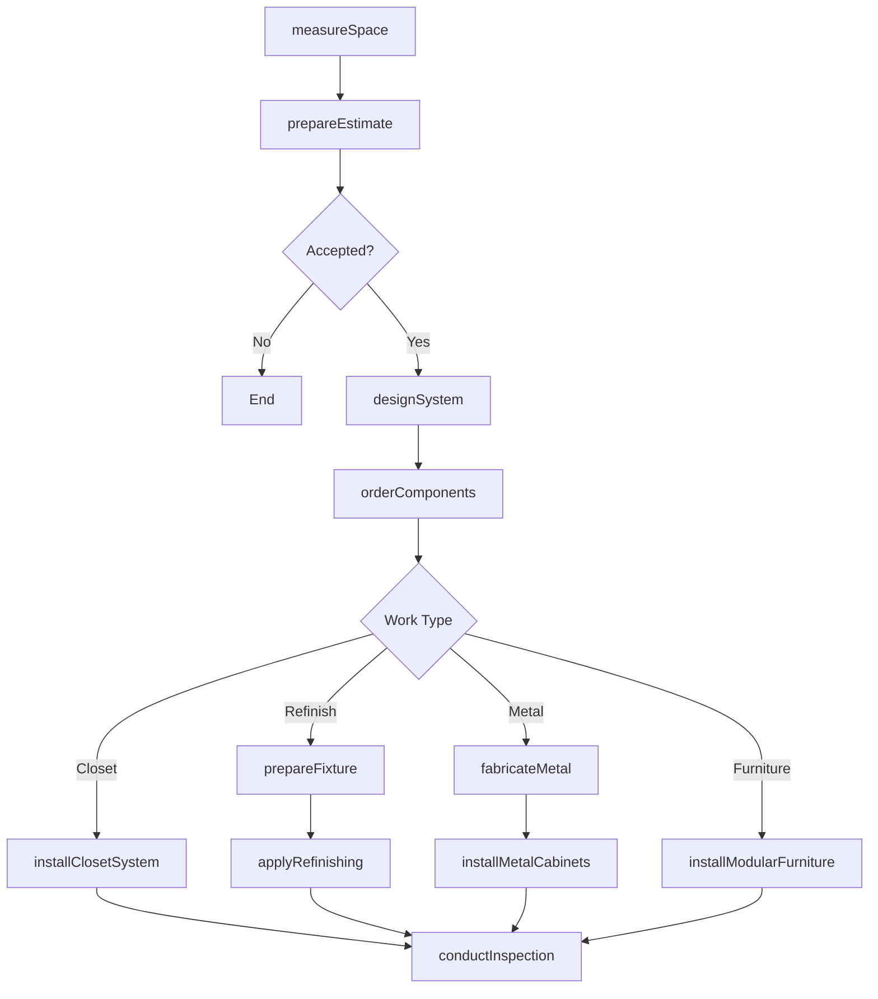
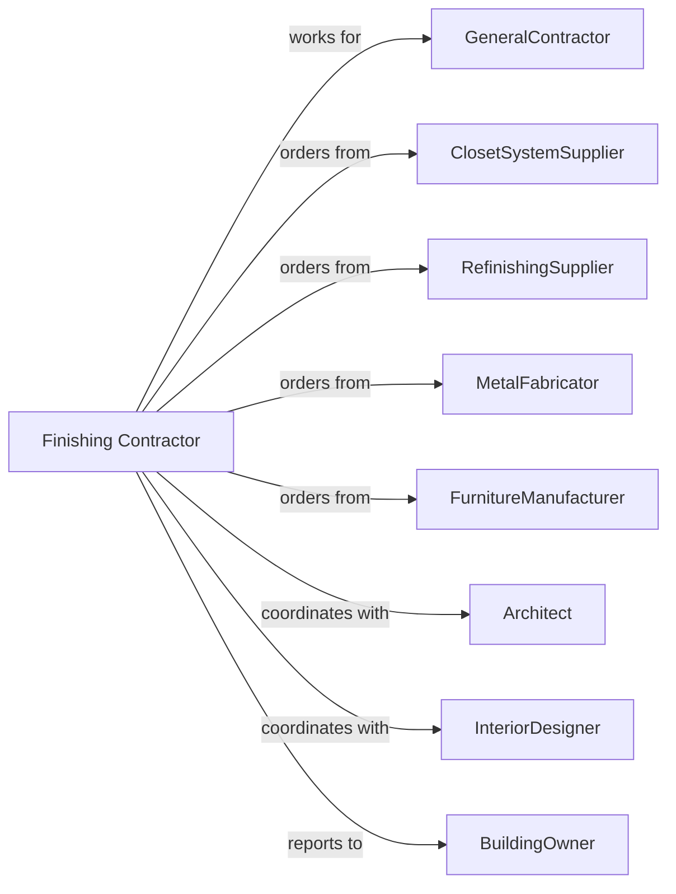

# Other Building Finishing Contractors

> Business-as-Code definition for specialty building finishing contracting operations. Models the complete lifecycle from specification through installation for closet systems, bathtub refinishing, metal fabrication, and specialty finishes not covered by other categories.

## Overview

Other building finishing contractors specialize in work not classified under standard finishing trades, including closet organizer installation, bathtub and fixture refinishing, metal cabinet fabrication, modular furniture systems, and specialty surface treatments. This definition exposes actions for custom measurement, fabrication coordination, and installation while managing fit tolerances and finish quality.

## Actors

| Actor | Description |
|-------|-------------|
| GeneralContractor | Prime contractor managing overall construction |
| ClosetSystemSupplier | Provides closet organizer components |
| RefinishingSupplier | Provides coatings for fixture refinishing |
| MetalFabricator | Custom fabricates metal cabinetry and trim |
| FurnitureManufacturer | Produces modular furniture systems |
| Architect | Specifies custom finishing requirements |
| InteriorDesigner | Selects finishes and configurations |
| BuildingOwner | Approves selections and final work |

## Roles

| Role | Description |
|------|-------------|
| FinishingContractor | Business owner managing operations |
| Estimator | Measures and prepares proposals |
| ProjectManager | Coordinates materials and schedules |
| InstallationLead | Oversees installation crew |
| Installer | Skilled tradesperson installing systems |
| RefinishingTechnician | Specializes in surface restoration |

## Entities

| Entity | Description |
|--------|-------------|
| Project | The finishing scope with specifications |
| Estimate | Cost proposal with labor and materials |
| ClosetSystem | Storage organizer with shelves and rods |
| RefinishedFixture | Restored bathtub, sink, or tile |
| MetalCabinet | Custom fabricated metal storage |
| ModularFurniture | Demountable furniture system |
| Countertop | Fabricated horizontal surface |
| AccessPanel | Removable service access panel |
| ShowerEnclosure | Glass and metal shower surround |
| SpecialtyCoating | Applied decorative or protective finish |

## Actions

| Action | Description |
|--------|-------------|
| measureSpace | Field verify dimensions for systems |
| prepareEstimate | Calculate materials and labor costs |
| designSystem | Configure closet or furniture layout |
| orderComponents | Purchase systems and materials |
| prepareFixture | Clean and prepare surface for refinishing |
| applyRefinishing | Spray coating on bathtubs and fixtures |
| fabricateMetal | Custom build metal components |
| installClosetSystem | Mount shelving, rods, and accessories |
| installModularFurniture | Assemble and secure furniture systems |
| installMetalCabinets | Set and level fabricated cabinetry |
| installShowerEnclosure | Mount glass panels and hardware |
| installAccessPanels | Place and trim service panels |
| applySpecialtyCoating | Apply decorative finish coatings |
| conductInspection | Review work for quality acceptance |

## Events

| Event | Description |
|-------|-------------|
| spaceMeasured | Dimensions recorded and verified |
| estimatePresented | Proposal delivered |
| systemDesigned | Layout configured and approved |
| componentsOrdered | Materials purchased |
| fixturePrepared | Surface ready for refinishing |
| refinishingApplied | Coating cured and complete |
| metalFabricated | Components built and delivered |
| closetSystemInstalled | Organizer fully assembled |
| modularFurnitureInstalled | Furniture system complete |
| metalCabinetsInstalled | Fabricated cabinetry mounted |
| showerEnclosureInstalled | Glass enclosure complete |
| accessPanelsInstalled | Service panels placed |
| specialtyCoatingApplied | Decorative finish complete |
| inspectionPassed | Work accepted by customer |

## Searches

| Search | Description |
|--------|-------------|
| findProjects | List projects by status or GC |
| getSystemDesigns | View closet and furniture configurations |
| getFabricationStatus | Track custom metal work progress |
| getRefinishingSchedule | View fixture restoration timeline |
| getCrewSchedule | Check installer assignments |
| getDeliveryStatus | Track component deliveries |
| getPunchlist | List items requiring correction |

## Workflow



## Actor Relationships



## Usage

### Calling Actions

```typescript
import { finishBuildingFinishing } from '@headlessly/finish-building-finishing'

const finisher = finishBuildingFinishing()

// Install walk-in closet system
await finisher.installClosetSystem({
  projectId: 'master-suite-789',
  closetId: 'walk-in-master',
  width: 144,
  depth: 96,
  components: ['double-hang', 'shelving', 'drawers', 'shoe-racks'],
  finish: 'white-melamine'
})

// Refinish bathtub
await finisher.applyRefinishing({
  projectId: 'bathroom-remodel-456',
  fixtureType: 'cast-iron-tub',
  color: 'white',
  finish: 'high-gloss',
  warrantyYears: 5
})

// Install modular furniture system
await finisher.installModularFurniture({
  projectId: 'office-buildout-123',
  area: 'open-office',
  system: 'Steelcase-Answer',
  workstations: 24,
  configuration: 'bench-style'
})
```

### Event-Driven Automation

```typescript
// Auto-install when components arrive
finisher.componentsOrdered(async ({ projectId, deliveryDate }) => {
  await finisher.installClosetSystem({
    projectId,
    startDate: addDays(deliveryDate, 1)
  })
})

// Auto-schedule inspection when installation complete
finisher.closetSystemInstalled(async ({ projectId }) => {
  await finisher.conductInspection({
    projectId,
    inspectionDate: addDays(new Date(), 2)
  })
})
```
