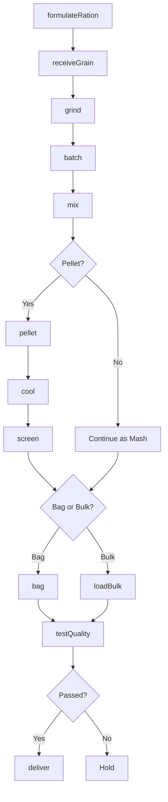
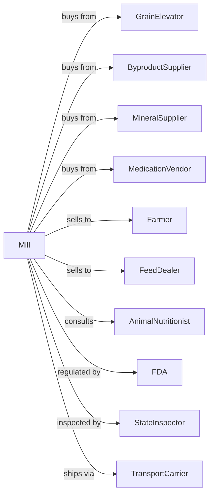

# Other Animal Food Manufacturing

> Business-as-Code definition for livestock and specialty animal feed manufacturing. Models feed formulation, milling, pelleting, and distribution for cattle, poultry, swine, horses, and aquaculture.

## Overview

This U.S. industry comprises establishments primarily engaged in manufacturing animal food (except dog and cat) from ingredients, such as grains, oilseed mill products, and meat products. This definition exposes actions for nutritional formulation, ingredient processing, pelleting or texturizing, and delivery to farms and feed dealers.

## Actors

| Actor | Description |
|-------|-------------|
| GrainElevator | Supplies corn, soybeans, wheat, and other grains |
| ByproductSupplier | Provides distillers grains, soy hulls, and mill feeds |
| MineralSupplier | Supplies vitamins, minerals, and trace elements |
| MedicationVendor | Provides feed-grade medications and additives |
| Farmer | Purchases feed for livestock operations |
| FeedDealer | Distributes feed to farm customers |
| AnimalNutritionist | Consults on ration formulation and performance |
| FDA | Regulates feed safety and medicated feed requirements |
| StateInspector | Inspects facilities and enforces feed laws |
| TransportCarrier | Hauls bulk feed to farms and dealers |

## Roles

| Role | Description |
|------|-------------|
| MillManager | Oversees feed mill operations |
| Nutritionist | Formulates rations for target species and production goals |
| QualityManager | Ensures feed safety and label compliance |
| MillOperator | Operates grinding, mixing, and pelleting equipment |
| BatchOperator | Controls ingredient batching and sequencing |
| MaintenanceTech | Maintains mill equipment and systems |
| SalesRep | Sells feed products and provides customer service |
| TruckDriver | Delivers bulk and bagged feed to customers |

## Entities

| Entity | Description |
|--------|-------------|
| Ration | Feed formula for specific species and production stage |
| Batch | Production lot with traceable ingredients |
| Ingredient | Grain, protein, mineral, or additive component |
| Pellet | Compressed feed in cylindrical form |
| Mash | Ground, uncompressed feed mixture |
| Premix | Concentrated vitamin-mineral supplement |
| Medication | Feed-grade drug for disease prevention or treatment |
| Tag | Feed label with guaranteed analysis and instructions |
| BulkOrder | Customer order for bulk feed delivery |
| Silo | On-farm storage for bulk feed delivery |

## Actions

| Action | Description |
|--------|-------------|
| formulateRation | Develop feed formula for species and production goal |
| receiveGrain | Inspect and accept incoming grain shipments |
| grind | Mill grains to target particle size |
| batch | Weigh and sequence ingredients per formula |
| mix | Blend ingredients to homogeneous mixture |
| pellet | Compress mash through pellet die |
| cool | Reduce pellet temperature after pelleting |
| screen | Remove fines and oversized particles |
| bag | Package feed in bags for retail sale |
| loadBulk | Fill trucks for bulk delivery |
| deliver | Transport feed to farm or dealer |
| testQuality | Analyze feed for nutrient content and safety |
| flush | Clear equipment between medicated batches |
| adjustFormula | Modify ration based on ingredient availability or price |

## Events

| Event | Description |
|-------|-------------|
| rationFormulated | Feed formula approved for production |
| grainReceived | Grain shipment inspected and accepted |
| batchMixed | Feed mixed and ready for pelleting or delivery |
| batchPelleted | Feed compressed into pellets |
| batchCooled | Pellets cooled and ready for packaging |
| batchBagged | Feed packaged in bags |
| orderLoaded | Bulk order loaded for delivery |
| orderDelivered | Feed delivered to customer |
| qualityApproved | Feed passed testing requirements |
| qualityFailed | Feed failed testing and held for review |
| equipmentFlushed | Mill cleared for non-medicated production |
| priceAlertTriggered | Ingredient price moved beyond threshold |

## Searches

| Search | Description |
|--------|-------------|
| findRations | List formulas by species, stage, or medication |
| getIngredientPrices | Retrieve current commodity and ingredient prices |
| checkInventory | Get grain and ingredient stock levels |
| findCustomers | List customers by species, volume, or location |
| getOrders | Retrieve orders by customer or delivery date |
| getProductionSchedule | View scheduled batches and sequences |
| getBatchHistory | Retrieve production records by date or formula |
| getMedicationLog | Track medicated feed production and withdrawals |

## Workflow



## Actor Relationships



## Usage

### Calling Actions

```typescript
import { manufactureAnimalFood } from '@headlessly/manufacture-animal-food'

const mill = manufactureAnimalFood()

// Formulate a dairy ration
const ration = await mill.formulateRation({
  species: 'dairy-cattle',
  stage: 'lactating',
  targetProtein: 16,
  targetEnergy: 0.75,
  ingredients: ['corn', 'soybean-meal', 'distillers-grains', 'mineral-premix']
})

// Run a production batch
const batch = await mill.batch({
  rationId: ration.id,
  quantity: 25,
  unit: 'tons'
})

// Mix and pellet
await mill.mix({ batchId: batch.id })
await mill.pellet({
  batchId: batch.id,
  dieSize: 5.0,
  temperature: 180
})
```

### Event-Driven Automation

```typescript
// Auto-schedule delivery when batch is ready
mill.batchCooled(async ({ batchId, customerId }) => {
  const order = await mill.findOrders({ batchId })

  if (order.deliveryType === 'bulk') {
    await mill.loadBulk({
      batchId,
      truckId: await mill.assignTruck({ capacity: order.tons })
    })
  }
})

// Adjust formulas when prices change
mill.priceAlertTriggered(async ({ ingredient, newPrice, changePercent }) => {
  if (changePercent > 10) {
    const affectedRations = await mill.findRations({ ingredient })

    for (const ration of affectedRations) {
      await mill.adjustFormula({
        rationId: ration.id,
        optimizeFor: 'cost',
        maintainNutrition: true
      })
    }
  }
})
```
