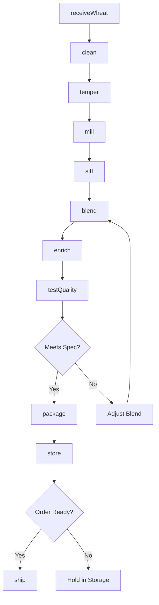

# Flour Milling

> Business-as-Code definition for flour milling operations. Models wheat and grain processing from receiving through milling, blending, and distribution to bakeries and food manufacturers.

## Overview

This U.S. industry comprises establishments primarily engaged in milling flour or meal from grains (except rice) or vegetables and/or milling flour and preparing flour mixes or doughs. This definition exposes actions for wheat grading, tempering, milling, flour blending, and quality testing for baking performance.

## Actors

| Actor | Description |
|-------|-------------|
| GrainElevator | Supplies wheat and other grains by class and grade |
| WheatFarmer | Produces wheat for purchase and delivery |
| GrainBroker | Facilitates grain trading and logistics |
| Bakery | Purchases flour for bread and baked goods production |
| FoodManufacturer | Purchases flour for processed food products |
| Distributor | Warehouses and delivers flour to customers |
| GrainInspector | Grades and certifies wheat quality |
| FDA | Regulates food safety and enrichment requirements |
| Commodity Exchange | Provides price discovery and hedging instruments |
| EquipmentVendor | Supplies and services milling equipment |

## Roles

| Role | Description |
|------|-------------|
| MillManager | Oversees daily milling operations |
| HeadMiller | Controls milling process and flour quality |
| QualityManager | Manages testing lab and specifications |
| GrainBuyer | Purchases wheat and manages grain inventory |
| MillOperator | Operates cleaning, tempering, and milling equipment |
| Blender | Creates flour blends to customer specifications |
| MaintenanceTech | Maintains milling equipment and systems |
| SalesManager | Manages customer relationships and contracts |

## Entities

| Entity | Description |
|--------|-------------|
| Wheat | Raw grain classified by class, protein, and quality |
| Flour | Milled product with specific protein and ash content |
| Blend | Custom flour mixture for specific applications |
| Bran | Outer layer of wheat kernel separated during milling |
| Middlings | Wheat germ and fine bran particles |
| Specification | Customer requirements for flour performance |
| Lot | Traceable quantity of flour from specific wheat |
| TestResult | Lab analysis of wheat or flour properties |
| Contract | Agreement for flour supply at specified terms |
| Enrichment | Vitamins and minerals added per FDA requirements |

## Actions

| Action | Description |
|--------|-------------|
| receiveWheat | Accept and grade incoming wheat shipments |
| clean | Remove foreign material and damaged kernels |
| temper | Add moisture to condition wheat for milling |
| mill | Grind wheat through roller mills and sifters |
| sift | Separate flour from bran and middlings |
| blend | Combine flours to achieve target specifications |
| enrich | Add vitamins and minerals per federal requirements |
| package | Fill bags, totes, or bulk containers |
| testQuality | Analyze protein, ash, moisture, and baking properties |
| store | Maintain flour in temperature-controlled silos |
| ship | Deliver flour to customers via truck or rail |
| hedge | Use futures to manage wheat price risk |
| certify | Obtain quality certifications for customers |
| trace | Track wheat lots through finished flour |

## Events

| Event | Description |
|-------|-------------|
| wheatReceived | Wheat shipment graded and accepted |
| wheatCleaned | Wheat cleaned and ready for tempering |
| wheatTempered | Wheat conditioned to target moisture |
| flourMilled | Wheat processed into flour streams |
| flourBlended | Custom blend created to specification |
| flourEnriched | Vitamins and minerals added |
| flourPackaged | Flour packaged for shipment |
| qualityApproved | Flour passed customer specifications |
| qualityFailed | Flour failed testing requirements |
| orderShipped | Flour dispatched to customer |
| priceHedged | Futures position established for wheat |
| specificationUpdated | Customer specification changed |

## Searches

| Search | Description |
|--------|-------------|
| findWheatLots | List wheat inventory by class, protein, or origin |
| getFlourInventory | Check flour stock by type and specification |
| getContracts | Retrieve active customer contracts |
| findOrders | List orders by customer, product, or ship date |
| getTestResults | Retrieve quality test data by lot or date |
| getMillingYields | View extraction rates and byproduct volumes |
| getPrice | Get current wheat and flour market prices |
| getSpecifications | Retrieve customer flour specifications |

## Workflow



## Actor Relationships

```mermaid
graph LR
    M[Mill]

    M -->|buys from| GrainElevator
    M -->|buys from| WheatFarmer
    M -->|trades via| GrainBroker
    M -->|sells to| Bakery
    M -->|sells to| FoodManufacturer
    M -->|sells to| Distributor
    M -->|graded by| GrainInspector
    M -->|regulated by| FDA
    M -->|hedges on| Commodity Exchange
    M -->|equipment from| EquipmentVendor
```

## Usage

### Calling Actions

```typescript
import { millFlourMilling } from '@headlessly/mill-flour-milling'

const mill = millFlourMilling()

// Receive and grade wheat
const wheat = await mill.receiveWheat({
  source: 'elevator-midwest',
  class: 'hardRedWinter',
  quantity: 5000,
  unit: 'bushels'
})

// Process through cleaning and tempering
await mill.clean({ lotId: wheat.lotId })
await mill.temper({
  lotId: wheat.lotId,
  targetMoisture: 15.5,
  hours: 18
})

// Mill to target specifications
const flour = await mill.mill({
  lotId: wheat.lotId,
  extractionRate: 76,
  flourStreams: ['patent', 'clear', 'straight']
})
```

### Event-Driven Automation

```typescript
// Auto-blend when flour is milled
mill.flourMilled(async ({ lotId, streams }) => {
  const orders = await mill.findOrders({ status: 'pending' })

  for (const order of orders) {
    const spec = await mill.getSpecifications({ customerId: order.customerId })

    await mill.blend({
      targetProtein: spec.proteinMin,
      targetAsh: spec.ashMax,
      streams: streams.filter(s => s.quality >= spec.minQuality)
    })
  }
})

// Alert on quality issues
mill.qualityFailed(async ({ lotId, specification, actualValue }) => {
  await mill.notifyQualityTeam({
    lotId,
    issue: `${specification} out of range: ${actualValue}`,
    priority: 'high'
  })
})
```
