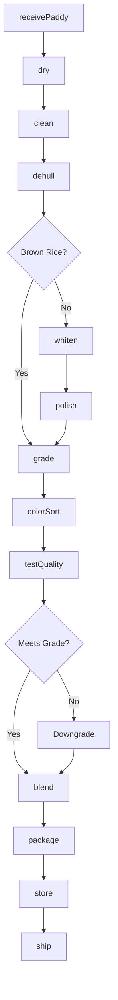
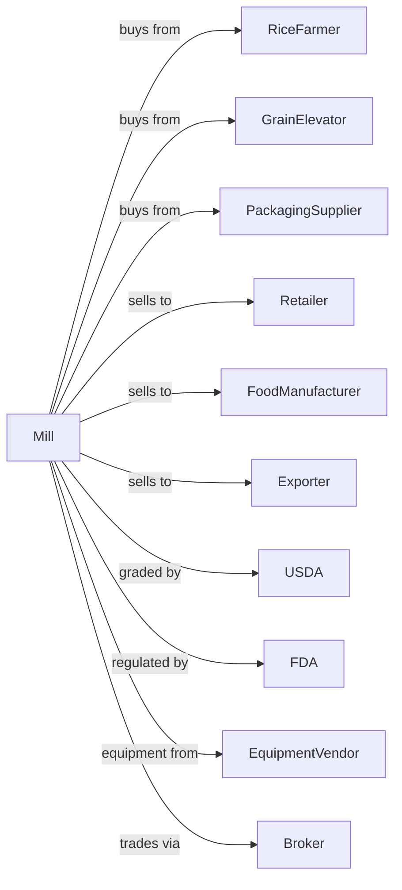

# Rice Milling

> Business-as-Code definition for rice milling operations. Models paddy rice processing from receiving through hulling, polishing, grading, and packaging for retail and foodservice markets.

## Overview

This U.S. industry comprises establishments primarily engaged in milling rice, cleaning and polishing rice, or milling, cleaning, and polishing rice. This definition exposes actions for paddy drying, dehulling, whitening, grading by kernel size, and packaging for consumer and industrial customers.

## Actors

| Actor | Description |
|-------|-------------|
| RiceFarmer | Produces paddy rice for sale to mills |
| GrainElevator | Stores and delivers rough rice |
| PackagingSupplier | Provides bags, boxes, and packaging materials |
| Retailer | Purchases packaged rice for consumer sale |
| FoodManufacturer | Purchases rice for processed food production |
| Exporter | Ships rice to international markets |
| USDA | Grades rice and enforces quality standards |
| FDA | Regulates food safety and labeling |
| EquipmentVendor | Supplies milling and sorting equipment |
| Broker | Facilitates rice trading and logistics |

## Roles

| Role | Description |
|------|-------------|
| MillManager | Oversees rice milling operations |
| QualityManager | Ensures rice meets grade and customer specifications |
| MillOperator | Operates hulling, whitening, and grading equipment |
| DryerOperator | Controls paddy drying to safe moisture levels |
| GraderOperator | Operates optical sorters and grading equipment |
| PackagingOperator | Runs filling and sealing lines |
| ProcurementManager | Purchases paddy rice from farmers and elevators |
| SalesManager | Manages customer relationships and orders |

## Entities

| Entity | Description |
|--------|-------------|
| PaddyRice | Rough rice with hull intact as harvested |
| BrownRice | Rice with hull removed but bran layer intact |
| WhiteRice | Fully milled rice with bran removed |
| Hull | Outer husk removed during dehulling |
| Bran | Outer layers removed during whitening |
| Broken | Fragments and broken kernels separated during grading |
| Grade | USDA quality classification based on defects |
| Lot | Traceable batch of rice from receiving to packaging |
| Specification | Customer requirements for variety and quality |
| Blend | Mixture of rice varieties or grades |

## Actions

| Action | Description |
|--------|-------------|
| receivePaddy | Accept and sample incoming rough rice |
| dry | Reduce paddy moisture to safe storage level |
| clean | Remove stones, straw, and foreign material |
| dehull | Remove outer husk to produce brown rice |
| whiten | Remove bran layers through abrasive milling |
| polish | Buff rice surface for appearance |
| grade | Sort rice by kernel size and defects |
| colorSort | Remove discolored and defective kernels |
| blend | Combine rice varieties to meet specifications |
| enrich | Coat rice with vitamins per regulations |
| package | Fill bags or containers with graded rice |
| store | Maintain rice in climate-controlled storage |
| ship | Dispatch orders to customers |
| testQuality | Analyze moisture, milling degree, and defects |

## Events

| Event | Description |
|-------|-------------|
| paddyReceived | Rough rice accepted and sampled |
| paddyDried | Rice dried to target moisture |
| paddyCleaned | Foreign material removed |
| riceDehulled | Hulls removed to produce brown rice |
| riceWhitened | Bran removed to produce white rice |
| ricePolished | Surface buffed for appearance |
| riceGraded | Kernels sorted by size and quality |
| riceSorted | Defective kernels removed |
| ricePackaged | Product filled and sealed |
| qualityApproved | Rice met grade and specifications |
| qualityFailed | Rice failed testing requirements |
| orderShipped | Rice dispatched to customer |

## Searches

| Search | Description |
|--------|-------------|
| findPaddyLots | List paddy inventory by variety and moisture |
| getRiceInventory | Check milled rice stock by grade and variety |
| getOrders | Retrieve orders by customer or ship date |
| getGradeReports | View quality and grading test results |
| findByproducts | List hull, bran, and broken inventory |
| getMillingYields | View head rice and broken rice ratios |
| getCustomers | List customers by volume and variety preference |
| getMarketPrices | Retrieve current rice market prices by grade |

## Workflow



## Actor Relationships



## Usage

### Calling Actions

```typescript
import { millRiceMilling } from '@headlessly/mill-rice-milling'

const mill = millRiceMilling()

// Receive paddy rice
const paddy = await mill.receivePaddy({
  farmerId: 'farm-louisiana-01',
  variety: 'longGrain',
  quantity: 50000,
  unit: 'cwt',
  moistureReceived: 18.5
})

// Dry and process
await mill.dry({
  lotId: paddy.lotId,
  targetMoisture: 12.5
})

await mill.clean({ lotId: paddy.lotId })
await mill.dehull({ lotId: paddy.lotId })
await mill.whiten({
  lotId: paddy.lotId,
  millingDegree: 92
})
```

### Event-Driven Automation

```typescript
// Auto-grade after whitening
mill.riceWhitened(async ({ lotId, millingDegree }) => {
  await mill.polish({ lotId })

  await mill.grade({
    lotId,
    targetGrade: 'usNo1',
    sortBroken: true
  })
})

// Auto-package when quality approved
mill.qualityApproved(async ({ lotId, grade, variety }) => {
  const orders = await mill.getOrders({
    variety,
    gradeMin: grade,
    status: 'pending'
  })

  if (orders.length > 0) {
    await mill.package({
      lotId,
      orderId: orders[0].id,
      packageSize: orders[0].packageSize
    })
  }
})
```
