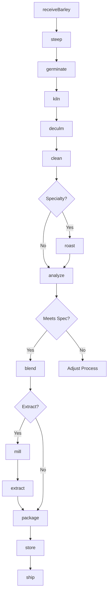
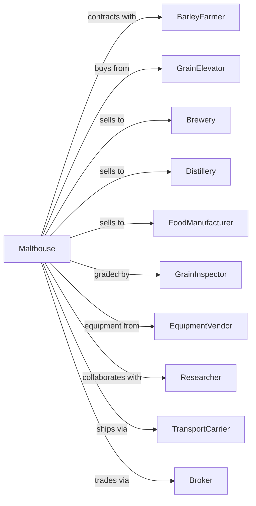

# Malt Manufacturing

> Business-as-Code definition for malt manufacturing operations. Models the malting process from barley selection through steeping, germination, kilning, and delivery to breweries and distilleries.

## Overview

This U.S. industry comprises establishments primarily engaged in manufacturing malt from barley, rye, or other grains. This definition exposes actions for grain selection, controlled germination, kilning to develop flavor and color, and distribution to craft and commercial brewers, distillers, and food manufacturers.

## Actors

| Actor | Description |
|-------|-------------|
| BarleyFarmer | Produces malting barley under contract |
| GrainElevator | Stores and delivers malting-grade barley |
| Brewery | Purchases malt for beer production |
| Distillery | Purchases malt for whiskey and spirits production |
| FoodManufacturer | Uses malt extract in food products |
| GrainInspector | Grades barley for malting quality |
| EquipmentVendor | Supplies malting and kilning equipment |
| Researcher | Develops new barley varieties and malting techniques |
| TransportCarrier | Ships malt to customers |
| Broker | Facilitates malt trading and contracts |

## Roles

| Role | Description |
|------|-------------|
| MalthouseManager | Oversees malting operations |
| Maltster | Controls steeping, germination, and kilning |
| QualityManager | Ensures malt meets brewing specifications |
| KilnOperator | Operates kilns for drying and roasting |
| GrainBuyer | Procures malting barley from farmers and elevators |
| LabTechnician | Conducts malt analysis and quality tests |
| ProductionPlanner | Schedules batches to meet customer demand |
| SalesManager | Manages customer relationships and orders |

## Entities

| Entity | Description |
|--------|-------------|
| Barley | Malting-grade grain with specific protein and moisture |
| GreenMalt | Germinated grain before kilning |
| BaseMalt | Lightly kilned malt providing fermentable sugars |
| SpecialtyMalt | Roasted or caramelized malt for color and flavor |
| Extract | Liquid or dry malt concentrate |
| Batch | Lot of malt tracked through production |
| Specification | Customer requirements for malt properties |
| Certificate | Analysis report for malt quality |
| Contract | Agreement for malt supply to customer |
| Sprout | Rootlets removed after kilning |

## Actions

| Action | Description |
|--------|-------------|
| receiveBarley | Accept and test incoming malting barley |
| steep | Soak barley to increase moisture for germination |
| germinate | Allow controlled sprouting to develop enzymes |
| kiln | Dry and roast malt to target color and flavor |
| deculm | Remove rootlets from kilned malt |
| clean | Remove dust and foreign material |
| roast | Apply additional heat for specialty malts |
| blend | Combine malt types for custom specifications |
| mill | Crush malt for extract production |
| extract | Produce liquid or dry malt extract |
| package | Fill bags, totes, or bulk containers |
| analyze | Test malt for brewing performance properties |
| store | Maintain malt in climate-controlled silos |
| ship | Deliver malt to breweries and distilleries |

## Events

| Event | Description |
|-------|-------------|
| barleyReceived | Malting barley accepted and tested |
| steepingComplete | Barley moisture reached target level |
| germinationComplete | Enzymes developed and modification achieved |
| kilningComplete | Malt dried to target moisture and color |
| deculmingComplete | Rootlets removed from malt |
| maltRoasted | Specialty malt achieved target color |
| maltBlended | Custom blend created to specification |
| extractProduced | Malt extract manufactured |
| analysisComplete | Quality testing finished |
| qualityApproved | Malt met customer specifications |
| orderShipped | Malt dispatched to customer |
| contractSigned | New supply agreement executed |

## Searches

| Search | Description |
|--------|-------------|
| findBarleyLots | List barley inventory by variety and quality |
| getMaltInventory | Check malt stock by type and specification |
| getContracts | Retrieve active customer contracts |
| getOrders | List orders by customer or delivery date |
| getAnalysisReports | Retrieve malt quality certificates |
| getProductionSchedule | View planned batches and timing |
| findCustomers | List customers by volume and malt type |
| getMarketPrices | Retrieve current malt and barley prices |

## Workflow



## Actor Relationships



## Usage

### Calling Actions

```typescript
import { millMalt } from '@headlessly/mill-malt'

const malthouse = millMalt()

// Receive malting barley
const barley = await malthouse.receiveBarley({
  variety: 'fullPint',
  quantity: 100000,
  unit: 'pounds',
  protein: 11.2,
  moisture: 12.0
})

// Process through malting
await malthouse.steep({
  lotId: barley.lotId,
  targetMoisture: 44,
  cycles: 3,
  duration: 48
})

await malthouse.germinate({
  lotId: barley.lotId,
  temperature: 60,
  duration: 96,
  turningFrequency: 8
})

await malthouse.kiln({
  lotId: barley.lotId,
  targetMoisture: 4,
  targetColor: 2.5,
  profile: 'paleMalt'
})
```

### Event-Driven Automation

```typescript
// Auto-analyze after kilning
malthouse.kilningComplete(async ({ lotId, color, moisture }) => {
  await malthouse.deculm({ lotId })
  await malthouse.clean({ lotId })

  const analysis = await malthouse.analyze({
    lotId,
    tests: ['extractPotential', 'diastaticPower', 'proteinContent', 'friability']
  })
})

// Match malt to customer orders
malthouse.analysisComplete(async ({ lotId, results }) => {
  const orders = await malthouse.getOrders({ status: 'pending' })

  for (const order of orders) {
    if (results.extractPotential >= order.minExtract &&
        results.diastaticPower >= order.minDP) {
      await malthouse.package({
        lotId,
        orderId: order.id,
        packageType: order.packageType
      })
      break
    }
  }
})
```
