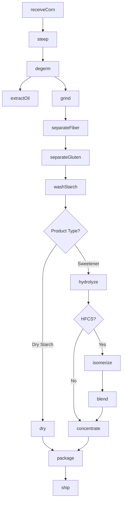
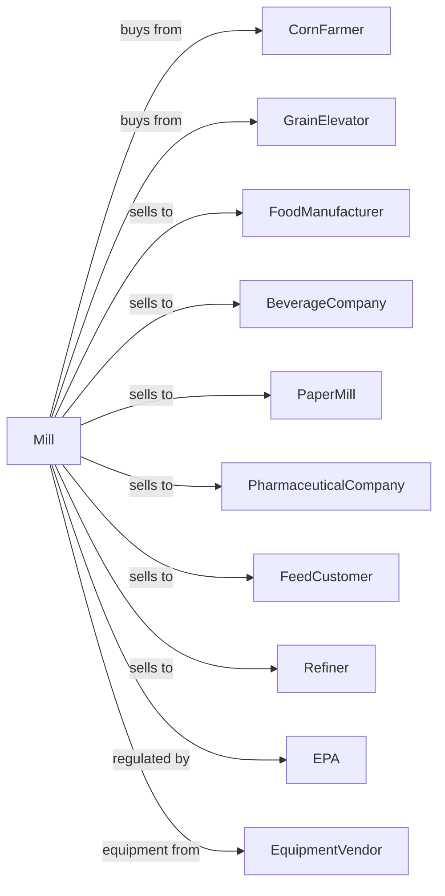

# Wet Corn Milling and Starch Manufacturing

> Business-as-Code definition for wet corn milling operations. Models corn fractionation into starch, sweeteners, oil, and feed products through steeping, separation, and refining processes.

## Overview

This U.S. industry comprises establishments primarily engaged in wet milling corn and other vegetables (except to make ethyl alcohol). Examples of products made in these establishments are corn sweeteners, such as glucose, dextrose, and fructose; corn oil; and starches. This definition exposes actions for steeping, germ separation, starch washing, and sweetener production.

## Actors

| Actor | Description |
|-------|-------------|
| CornFarmer | Produces yellow dent corn for milling |
| GrainElevator | Stores and delivers shelled corn |
| FoodManufacturer | Purchases sweeteners and starches for food production |
| BeverageCompany | Uses high fructose corn syrup in soft drinks |
| PaperMill | Purchases starch for paper coating and sizing |
| PharmaceuticalCompany | Uses dextrose and starch in drug formulations |
| FeedCustomer | Purchases corn gluten feed and meal |
| Refiner | Further processes crude corn oil |
| EPA | Regulates environmental emissions and waste |
| EquipmentVendor | Supplies milling and separation equipment |

## Roles

| Role | Description |
|------|-------------|
| PlantManager | Oversees wet milling operations |
| ProcessEngineer | Optimizes separation and refining processes |
| QualityManager | Ensures product specifications and food safety |
| SteepOperator | Controls corn steeping process |
| SeparationOperator | Operates centrifuges and hydrocyclones |
| RefineryOperator | Controls starch washing and sweetener conversion |
| LabTechnician | Conducts quality testing and analysis |
| EnvironmentalManager | Manages waste treatment and compliance |

## Entities

| Entity | Description |
|--------|-------------|
| Corn | Yellow dent corn as feedstock |
| SteepWater | Liquid containing solubles extracted during steeping |
| Germ | Corn embryo separated for oil extraction |
| Fiber | Corn hull and fiber fraction for feed |
| Gluten | Protein fraction from starch separation |
| Starch | Purified carbohydrate from corn endosperm |
| Glucose | Simple sugar from starch hydrolysis |
| HFCS | High fructose corn syrup from isomerization |
| CornOil | Oil extracted from germ |
| CornGlutenFeed | Byproduct mixture of fiber, steep liquor, and germ |

## Actions

| Action | Description |
|--------|-------------|
| receiveCorn | Accept and test incoming corn shipments |
| steep | Soak corn in sulfur dioxide solution to soften |
| degerm | Separate germ from steeped corn |
| extractOil | Press or extract oil from germ |
| grind | Mill degerminated corn to release starch |
| separateFiber | Remove hull and fiber from slurry |
| separateGluten | Centrifuge to separate gluten from starch |
| washStarch | Purify starch through multi-stage washing |
| dry | Remove moisture from starch or byproducts |
| hydrolyze | Convert starch to glucose with enzymes |
| isomerize | Convert glucose to fructose for HFCS |
| blend | Create sweetener blends to specification |
| concentrate | Evaporate water from sweetener streams |
| package | Fill tanks, railcars, or containers |

## Events

| Event | Description |
|-------|-------------|
| cornReceived | Corn shipment tested and accepted |
| steepingComplete | Corn softened and ready for processing |
| germSeparated | Germ fraction collected for oil extraction |
| oilExtracted | Crude corn oil produced |
| fiberSeparated | Fiber fraction removed from slurry |
| glutenSeparated | Gluten fraction isolated |
| starchWashed | Starch purified to specification |
| starchDried | Dry starch produced |
| glucoseProduced | Starch hydrolyzed to glucose |
| hfcsProduced | High fructose corn syrup manufactured |
| productShipped | Product dispatched to customer |
| qualityApproved | Product met specifications |

## Searches

| Search | Description |
|--------|-------------|
| findCornLots | List corn inventory by moisture and quality |
| getInventory | Check product stock by type and grade |
| getOrders | Retrieve orders by customer or product |
| getYields | View starch and byproduct yields |
| getQualityReports | Retrieve product analysis and certificates |
| getProcessData | View real-time process parameters |
| findByproducts | List feed and oil inventory |
| getMarketPrices | Retrieve corn and sweetener prices |

## Workflow



## Actor Relationships



## Usage

### Calling Actions

```typescript
import { millWetCorn } from '@headlessly/mill-wet-corn'

const plant = millWetCorn()

// Receive corn
const corn = await plant.receiveCorn({
  source: 'elevator-midwest',
  quantity: 100000,
  unit: 'bushels',
  moisture: 14.5,
  testWeight: 56
})

// Process through wet milling
await plant.steep({
  lotId: corn.lotId,
  so2Concentration: 0.2,
  temperature: 120,
  duration: 36
})

await plant.degerm({ lotId: corn.lotId })
await plant.grind({ lotId: corn.lotId, passes: 3 })
await plant.separateFiber({ lotId: corn.lotId })
await plant.separateGluten({ lotId: corn.lotId })
await plant.washStarch({ lotId: corn.lotId, stages: 12 })
```

### Event-Driven Automation

```typescript
// Auto-process starch based on orders
plant.starchWashed(async ({ lotId, purity, quantity }) => {
  const orders = await plant.getOrders({ product: 'hfcs-55', status: 'pending' })

  if (orders.length > 0) {
    await plant.hydrolyze({
      lotId,
      enzyme: 'glucoamylase',
      targetDE: 95
    })
  } else {
    await plant.dry({
      lotId,
      targetMoisture: 12
    })
  }
})

// Optimize based on market prices
plant.cornReceived(async ({ lotId }) => {
  const prices = await plant.getMarketPrices()

  const optimalProduct = prices.hfcs > prices.starch * 1.3 ? 'hfcs' : 'starch'

  await plant.setProductionPlan({
    lotId,
    primaryProduct: optimalProduct
  })
})
```
